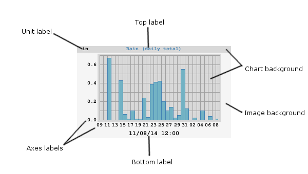

# WeeWX Customization Guide

This document covers the customization of WeeWX. It assumes that you have read, and are reasonably familiar with, the [Users Guide](usersguide.htm).

The introduction contains an overview of the architecture. If you are only interested in customizing the generated reports you can probably skip the introduction and proceed directly to the section [_Customizing reports_](#customizing_reports). With this approach you can easily add new plot images, change the titles of images, change the units used in the reports, and so on.

However, if your goal is a specialized application, such as adding alarms, RSS feeds, _etc._, then it would be worth your while to read about the internal architecture.

Most of the guide applies to any hardware, but the exact data types are hardware-specific. See the [_WeeWX Hardware Guide_](hardware.htm) for details of how different observation types are handled by different types hardware.

!!! Warning
    WeeWX is still an experimental system and, as such, its internal design is subject to change. Future upgrades may break any customizations you have done, particularly if they involve the API (skin customizations tend to be more stable).

## Introduction

### Overall system architecture

Below is a brief overview of the WeeWX system architecture, which is covered in much more detail in the rest of this document.


A typical WeeWX pipeline. The actual pipeline depends on what extensions are in use. Data, in the form of LOOP packets and archive records, flows from top to bottom.

*   A WeeWX process normally handles the monitoring of one station — _e.g._ a weather station. The process is configured using options in a configuration file, typically called `weewx.conf`.
*   A WeeWX process has at most one "driver" to communicate with the station hardware and receive "high resolution" (_i.e._ every few seconds) measurement data in the form of LOOP packets. The driver is single-threaded and blocking, so no more than one driver can run in a WeeWX process.
*   LOOP packets may contain arbitrary data from the station/driver in the form of a Python dictionary. Each LOOP packet must contain a time stamp and a unit system, in addition to any number of observations, such as temperature or humidity. For extensive types, such as rain, the packet contains the total amount of rain that fell during the observation period.
*   WeeWX then compiles these LOOP packets into regularly spaced "archive records." For most types, the archive record contains the average value seen in all of the LOOP packets over the archive interval (typically 5 minutes). For extensive types, such as rain, it is the sum of all values over the archive interval.
*   Internally, the WeeWX engine uses a _pipeline_ architecture, consisting of many _services_. Services bind to events of interest, such as new LOOP packets, or new archive records. Events are then run down the pipeline in order — services at the top of the pipeline act on the data before services farther down the pipe.
*   Services can do things such as check the data quality, apply corrections, or save data to a database. Users can easily add new services.
*   WeeWX includes an ability to customize behavior by installing _extensions_. Extensions may consist of one or more drivers, services, and/or skins, all in an easy-to-install package.

### Data architecture

WeeWX is data-driven. When the sensors spit out some data, WeeWX does something. The "something" might be to print out the data, or to generate an HTML report, or to use FTP to copy a report to a web server, or to perform some calculations using the data.

A driver is Python code that communicates with the hardware. The driver reads data from a serial port or a device on the USB or a network interface. It handles any decoding of raw bits and bytes, and puts the resulting data into LOOP packets. The drivers for some kinds of hardware (most notably, Davis Vantage) are capable of emitting archive records as well.

In addition to the primary observation types such as temperature, humidity, or solar radiation, there are also many useful dependent types, such as wind chill, heat index, or ET, which are calculated from the primary data. The firmware in some weather stations are capable of doing many of these calculations on their own. For the rest, should you choose to do so, the WeeWX service [StdWXCalculate](usersguide.htm#StdWXCalculate) can fill in the gaps. Sometimes the firmware simply does it wrong, and you may choose to have WeeWX do the calculation, despite the type's presence in LOOP packets.

### LOOP packets _vs._ archive records

Generally, there are two types of data that flow through WeeWX: LOOP packets, and archive records. Both are represented as Python dictionaries.

#### LOOP packets

LOOP packets are the raw data generated by the device driver. They get their name from the Davis Instruments documentation. For some devices they are generated at rigid intervals, such as every 2 seconds for the Davis Vantage series, for others, irregularly, every 20 or 30 seconds or so. LOOP packets may or may not contain all the data types an instrument is capable of measuring. For example, a packet may contain only temperature data, another only barometric data, _etc_. These kinds of packet are called _partial record packets_. By contrast, other types of hardware (notably the Vantage series) include every data type in every LOOP packet.

In summary, LOOP packets can be highly irregular in time and in what they contain, but they come in frequently.

#### Archive records

By contrast, archive records are highly regular. They are generated at regular intervals (typically every 5 to 30 minutes), and all contain the same data types. They represent an _aggregation_ of the LOOP packets over the archive interval. The exact kind of aggregation depends on the data type. For example, for temperature, it's generally the average temperature over the interval. For rain, it's the sum of rain over the interval. For battery status it's the last value in the interval.

Some hardware is capable of generating their own archive records (the Davis Vantage and Oregon Scientific WMR200, for example), but for hardware that cannot, WeeWX generates them.

It is the archive data that is put in the SQL database, although, occasionally, the LOOP packets can be useful (such as for the Weather Underground's "Rapidfire" mode).

### What to customize

For configuration changes, such as which skins to use, or enabling posts to the Weather Underground, simply modify the WeeWX configuration file `weewx.conf`. Any changes you make will be preserved during an upgrade.

Customization of reports may require changes to a skin configuration file `skin.conf` or template files ending in `.tmpl` or `.inc`. Anything in the skins subdirectory is also preserved across upgrades.

You may choose to install one of the many [third-party extensions](https://github.com/weewx/weewx/wiki#extensions-to-weewx) that are available for WeeWX. These are typically installed in either the skins or user subdirectories, both of which are preserved across upgrades.

More advanced customizations may require new Python code or modifications of example code. These should be placed in the user directory, where they will be preserved across upgrades. For example, if you wish to modify one of the examples that comes with WeeWX, copy it from the examples directory to the user directory, then modify it there. This way, your modifications will not be touched if you upgrade.

For code that must run before anything else in WeeWX runs (for example, to set up an environment), put it in the file extensions.py in the user directory. It is always run before the WeeWX engine starts up. Because it is in the user subdirectory, it is preserved between upgrades.

### Do I need to restart WeeWX?

If you make a change in `weewx.conf`, you will need to restart `weewxd`.

If you modify Python code in the user directory or elsewhere, you will need to restart `weewxd`.

If you install an extension, you will need to restart `weewxd`.

If you make a change to a template or to a `skin.conf` file, then you do not need to restart `weewxd`. The change will be adopted at the next reporting cycle, typically at the end of an archive interval.

### The utility `wee_reports`

If you make changes, how do you know what the results will look like? You could just run `weewxd` and wait until the next reporting cycle kicks off but, depending on your archive interval, that could be a 30 minute wait or more.

The utility `wee_reports` allows you to run a report whenever you like. To use it, just run it from a command line, with the location of your configuration file `weewx.conf` as the first argument. Optionally, if you include a unix epoch timestamp as a second argument, then the report will use that as the "Current" time; otherwise, the time of the last record in the archive database will be used. Here is an example, using 1 May 2014 00:00 PDT as the "Current" time.

```shell
wee_reports weewx.conf 1398927600
```

For more information about `wee_reports`, see the [Utilities Guide](utilities.htm#wee_reports_utility)

### The WeeWX service architecture

At a high-level, WeeWX consists of an engine class called `StdEngine`. It is responsible for loading _services_, then arranging for them to be called when key events occur, such as the arrival of LOOP or archive data. The default install of WeeWX includes the following services:

<table id='default_services' class="indent">
    <caption>The standard WeeWX services</caption>
    <tbody>
    <tr class="first_row">
        <td>Service</td>
        <td>Function</td>
    </tr>
    <tr>
        <td class="code first_col">weewx.engine.StdTimeSynch</td>
        <td>Arrange to have the clock on the station synchronized at regular intervals.
        </td>
    </tr>
    <tr>
        <td class="code first_col">weewx.engine.StdConvert</td>
        <td>Converts the units of the input to a target unit system (such as US or Metric).
        </td>
    </tr>
    <tr>
        <td class="code first_col">weewx.engine.StdCalibrate</td>
        <td>Adjust new LOOP and archive packets using calibration expressions.
        </td>
    </tr>
    <tr>
        <td class="code first_col">weewx.engine.StdQC</td>
        <td>Check quality of incoming data, making sure values fall within a specified range.
        </td>
    </tr>
    <tr>
        <td class="code first_col">weewx.wxservices.StdWXCalculate</td>
        <td>Calculate any missing, derived weather observation types, such a dewpoint, windchill, or
            altimeter-corrected pressure.
        </td>
    </tr>
    <tr>
        <td class="code first_col">weewx.engine.StdArchive</td>
        <td>Archive any new data to the SQL databases.</td>
    </tr>
    <tr>
        <td class="code first_col">weewx.restx.StdStationRegistry<br/> weewx.restx.StdWunderground<br/>
            weewx.restx.StdPWSweather<br/> weewx.restx.StdCWOP<br/> weewx.restx.StdWOW<br/>weewx.restx.StdAWEKAS
        </td>
        <td>Various <a href="https://en.wikipedia.org/wiki/Representational_State_Transfer"> RESTful services</a>
            (simple stateless client-server protocols), such as the Weather Underground, CWOP, etc. Each
            launches its own, independent thread, which manages the post.
        </td>
    </tr>
    <tr>
        <td class="code first_col">weewx.engine.StdPrint</td>
        <td>Print out new LOOP and archive packets on the console.
        </td>
    </tr>
    <tr>
        <td class="code first_col">weewx.engine.StdReport</td>
        <td>Launch a new thread to do report processing after a new archive record arrives. Reports do things
            such as generate HTML or CSV files, generate images, or transfer files using FTP/rsync.
        </td>
    </tr>
    </tbody>
</table>

It is easy to extend old services or to add new ones. The source distribution includes an example new service called MyAlarm, which sends an email when an arbitrary expression evaluates True. These advanced topics are covered later in the section _[Customizing the WeeWX service engine](#service_engine)_.

### The standard reporting service `StdReport`

For the moment, let us focus on the last service, `weewx.engine.StdReport`, the standard service for creating reports. This will be what most users will want to customize, even if it means just changing a few options.

#### Reports

The standard reporting service, `StdReport`, runs zero or more _reports_. The specific reports which get run are set in the configuration file `weewx.conf`, in section `[StdReport]`.

The default distribution of WeeWX includes six reports:

<table class="indent">
    <tbody>
    <tr class="first_row">
        <td>Report</td>
        <td>Default functionality</td>
    </tr>
    <tr>
        <td class="code first_col">SeasonsReport</td>
        <td>Introduced with WeeWX V3.9, this report generates a single HTML file with day, week, month and year
            "to-date" summaries, as well as the plot images to go along with them. Buttons select which time
            scale the user wants. It also generates HTML files with more details on celestial bodies and
            statistics. Also generates NOAA monthly and yearly summaries.
        </td>
    </tr>
    <tr>
        <td class="code first_col">SmartphoneReport</td>
        <td>A simple report that generates an HTML file, which allows "drill down" to show more detail about
            observations. Suitable for smaller devices, such as smartphones.
        </td>
    </tr>
    <tr>
        <td class="code first_col">MobileReport</td>
        <td>A super simple HTML file that just shows the basics. Suitable for low-powered or
            bandwidth-constrained devices.
        </td>
    </tr>
    <tr>
        <td class="code first_col">StandardReport</td>
        <td>This is an older report that has been used for many years in WeeWX. It generates day, week, month
            and year "to-date" summaries in HTML, as well as the plot images to go along with them. Also
            generates NOAA monthly and yearly summaries. It typically loads faster than the
            <em>SeasonsReport</em>.
        </td>
    </tr>
    <tr>
        <td class="code first_col">FTP</td>
        <td>Transfer everything in the <span class="symcode">HTML_ROOT</span> directory to a remote server using
            ftp.
        </td>
    </tr>
    <tr>
        <td class="code first_col">RSYNC</td>
        <td>Transfer everything in the <span class="symcode">HTML_ROOT</span> directory to a remote server using
            the utility <a href="https://man7.org/linux/man-pages/man1/rsync.1.html">rsync</a>.
        </td>
    </tr>
    </tbody>
</table>

Note that the FTP and RSYNC "reports" are a funny kind of report in that it they do not actually generate anything. Instead, they use the reporting service engine to transfer files and folders to a remote server.

#### Skins

Each report has a _skin_ associated with it. For most reports, the relationship with the skin is an obvious one: the skin contains the templates, any auxiliary files such as background GIFs or CSS style sheets, files with localization data, and a _skin configuration file_, `skin.conf`. If you will, the skin controls the _look and feel_ of the report. Note that more than one report can use the same skin. For example, you might want to run a report that uses US Customary units, then run another report against the same skin, but using metric units and put the results in a different place. All this is possible by either overriding configuration options in the WeeWX configuration file or the skin configuration file.

Like all reports, the FTP and RSYNC "reports" also use a skin, and include a skin configuration file, although they are quite minimal.

Skins live in their own directory called `skins`, whose location is referred to as `SKIN_ROOT`.

??? SKIN_ROOT
    The symbol SKIN_ROOT is a symbolic name to the location of the directory where your skins are located. It is not to be taken literally. Consult the [directory layout table](usersguide.htm#dir-layout-table) in the User's Guide for its exact location, dependent on how you installed WeeWX and what operating system you are using

#### Generators

To create their output, skins rely on one or more _generators_, which are what do the actual work, such as creating HTML files or plot images. Generators can also copy files around or FTP/rsync them to remote locations. The default install of WeeWX includes the following generators:

<table class="indent">
    <tbody>
    <tr class="first_row">
        <td>Generator</td>
        <td>Function</td>
    </tr>
    <tr>
        <td class="code first_col">weewx.cheetahgenerator.CheetahGenerator</td>
        <td>Generates files from templates, using the Cheetah template engine. Used to generate HTML and text
            files.
        </td>
    </tr>
    <tr>
        <td class="code first_col">weewx.imagegenerator.ImageGenerator</td>
        <td>Generates graph plots.</td>
    </tr>
    <tr>
        <td class="code first_col">weewx.reportengine.FtpGenerator</td>
        <td>Uploads data to a remote server using FTP.</td>
    </tr>
    <tr>
        <td class="code first_col">weewx.reportengine.RsyncGenerator</td>
        <td>Uploads data to a remote server using rsync.</td>
    </tr>
    <tr>
        <td class="code first_col">weewx.reportengine.CopyGenerator</td>
        <td>Copies files locally.</td>
    </tr>
    </tbody>
</table>

Note that the three generators `FtpGenerator`, `RsyncGenerator`, and `CopyGenerator` do not actually generate anything having to do with the presentation layer. Instead, they just move files around.

Which generators are to be run for a given skin is specified in the skin's configuration file skin.conf, in section [[Generators]](#generators_section).

#### Templates

A template is a text file that is processed by a _template engine_ to create a new file. WeeWX uses the [Cheetah](https://pythonhosted.org/Cheetah/) template engine. The generator `weewx.cheetahgenerator.CheetahGenerator` is responsible for running Cheetah at appropriate times.

A template may be used to generate HTML, XML, CSV, Javascript, or any other type of text file. A template typically contains variables that are replaced when creating the new file. Templates may also contain simple programming logic.

Each template file lives in the skin directory of the skin that uses it. By convention, a template file ends with the `.tmpl` extension. There are also template files that end with the `.inc` extension. These templates are included in other templates.

### The database

WeeWX uses a single database to store and retrieve the records it needs. It can be implemented by using either [SQLITE3](https://www.sqlite.org/), an open-source, lightweight SQL database, or [MySQL](https://www.mysql.com/), an open-source, full-featured database server.

#### Structure

Inside this database are several tables. The most important is the _archive table_, a big flat table, holding one record for each archive interval, keyed by dateTime, the time at the end of the archive interval. It looks something like this:

<table class="indent fixed_width">
    <caption>
        Structure of the <span class="code">archive</span> database table
    </caption>
    <tr class="code first_row">
        <td>dateTime</td>
        <td>usUnits</td>
        <td>interval</td>
        <td>barometer</td>
        <td>pressure</td>
        <td>altimeter</td>
        <td>inTemp</td>
        <td>outTemp</td>
        <td>...</td>
    </tr>

    <tr class="code">
        <td>1413937800</td>
        <td>1</td>
        <td>5</td>
        <td>29.938</td>
        <td><em>null</em></td>
        <td><em>null</em></td>
        <td>71.2</td>
        <td>56.0</td>
        <td>...</td>
    </tr>
    <tr class="code">
        <td>1413938100</td>
        <td>1</td>
        <td>5</td>
        <td>29.941</td>
        <td><em>null</em></td>
        <td><em>null</em></td>
        <td>71.2</td>
        <td>55.9</td>
        <td>...</td>
    </tr>
    <tr class="code">
        <td>...</td>
        <td>...</td>
        <td>...</td>
        <td>...</td>
        <td>...</td>
        <td>...</td>
        <td>...</td>
        <td>...</td>
        <td>...</td>
    </tr>
</table>

The first three columns are _required._ Here's what they mean:

<table class="indent">
    <tr class="first_row">
        <td>Name</td>
        <td>Meaning</td>
    </tr>
    <tr>
        <td class="first_col code">dateTime</td>
        <td>The time at the end of the archive interval in <a href="https://en.wikipedia.org/wiki/Unix_time">unix
            epoch time</a>. This is the <em>primary key</em> in the database. It must be unique, and it cannot
            be null.
        </td>
    </tr>
    <tr>
        <td class="first_col code">usUnits</td>
        <td>The unit system the record is in. It cannot be null. See the <em><a href="#units">Appendix:
            Units</a></em> for how these systems are encoded.
        </td>
    </tr>
    <tr>
        <td class="first_col code">interval</td>
        <td>The length of the archive interval in <em>minutes</em>. It cannot be null.
        </td>
    </tr>
</table>

In addition to the main archive table, there are a number of smaller tables inside the database, one for each observation type, which hold _daily summaries_ of the type, such as the minimum and maximum value seen during the day, and at what time. These tables have names such as `archive_day_outTemp` or `archive_day_barometer`. Their existence is generally transparent to the user. For more details, see the section [_Daily summaries_](devnotes.htm#Daily_summaries) in the document _Developer's Notes_.

#### Binding names

While most users will only need the one weather database that comes with WeeWX, the reporting engine allows you to use multiple databases in the same report. For example, if you have installed the [cmon](https://github.com/weewx/weewx/wiki/cmon) computer monitoring package, which uses its own database, you may want to include some statistics or graphs about your server in your reports, using that database.

An additional complication is that WeeWX can use more than one database implementation: SQLite or MySQL. Making users specify in the templates not only which database to use, but also which implementation, would be unreasonable.

The solution, like so many other problems in computer science, is to introduce another level of indirection, a _database binding_. Rather than specify which database to use, you specify which _binding_. Bindings do not change with the database implementation, so, for example, you know that `wx_binding` will always point to the weather database, no matter if its implementation is a sqlite database or a MySQL database. Bindings are listed in section [[DataBindings]](usersguide.htm#DataBindings) in `weewx.conf`.

The standard weather database binding that WeeWX uses is `wx_binding`. This is the binding that you will be using most of the time and, indeed, it is the default. You rarely have to specify it explicitly.

#### Programming interface

WeeWX includes a module called `weedb` that provides a single interface for many of the differences between database implementations such as SQLite and MySQL. However, it is not uncommon to make direct SQL queries within services or search list extensions. In such cases, the SQL should be generic so that it will work with every type of database.

The database manager class provides methods to create, open, and query a database. These are the canonical forms for obtaining a database manager.

If you are opening a database from within a WeeWX service:

```python
db_manager = self.engine.db_binder.get_manager(data_binding='name_of_binding', initialize=True)

# Sample query:
db_manager.getSql("SELECT SUM(rain) FROM %s "\\
    "WHERE dateTime>? AND dateTime<=?" % db_manager.table_name, (start_ts, stop_ts))
```

If you are opening a database from within a WeeWX search list extension, you will be passed in a function `db_lookup()` as a parameter, which can then be used to bind to a database. By default, it returns a manager bound to `wx_binding`:

```python
wx_manager    = db_lookup()                                    # Get default binding
other_manager = db_lookup(data_binding='some_other_binding')   # Get an explicit binding

# Sample queries:
wx_manager.getSql("SELECT SUM(rain) FROM %s "\\
    "WHERE dateTime>? AND dateTime<=?" % wx_manager.table_name, (start_ts, stop_ts))
other_manager.getSql("SELECT SUM(power) FROM %s"\\
    "WHERE dateTime>? AND dateTime<=?" % other_manager.table_name, (start_ts, stop_ts))
```

If opening a database from somewhere other than a service, and there is no `DBBinder` available:

```python
db_manager = weewx.manager.open_manager_with_config(config_dict, data_binding='name_of_binding')

# Sample query:
db_manager.getSql("SELECT SUM(rain) FROM %s "\\
    "WHERE dateTime>? AND dateTime<=?" % db_manager.table_name, (start_ts, stop_ts))
```

The `DBBinder` caches managers, and thus database connections. It cannot be shared between threads.

### Units

The unit architecture in WeeWX is designed to make basic unit conversions and display of units easy. It is not designed to provide dimensional analysis, arbitrary conversions, and indications of compatibility.

The _driver_ reads observations from an instrument and converts them, as necessary, into a standard set of units. The actual units used by each instrument vary widely; some instruments use Metric units, others use US Customary units, and many use a mixture. The driver can emit measurements in any unit system, but it must use the same unit system for all values in a LOOP packet or archive record. 

By default, and to maintain compatibility with wview, the default database units are US Customary, although this can be changed.

Note that whatever unit system is used in the database, data can be _displayed_ using any unit system. So, in practice, it does not matter what unit system is used in the database.

Each _observation type_, such as `outTemp` or `pressure`, is associated with a _unit group_, such as `group_temperature` or `group_pressure`. Each unit group is associated with a _unit type_ such as `degree_F` or `mbar`. The reporting service uses this architecture to convert observations into a target unit system, to be displayed in your reports.

With this architecture one can easily create reports with, say, wind measured in knots, rain measured in mm, and temperatures in degree Celsius. Or one can create a single set of templates, but display data in different unit systems with only a few stanzas in a configuration file.

## Customizing reports

There are two general mechanisms for customizing reports: change options in one or more configuration files, or change the template files. The former is generally easier, but occasionally the latter is necessary.

### Options

Options are used to specify how reports will look and what they will contain. For example, they control which units to use, how to format dates and times, which data should be in each plot, the colors of plot elements, _etc_.

For a complete listing of the report options, see the section [_Reference: report options_](#report_options).

Options are read from three different types of _configuration files:_

<table class="indent">
    <caption>Configuration files</caption>
    <thead>
    <tr class="first_row">
        <td>File</td>
        <td>Use</td>
    </tr>
    </thead>
    <tbody>
    <tr>
        <td class="code">weewx.conf</td>
        <td>This is the application configuration file.  It contains general configuration information, such which drivers and services to load, as well as which
            reports to run.  Report options can also be specified in this file.
        </td>
    </tr>
    <tr>
        <td class="code">skin.conf</td>
        <td>This is the skin configuration file.  It contains information specific to a <em>skin</em>, in particular, which template files to process, and
            which plots to generate. Typically this file is supplied by the skin author.
        </td>
    </tr>
    <tr>
        <td class="code">en.conf<br/>de.conf<br/>fr.conf<br/><em>etc.</em></td>
        <td>These are internationalization files.  They contain language and locale information for a specific <em>skin</em>.</td>
    </tr>
    </tbody>
</table>

Configuration files are read and processed using the Python utility [ConfigObj](https://configobj.readthedocs.io/en/latest/configobj.html), using a format similar to the MS-DOS ["INI" format](https://en.wikipedia.org/wiki/INI_file). Here's a simple example:

```ini
[Section1]
    # A comment
    key1 = value1
    [[SubSectionA]]
        key2 = value2
[Section2]
    key3=value3
```

This example uses two sections at root level (sections `Section1` and `Section2`), and one sub-section (`SubSectionA`), which is nested under `Section1`. The option `key1` is nested under `Section1`, option `key3` is nested under `Section2`, while option `key2` is nested under sub-section `SubSectionA`.

Note that while this example indents sub-sections and options, this is strictly for readability — this isn't Python! It's the number of brackets that counts in determining nesting, not the indentation!

Configuration files take advantage of ConfigObj's ability to organize options hierarchically into _stanzas_. For example, the `[Labels]` stanza contains the text that should be displayed for each observation. The `[Units]` stanza contains other stanzas, each of which contains parameters that control the display of units.

### Processing order

Configuration files and their sections are processed in a specific order. Generally, the values from the skin configuration file (`skin.conf`) are processed first, then options in the WeeWX configuration file (nominally `weewx.conf`) are applied last. This order allows skin authors to specify the basic look and feel of a report, while ensuring that users of the skin have the final say.

To illustrate the processing order, here are the steps for the skin _Seasons_:

*   First, a set of options defined in the Python module `weewx.defaults` serve as the starting point.
*   Next, options from the configuration file for _Seasons_, located in `skins/Seasons/skin.conf`, are merged.
*   Next, any options that apply to all skins, specified in the `[StdReport] / [[Defaults]]` section of the WeeWX configuration file, are merged.
*   Finally, any skin-specific options, specified in the [StdReport] / [[Seasons]] section of the WeeWX configuration, are merged. These options have the final say.

At all four steps, if a language specification is encountered (option `lang`), then the corresponding language file will be read and merged. If a unit specification (option `unit_system`) is encountered, then the appropriate unit groups are set. For example, if `unit_system=metricwx`, then the unit for `group_pressure` will be set to `mbar`, etc.

The result is the following option hierarchy, listed in order of increasing precedence.

<table class="indent">
    <caption>Option hierarchy, lowest to highest</caption>
    <thead>
    <tr class="first_row">
        <td>File</td>
        <td>Example</td>
        <td>Comments</td>
    </tr>
    </thead>
    <tbody>
    <tr>
        <td class="code">weewx/defaults.py</td>
        <td class="code">
            [Units]<br/> &nbsp;&nbsp;[[Labels]]<br/> &nbsp;&nbsp;&nbsp;&nbsp;mbar=" mbar"
        </td>
        <td>
            These are the hard-coded default values for every option. They are used when an option is not
            specified anywhere else. These should not be modified unless you propose a change to the WeeWX code;
            any changes made here will be lost when the software is updated.
        </td>
    </tr>
    <tr>
        <td class="code">skin.conf</td>
        <td class="code">
            [Units]<br/> &nbsp;&nbsp;[[Labels]]<br/> &nbsp;&nbsp;&nbsp;&nbsp;mbar=" hPa"
        </td>
        <td>
            Supplied by the skin author, the skin configuration file, <span class="code">skin.conf</span>,
            contains options that define the baseline behavior of the skin. In this example, for whatever
            reasons, the skin author has decided that the label for units in millibars should be <span
            class="code">" hPa"</span> (which is equivalent).
        </td>
    </tr>
    <tr>
        <td class="code">weewx.conf</td>
        <td class="code">
            [StdReport]<br/> &nbsp;&nbsp;[[Defaults]]<br/> &nbsp;&nbsp;&nbsp;&nbsp;[[[Labels]]]<br/> &nbsp;&nbsp;&nbsp;&nbsp;&nbsp;&nbsp;[[[[Generic]]]]<br/>
            &nbsp;&nbsp;&nbsp;&nbsp;&nbsp;&nbsp;&nbsp;&nbsp;rain=Rainfall
        </td>
        <td>
            Options specified under <span class="code">[[Defaults]]</span> apply to <em>all</em> reports. This
            example indicates that the label <span class="example_text">Rainfall</span> should be used for the
            observation <span class="code">rain</span>, in all reports.
        </td>
    </tr>
    <tr>
        <td class="code">weewx.conf</td>
        <td class="code">
            [StdReport]<br/> &nbsp;&nbsp;[[SeasonsReport]]<br/> &nbsp;&nbsp;&nbsp;&nbsp;[[[Labels]]]<br/> &nbsp;&nbsp;&nbsp;&nbsp;&nbsp;&nbsp;[[[[Generic]]]]<br/>
            &nbsp;&nbsp;&nbsp;&nbsp;&nbsp;&nbsp;&nbsp;&nbsp;inTemp=Kitchen&nbsp;temperature
        </td>
        <td>
            Highest precedence. Has the final say. Options specified here apply to a <em>single</em> report.
            This example indicates that the label <span class="example_text">Kitchen temperature</span> should
            be used for the observation <span class="code">inTemp</span>, but only for the report <em>SeasonsReport</em>.
        </td>
    </tr>
    </tbody>
</table>

!!! Note
    When specifying options, you must pay attention to the number of brackets! In the table above, there are two different nesting depths used: one for `weewx.conf`, and one for `weewx/defaults.py` and `skin.conf`. This is because the stanzas defined in `weewx.conf` start two levels down in the hierarchy `[StdReport]`, whereas the stanzas defined in `skin.conf` and `defaults.py` are at the root level. Therefore, options specified in `weewx.conf` must use two extra sets of brackets.

Other skins are processed in a similar manner although, of course, their name will be something other than _Seasons_.

Although it is possible to modify the options at any level, as the user of a skin, it is usually best to keep your modifications in the WeeWX configuration file (`weewx.conf`) if you can. That way you can apply any fixes or changes when the skin author updates the skin, and your customizations will not be overwritten.

If you are a skin author, then you should provide the skin configuration file (`skin.conf`), and put in it only the options necessary to make the skin render the way you intend it. Any options that are likely to be localized for a specific language (in particular, text), should be put in the appropriate language file.

### Changing languages

By default, the skins that come with WeeWX are set up for the English language, but suppose you wish to switch to another language. How you do so will depend on whether the skin you are using has been _internationalized_ and, if so, whether it offers your local language.

#### Internationalized skins

All the skins included with WeeWX have been internationalized, so if you're working with one of them, this is the section you want. Next, you need to check whether there is a _localization_ file for your particular language. To check, look in the contents of subdirectory `lang` in the skin's directory. For example, if you used a package installer and are using the _Seasons_ skin, you will want to look in `/etc/weewx/skins/Seasons/lang`. Inside, you will see something like this:

```bash
ls -l /etc/weewx/skins/Seasons/lang
total 136
-rw-rw-r-- 1 tkeffer tkeffer  9447 Jul  1 11:11 cn.conf
-rw-rw-r-- 1 tkeffer tkeffer  9844 Mar 13 12:31 cz.conf
-rw-rw-r-- 1 tkeffer tkeffer  9745 Mar 13 12:31 de.conf
-rw-rw-r-- 1 tkeffer tkeffer  9459 Mar 13 12:31 en.conf
-rw-rw-r-- 1 tkeffer tkeffer 10702 Mar 13 12:31 es.conf
-rw-rw-r-- 1 tkeffer tkeffer 10673 May 31 07:50 fr.conf
-rw-rw-r-- 1 tkeffer tkeffer 11838 Mar 13 12:31 gr.conf
-rw-rw-r-- 1 tkeffer tkeffer  9947 Mar 13 12:31 it.conf
-rw-rw-r-- 1 tkeffer tkeffer  9548 Mar 13 12:31 nl.conf
-rw-rw-r-- 1 tkeffer tkeffer 10722 Apr 15 14:52 no.conf
-rw-rw-r-- 1 tkeffer tkeffer 15356 Mar 13 12:31 th.conf
```

This means that the _Seasons_ skin has been localized for the following languages:

| File    | Language             |
|---------|----------------------|
| cn.conf | Traditional Chinese  |
| cz.conf | Czeck                | 
| de.conf | German               |
| en.conf | English              |
| es.conf | Spanish              |
| fr.conf | French               |
| it.conf | Italian              |
| gr.conf | Greek                |
| nl.conf | Dutch                |
| th.conf | Thai                 |

If you want to use the _Seasons_ skin and are working with one of these languages, then you are in luck: you can simply override the `lang` option. For example, to change the language displayed by the _Seasons_ skin from English to German, edit `weewx.conf`, and change the highlighted line:

```ini hl_lines="8"
[StdReport]
    ...
    [[SeasonsReport]]
        # The SeasonsReport uses the 'Seasons' skin, which contains the
        # images, templates and plots for the report.
        skin = Seasons
        enable = true
        lang = de
```

By contrast, if the skin has been internationalized, but there is no localization file for your language, then you will have to supply one. See the section [_Internationalized, but your language is missing_](#internationalized-missing-language).

### Changing date and time formats

Date and time formats are specified using the same format strings used by [strftime()](https://docs.python.org/3/library/datetime.html#strftime-strptime-behavior). For example, `%Y` indicates the 4-digit year, and `%H:%M` indicates the time in hours:minutes. The default values for date and time formats are generally `%x %X`, which indicates "use the format for the locale of the computer".

Since date formats default to the locale of the computer, a date might appear with the format of "month/day/year". What if you prefer dates to have the format "year.month.day"? How do you indicate 24-hour time format versus 12-hour?

Dates and times generally appear in two places: in plots and in tags.

#### Date and time formats in images

Most plots have a label on the horizontal axis that indicates when the plot was generated. By default, the format for this label uses the locale of the computer on which WeeWX is running, but you can modify the format by specifying the option `bottom_label_format`.

For example, this would result in a date/time string such as "2021.12.13 12:45" no matter what the computer's locale:

```ini
[StdReport]
    ...
    [[Defaults]]
        [[[ImageGenerator]]]
            [[[[day_images]]]]
                bottom_label_format = %Y.%m.%d %H:%M
            [[[[week_images]]]]
                bottom_label_format = %Y.%m.%d %H:%M
            [[[[month_images]]]]
                bottom_label_format = %Y.%m.%d %H:%M
            [[[[year_images]]]]
                bottom_label_format = %Y.%m.%d %H:%M
```

#### Date and time formats for tags

Each aggregation period has a format for the times associated with that period. These formats are defined in the `TimeFormats` section. The default format for each uses the date and/or time for the computer of the locale on which WeeWX is running.

For example, this would result in a date/time string such as "2021.12.13 12:45" no matter what the computer's locale:

```ini
[StdReport]
    ...
    [[Defaults]]
        [[[Units]]]
            [[[[TimeFormats]]]]
                hour        = %H:%M
                day         = %Y.%m.%d
                week        = %Y.%m.%d (%A)
                month       = %Y.%m.%d %H:%M
                year        = %Y.%m.%d %H:%M
                rainyear    = %Y.%m.%d %H:%M
                current     = %Y.%m.%d %H:%M
                ephem_day   = %H:%M
                ephem_year  = %Y.%m.%d %H:%M
```

### Changing unit systems

Each _unit system_ is a set of units. For example, the `METRIC` unit system uses centimeters for rain, kilometers per hour for wind speed, and degree Celsius for temperature. The option [unit_system](usersguide.htm#option-unit-system) controls which unit system will be used in your reports. The available choices are `US`, `METRIC`, or `METRICWX`. The option is case-insensitive. See the [_Appendix Units_](#units) for the unit defined in each of these unit systems.

By default, WeeWX uses `US` (US Customary) system. Suppose you would rather use the `METRICWX` system for all your reports? Then change this

```ini hl_lines="7"
[StdReport]
    ...
    [[Defaults]]

        # Which unit system to use for all reports. Choices are 'us', 'metric', or 'metricwx'.
        # You can override this for individual reports.
        unit_system = us
```

to this

```ini hl_lines="7"
[StdReport]
    ...
    [[Defaults]]

        # Which unit system to use for all reports. Choices are 'us', 'metric', or 'metricwx'.
        # You can override this for individual reports.
        unit_system = metricwx
```

#### Mixed units

However, what if you want a mix? For example, suppose you generally want US Customary units, but you want barometric pressures to be in millibars? This can be done by _overriding_ the appropriate unit group.

```ini hl_lines="12"
[StdReport]
    ...
    [[Defaults]]

        # Which unit system to use for all reports. Choices are 'us', 'metric', or 'metricwx'.
        # You can override this for individual reports.
        unit_system = us

        # Override the units used for pressure:
        [[[Units]]]
            [[[[Groups]]]]
                group_pressure = mbar
```

This says that you generally want the US systems of units for all reports, but want pressure to be reported in _millibars_. Other units can be overridden in a similar manner.

#### Multiple unit systems

Another example. Suppose we want to generate _two_ reports, one in the `US` system, the other using the `METRICWX` system. The first, call it _SeasonsUSReport_, will go in the regular directory `HTML_ROOT`. However, the latter, call it _SeasonsMetricReport_, will go in a subdirectory, `HTML_ROOT/metric`. Here's how you would do it

```ini
[StdReport]

    # Where the skins reside, relative to WEEWX_ROOT
    SKIN_ROOT = skins

    # Where the generated reports should go, relative to WEEWX_ROOT
    HTML_ROOT = public_html

    # The database binding indicates which data should be used in reports.
    data_binding = wx_binding

    [[SeasonsUSReport]]
        skin = Seasons
        unit_system = us
        enable = true

    [[SeasonsMetricReport]]
        skin = Seasons
        unit_system = metricwx
        HTML_ROOT = public_html/metric
        enable = true
```

Note how both reports use the same _skin_ (that is, skin _Seasons_), but different unit systems, and different destinations. The first, _SeasonsUSReport_ sets option unit_system to `us`, and uses the default destination. By contrast, the second, _SeasonsMetricReport_, uses unit system `metricwx`, and a different destination, `public_html/metric`.

### Changing labels

Every observation type is associated with a default _label_. For example, in the English language, the default label for observation type `outTemp` is generally "Outside Temperature". You can change this label by _overriding_ the default. How you do so will depend on whether the skin you are using has been _internationalized_ and, if so, whether it offers your local language.

Let's look at an example. If you take a look inside the file `skins/Seasons/lang/en.conf`, you will see it contains what looks like a big configuration file. Among other things, it has two entries that look like this:

```ini
...
[Labels]
    ...
    [[Generic]]
        ...
        inTemp = Inside Temperature
        outTemp = Outside Temperature
        ...
```

This tells the report generators that when it comes time to label the observation variables `inTemp` and `outTemp`, use the strings "Inside Temperature" and "Outside Temperature", respectively.

However, let's say that we have actually located our outside temperature sensor in the barn, and wish to label it accordingly. We need to _override_ the label that comes in the localization file. We could just change the localization file `en.conf`, but then if the author of the skin came out with a new version, our change could get lost. Better to override the default by making the change in `weewx.conf`. To do this, make the following changes in `weewx.conf`:

```ini
    [[SeasonsReport]]
        # The SeasonsReport uses the 'Seasons' skin, which contains the
        # images, templates and plots for the report.
        skin = Seasons
        lang = en
        unit_system = US
        enable = true
        [[[Labels]]]
            [[[[Generic]]]]
                outTemp = Barn Temperature
```        

This will cause the default label Outside Temperature to be replaced with the new label "Barn Temperature" everywhere in your report. The label for type `inTemp` will be untouched.

### Scheduling report generation

See the separate document [_Scheduling report generation_](report_scheduling.md) for how to control when reports are run.

## The Cheetah generator

This section gives an overview of the Cheetah generator. For details about each of its various options, see the section [_[CheetahGenerator]_](#CheetahGenerator) in the [_Reference: report options_](#report_options).

File generation is done using the [Cheetah](https://pythonhosted.org/Cheetah/) templating engine, which processes a _template_, replacing any symbolic _tags_, then produces an output file. Typically, it runs after each new archive record (usually about every five minutes), but it can also run on demand using the utility `wee_reports`.

The Cheetah engine is very powerful, essentially letting you have the full semantics of Python available in your templates. As this would make the templates incomprehensible to anyone but a Python programmer, WeeWX adopts a very small subset of its power.

The Cheetah generator is controlled by the section [[CheetahGenerator]](#CheetahGenerator). Let's take a look at how this works.

### Which files get processed?

Each template file is named something like `_D/F.E.tmpl_`, where `D` is the (optional) directory the template sits in and will also be the directory the results will be put in, and `F.E` is the generated file name. So, given a template file with name `Acme/index.html.tmpl`, the results will be put in `HTML_ROOT/Acme/index.html`.

The configuration for a group of templates will look something like this:

```init
[CheetahGenerator]
    [[index]]
        template = index.html.tmpl
    [[textfile]]
        template = filename.txt.tmpl
    [[xmlfile]]
        template = filename.xml.tmpl
```

There can be only one template in each block. In most cases, the block name does not matter — it is used only to isolate each template. However, there are four block names that have special meaning: `SummaryByDay`, `SummaryByMonth`, `SummaryByYear`, and `ToDate`.

#### Specifying template files

By way of example, here is the `[CheetahGenerator]` section from the `skin.conf` for the skin _`Seasons`_.

```ini linenums="1"
[CheetahGenerator]
    # The CheetahGenerator creates files from templates.  This section
    # specifies which files will be generated from which template.

    # Possible encodings include 'html_entities', 'strict_ascii', 'normalized_ascii',
    # as well as those listed in https://docs.python.org/3/library/codecs.html#standard-encodings
    encoding = html_entities

    [[SummaryByMonth]]
        # Reports that summarize "by month"
        [[[NOAA_month]]]
            encoding = normalized_ascii
            template = NOAA/NOAA-%Y-%m.txt.tmpl

    [[SummaryByYear]]
        # Reports that summarize "by year"
        [[[NOAA_year]]]
            encoding = normalized_ascii
            template = NOAA/NOAA-%Y.txt.tmpl

    [[ToDate]]
        # Reports that show statistics "to date", such as day-to-date,
        # week-to-date, month-to-date, etc.
        [[[index]]]
            template = index.html.tmpl
        [[[statistics]]]
            template = statistics.html.tmpl
        [[[telemetry]]]
            template = telemetry.html.tmpl
        [[[tabular]]]
            template = tabular.html.tmpl
        [[[celestial]]]
            template = celestial.html.tmpl
            # Uncomment the following to have WeeWX generate a celestial page only once an hour:
            # stale_age = 3600
        [[[RSS]]]
            template = rss.xml.tmpl
```    

The skin contains three different kinds of generated output:

1.  Summary by Month (line 9). The skin uses `SummaryByMonth` to produce NOAA summaries, one for each month, as a simple text file.
2.  Summary by Year (line 15). The skin uses `SummaryByYear` to produce NOAA summaries, one for each year, as a simple text file.
3.  Summary "To Date" (line 21). The skin produces an HTML `index.html` page, as well as HTML files for detailed statistics, telemetry, and celestial information. It also includes a master page (`tabular.html`) in which NOAA information is displayed. All these files are HTML.

Because the option

        encoding = html_entities

appears directly under `[StdReport]`, this will be the default encoding of the generated files unless explicitly overridden. We see an example of this under `[SummaryByMonth]` and `[SummaryByYear]`, which use option `normalized_ascii` instead of `html_entities`. This encoding replaces accented characters with a non-accented analog.

Other than `SummaryByMonth` and `SummaryByYear`, the section names are arbitrary. The section `ToDate` could just as well have been called `files_to_date`, and the sections `index`, `statistics`, and `telemetry` could just as well have been called `tom`, `dick`, and `harry`.

#### `[[SummaryByYear]]`

Use `SummaryByYear` to generate a set of files, one file per year. The name of the template file should contain a [strftime()](https://docs.python.org/3/library/datetime.html#strftime-strptime-behavior) code for the year; this will be replaced with the year of the data in the file.

```ini
[CheetahGenerator]
    [[SummaryByYear]]
        # Reports that summarize "by year"
        [[[NOAA_year]]]
            encoding = normalized_ascii
            template = NOAA/NOAA-%Y.txt.tmpl
```

The template `NOAA/NOAA-%Y.txt.tmpl` might look something like this:

```
           SUMMARY FOR YEAR $year.dateTime

MONTHLY TEMPERATURES AND HUMIDITIES:
#for $record in $year.records
$record.dateTime $record.outTemp $record.outHumidity
#end for
```    

#### `[[SummaryByMonth]]`

Use `SummaryByMonth` to generate a set of files, one file per month. The name of the template file should contain a [strftime()](https://docs.python.org/3/library/datetime.html#strftime-strptime-behavior) code for year and month; these will be replaced with the year and month of the data in the file.

```ini
[CheetahGenerator]
    [[SummaryByMonth]]
        # Reports that summarize "by month"
        [[[NOAA_month]]]
            encoding = normalized_ascii
            template = NOAA/NOAA-%Y-%m.txt.tmpl
```

The template `NOAA/NOAA-%Y-%m.txt.tmpl` might look something like this:

```
           SUMMARY FOR MONTH $month.dateTime

DAILY TEMPERATURES AND HUMIDITIES:
#for $record in $month.records
$record.dateTime $record.outTemp $record.outHumidity
#end for
```

#### `[[SummaryByDay]]`

While the _Seasons_ skin does not make use of it, there is also a `SummaryByDay` capability. As the name suggests, this results in one file per day. The name of the template file should contain a [strftime()](https://docs.python.org/3/library/datetime.html#strftime-strptime-behavior) code for the year, month and day; these will be replaced with the year, month, and day of the data in the file.

```init
[CheetahGenerator]
    [[SummaryByDay]]
        # Reports that summarize "by day"
        [[[NOAA_day]]]
            encoding = normalized_ascii
            template = NOAA/NOAA-%Y-%m-%d.txt.tmpl
```

The template `NOAA/NOAA-%Y-%m-%d.txt.tmpl` might look something like this:

```
           SUMMARY FOR DAY $day.dateTime

HOURLY TEMPERATURES AND HUMIDITIES:
#for $record in $day.records
$record.dateTime $record.outTemp $record.outHumidity
#end for
```

!!! Note
    This can create a _lot_ of files &mdash; one per day. If you have 3 years of records, this would be more than 1,000 files!


### Tags

If you look inside a template, you will see it makes heavy use of _tags_. As the Cheetah generator processes the template, it replaces each tag with an appropriate value and, sometimes, a label. This section discusses the details of how that happens.

If there is a tag error during template generation, the error will show up in the log file. Many errors are obvious — Cheetah will display a line number and list the template file in which the error occurred. Unfortunately, in other cases, the error message can be very cryptic and not very useful. So make small changes and test often. Use the utility [wee_reports](#wee_reports) to speed up the process.

Here are some examples of tags:

```
$current.outTemp
$month.outTemp.max
$month.outTemp.maxtime
```

These code the current outside temperature, the maximum outside temperature for the month, and the time that maximum occurred, respectively. So a template file that contains:

```html
<html>
    <head>
        <title>Current conditions</title>
    </head>
    <body>
        <p>Current temperature = $current.outTemp</p>
        <p>Max for the month is $month.outTemp.max, which occurred at $month.outTemp.maxtime</p>
    </body>
</html>
```

would be all you need for a very simple HTML page that would display the text (assuming that the unit group for temperature is `degree_F`):

!!! Example
    Current temperature = 51.0°F  
    Max for the month is 68.8°F, which occurred at 07-Oct-2009 15:15

The format that was used to format the temperature (51.0) is specified in section [[Units][[StringFormat]]](#Units_StringFormats). The unit label °F is from section [[Units][[Labels]]](#Units_Labels), while the time format is from [[Units][[TimeFormats]]](#Units_TimeFormats).

As we saw above, the tags can be very simple:

```
## Output max outside temperature using an appropriate format and label:
$month.outTemp.max
```

Most of the time, tags will "do the right thing" and are all you will need. However, WeeWX offers extensive customization of the tags for specialized applications such as XML RSS feeds, or rigidly formatted reports (such as the NOAA reports). This section specifies the various tag options available.

There are two different versions of the tags, depending on whether the data is "current", or an aggregation over time. However, both versions are similar.

#### Time period `$current`

Time period `$current` represents a _current observation_. An example would be the current barometric pressure:

    $current.barometer

Formally, for current observations, WeeWX first looks for the observation type in the record emitted by the `NEW_ARCHIVE_RECORD` event. This is generally the data emitted by the station console, augmented by any derived variables (_e.g._ wind chill) that you might have specified. If the observation type cannot be found there, the most recent record in the database will be searched.

The most general tag for a "current" observation looks like:

    $current($timestamp=some_time, $max_delta=delta_t,$data_binding=binding_name).obstype[.optional_unit_conversion][.optional_rounding][.optional_formatting]

Where:

_`some_time`_ is a timestamp that you want to display. It is optional, The default is to display the value for the current time.

_`delta_t`_ is the largest time difference (in seconds) between the time specified and a timestamp of a record in the database that will be returned. By default, it is zero, which means there must be an exact match with a specified time for a record to be retrieved.

_`binding_name`_ is a _binding name_ to a database. An example would be `wx_binding`. See the section _[Binding names](#binding_names)_ for more details.

_`obstype`_ is an observation type, such as `barometer`. This type must appear either as a field in the database, or in the current (usually, the latest) record.

_`optional_unit_conversion`_ is an optional unit conversion tag. If provided, the results will be converted into the specified units, otherwise the default units specified in the skin configuration file (in section `[Units][[Groups]]`) will be used. See the section _[Unit conversion options](#unit_conversion_options)_.

_`optional_rounding`_ allows the results to be rounded to a fixed number of decimal digits. See the section _[Optional rounding](#optional_rounding)_.

_`optional_formatting`_ is a set of optional formatting tags, which control how the value will appear. See the section _[Formatting options](#formatting_options)_ below.

#### Time period $latest

Time period `$latest` is very similar to `$current`, except that it uses the last available timestamp in a database. Usually, `$current` and `$latest` are the same, but if a data binding points to a remote database, they may not be. See the section _[Using multiple bindings](#stupid_detail)_ for an example where this happened.

#### Aggregation periods

Aggregation periods is the other kind of tag. For example,

    $week.rain.sum

represents an _aggregation over time_, using a certain _aggregation type_. In this example, the aggregation time is a week, and the aggregation type is summation. So, this tag represents the total rainfall over a week.

The most general tag for an aggregation over time looks like:

    $period($data_binding=binding_name, $optional_ago=_delta).statstype.aggregation[.optional_unit_conversion][.optional_rounding][.optional_formatting]

Where:

_`period`_ is the time period over which the aggregation is to be done. Possible choices are listed in the [table below](#aggregation_periods).

_`binding_name`_ is a _binding name_ to a database. An example would be `wx_binding`. See the section _[Binding names](#binding_names)_ for more details.

_`optional_ago`_ is a keyword that depends on the aggregation period. For example, for week, it would be `weeks_ago`, for day, it would be `days_ago`, _etc._

_`delta`_ is an integer indicating which aggregation period is desired. For example `$week($weeks_ago=1)` indicates last week, `$day($days_ago=2)` would be the day-before-yesterday, _etc_. The default is zero: that is, this aggregation period.

_`statstype`_ is a _statistical type_. This is generally any observation type that appears in the database, as well as a few synthetic types (such as heating and cooling degree-days). Not all aggregations are supported for all types.

_`aggregation`_ is an _aggregation type_. If you ask for `$month.outTemp.avg` you are asking for the _average_ outside temperature for the month. Possible aggregation types are given in _[Appendix: Aggregation types](#aggregation_types)_.

_`optional_unit_conversion`_ is an optional unit conversion tag. If provided, the results will be converted into the specified units, otherwise the default units specified in the skin configuration file (in section `[Units][[Groups]]`) will be used. See the section _[Unit Conversion Options](#unit_conversion_options)_.

_`optional_rounding`_ allows the results to be rounded to a fixed number of decimal digits. See the section _[Optional rounding](#optional_rounding)_

_`optional_formatting`_ is a set of optional formatting tags, which control how the value will appear. See the section _[Formatting Options](#formatting_options)_ below.

There are several different _aggregation periods_ that can be used:

<table id="aggregation_periods" class="indent">
    <caption>Aggregation periods</caption>
    <tbody>
    <tr class="first_row">
        <td>Aggregation period</td>
        <td>Meaning</td>
        <td>Example</td>
        <td>Meaning of example</td>
    </tr>
    <tr>
        <td class="first_col code">$hour</td>
        <td>This hour.</td>
        <td class="code">$hour.outTemp.maxtime</td>
        <td>The time of the max temperature this hour.</td>
    </tr>
    <tr>
        <td class="first_col code">$day</td>
        <td>Today (since midnight).</td>
        <td class="code">$day.outTemp.max</td>
        <td>The max temperature since midnight</td>
    </tr>
    <tr>
        <td class="first_col code">$yesterday</td>
        <td>Yesterday. Synonym for <span class="code">$day($days_ago=1)</span>.
        </td>
        <td class="code">$yesterday.outTemp.maxtime</td>
        <td>The time of the max temperature yesterday.</td>
    </tr>
    <tr>
        <td class="first_col code">$week</td>
        <td>This week. The start of the week is set by option <a href="usersguide.htm#week_start"><span
            class="code">week_start</span></a>.
        </td>
        <td class="code">$week.outTemp.max</td>
        <td>The max temperature this week.</td>
    </tr>
    <tr>
        <td class="first_col code">$month</td>
        <td>This month (since the first of the month).</td>
        <td class="code">$month.outTemp.min</td>
        <td>The minimum temperature this month.</td>
    </tr>
    <tr>
        <td class="first_col code">$year</td>
        <td>This year (since 1-Jan).</td>
        <td class="code">$year.outTemp.max</td>
        <td>The max temperature since the start of the year.</td>
    </tr>
    <tr>
        <td class="first_col code">$rainyear</td>
        <td>This rain year. The start of the rain year is set by option <a
            href="usersguide.htm#rain_year_start"><span class="code">rain_year_start</span></a>.
        </td>
        <td class="code">$rainyear.rain.sum</td>
        <td>The total rainfall for this rain year. The start of the rain year is set by option <a
            href="usersguide.htm#rain_year_start"><span class="code">rain_year_start</span></a>.
        </td>
    </tr>
    <tr>
        <td class="first_col code">$alltime</td>
        <td>
            All records in the database given by <span class="code"><em>binding_name</em></span>.
        </td>
        <td class="code">$alltime.outTemp.max</td>
        <td>
            The maximum outside temperature in the default database.
        </td>
    </tr>

    </tbody>
</table>

The _`$optional_ago`_ parameters can be useful for statistics farther in the past. Here are some examples:

<table class="indent">
    <tbody>
    <tr class="first_row">
        <td>Aggregation period</td>
        <td>Example</td>
        <td>Meaning</td>
    </tr>
    <tr>
        <td class="first_col code">$hour($hours_ago=<em>h</em>)
        </td>
        <td class="code">$hour($hours_ago=1).outTemp.avg</td>
        <td>The average temperature last hour (1 hour ago).</td>
    </tr>
    <tr>
        <td class="first_col code">$day($days_ago=<em>d</em>)
        </td>
        <td class="code">$day($days_ago=2).outTemp.avg</td>
        <td>The average temperature day before yesterday (2 days ago).
        </td>
    </tr>
    <tr>
        <td class="first_col code">$week($weeks_ago=<em>d</em>)
        </td>
        <td class="code">$week($weeks_ago=1).outTemp.max</td>
        <td>The maximum temperature last week.</td>
    </tr>
    <tr>
        <td class="first_col code">$month($months_ago=<em>m</em>)
        </td>
        <td class="code">$month($months_ago=1).outTemp.max</td>
        <td>The maximum temperature last month.</td>
    </tr>
    <tr>
        <td class="first_col code">$year($years_ago=<em>m</em>)
        </td>
        <td class="code">$year($years_ago=1).outTemp.max</td>
        <td>The maximum temperature last year.</td>
    </tr>
    </tbody>
</table>

### Unit conversion options

The tag _`optional_unit_conversion`_ can be used with either current observations or aggregations. If supplied, the results will be converted to the specified units. For example, if you have set `group_pressure` to inches of mercury (`inHg`), then the tag

    Today's average pressure=$day.barometer.avg 

would normally give a result such as

<div class="example_output">
Today's average pressure=30.05 inHg
</div>

However, if you add `mbar` to the end of the tag,

    Today's average pressure=$day.barometer.avg.mbar

then the results will be in millibars:

<div class="example_output">
Today's average pressure=1017.5 mbar
</div>

##### Illegal conversions

If an inappropriate or nonsense conversion is asked for, _e.g._,

```
Today's minimum pressure in mbars: $day.barometer.min.mbar
or in degrees C: $day.barometer.min.degree_C
or in foobar units: $day.barometer.min.foobar
```

then the offending tag(s) will be put in the output:

<div class="example_output">
Today's minimum pressure in mbars: 1015.3  
or in degrees C: $day.barometer.min.degree_C  
or in foobar units: $day.barometer.min.foobar
</div>

#### Optional rounding

The data in the resultant tag can be optionally rounded to a fixed number of decimal digits. This is useful when emitting raw data or JSON strings. It should _not_ be used with formatted data (using a [format string](#format_string) would be a better choice).

The structure of the tag is

    .round(ndigits=None)

where `ndigits` is the number of decimal digits to retain. If `None` (the default), then all digits will be retained.

### Formatting options

A variety of tags and arguments are available to you to customize the formatting of the final observation value. This table lists the tags:

<table class="indent">
    <caption>Optional formatting tag</caption>
    <tbody>
    <tr class="first_row">
        <td>Optional formatting tag</td>
        <td>Comment</td>
    </tr>
    <tr>
        <td class="code text_highlight">.format(<em>args</em>)</td>
        <td>Format the value as a string, according to a set of optional <em>args</em> (see below).</td>
    </tr>
    <tr>
        <td class="code text_highlight">.ordinal_compass</td>
        <td>Format the value as a compass ordinals (<i>e.g.</i>"SW"), useful for wind directions.
            The ordinal abbreviations are set by option <span class="code">directions</span> in the skin
            configuration file <span class="code">skin.conf</span>.
        </td>
    </tr>
    <tr>
        <td class="code text_highlight">.long_form</td>
        <td>
            Format delta times in the "long form". A "delta time" is the difference between two times. An
            example is the amount of uptime (difference between start and current time). By default, this will
            be formatted as the number of elapsed seconds (<em>e.g.,</em> <span
            class="code">45000 seconds</span>). The "long form" breaks the time down into constituent time
            elements (<em>e.g.,</em> <span class="code">12 hours, 30 minutes, 0 seconds</span>).
        </td>
    </tr>
    <tr>
        <td class="code text_highlight">.json</td>
        <td>
            Format the value as a <a href="https://www.json.org/json-en.html">JSON string</a>.
        </td>
    </tr>
    <tr>
        <td class="code text_highlight">.raw</td>
        <td>Return the value "as is", without being converted to a string and without any formatting applied.
            This can be useful for doing arithmetic directly within the templates. You must be prepared to deal
            with a potential <span class="code">None</span> value.
        </td>
    </tr>
    </tbody>
</table>


The first of these tags (.format()) has the formal structure:

    .format(format_string=None, None_string=None, add_label=True, localize=True)

Here is the meaning of each of the optional arguments:

<table class="indent">
    <caption>Optional arguments for <span class="code">.format()</span></caption>
    <tbody>
    <tr class="first_row">
        <td>Optional argument</td>
        <td>Comment</td>
    </tr>
    <tr>
        <td id="format_string" class='code text_highlight'>format_string</td>
        <td>Use the optional string to format the value. If set to <span class="code">None</span>, then an
            appropriate string format from <span class="code">skin.conf</span> will be used.
        </td>
    </tr>
    <tr>
        <td class="code text_highlight">None_string</td>
        <td>Should the observation value be <span class="code">NONE</span>, then use the supplied string
            (typically, something like "N/A"). If <span class="code">None_string</span> is set to <span
                class="code">None</span>, then the value for <span class="code">NONE</span> in <span
                class="code"> <a href="#Units_StringFormats">[Units][[StringFormats]]</a>
      </span> will be used.
        </td>
    </tr>
    <tr>
        <td class="code text_highlight">add_label</td>
        <td>If set to <span class="code">True</span> (the default), then a unit label (<i>e.g.</i>, &deg;F) from
            <span class="code">skin.conf</span> will be attached to the end. Otherwise, it will be left out.
        </td>
    </tr>
    <tr>
        <td class="code text_highlight">localize</td>
        <td>If set to <span class="code">True</span> (the default), then localize the results. Otherwise, do
            not.
        </td>
    </tr>
    </tbody>
</table>

If you're willing to honor the ordering of the arguments, the argument name can be omitted.

#### Formatting examples

This section gives a number of example tags, and their expected output. The following values are assumed:

<table class="indent" style="width:50%">
    <caption>Values used in the examples below</caption>
    <tr class="first_row">
        <td>Observation</td>
        <td>Value</td>
    </tr>
    <tr>
        <td class="code first_col">
            outTemp
        </td>
        <td>45.2&deg;F</td>
    </tr>
    <tr>
        <td class="code first_col">
            UV
        </td>
        <td>
            <span class="code">None</span>
        </td>
    </tr>
    <tr>
        <td class="code first_col">
            windDir
        </td>
        <td>138&deg;</td>
    </tr>
    <tr>
        <td class="code first_col">
            dateTime
        </td>
        <td>1270250700</td>
    </tr>
</table>

Here are the examples:

<table>
    <caption>Formatting options with expected results</caption>
    <tbody>
    <tr class="first_row">
        <td>Tag</td>
        <td>Result</td>
        <td>Result<br/>type</td>
        <td>Comment</td>
    </tr>
    <tr>
        <td class="code first_col">$current.outTemp</td>
        <td class="code">45.2°F</td>
        <td class="code">str</td>
        <td>
            String formatting from <span class="code"><a
            href="#Units_StringFormats">[Units][[StringFormats]]</a></span>. Label from <span class="code"><a
            href="#Units_Labels">[Units][[Labels]]</a></span>.
        </td>
    </tr>
    <tr>
        <td class="code first_col">$current.outTemp.format</td>
        <td class="code">45.2°F</td>
        <td class="code">str</td>
        <td>
            Same as the <span class="code">$current.outTemp</span>.
        </td>
    </tr>
    <tr>
        <td class="code first_col">$current.outTemp.format()</td>
        <td class="code">45.2°F</td>
        <td class="code">str</td>
        <td>
            Same as the <span class="code">$current.outTemp</span>.
        </td>
    </tr>
    <tr>
        <td class="code first_col">$current.outTemp.format(format_string="%.3f")</td>
        <td class="code">45.200°F</td>
        <td class="code">str</td>
        <td>
            Specified string format used; label from <span class="code"><a href="#Units_Labels">[Units][[Labels]]</a></span>.
        </td>
    </tr>
    <tr>
        <td class="code first_col">$current.outTemp.format("%.3f")</td>
        <td class="code">45.200°F</td>
        <td class="code">str</td>
        <td>
            As above, except a positional argument, instead of the named argument, is being used.
        </td>
    </tr>
    <tr>
        <td class="code first_col">$current.outTemp.format(add_label=False)</td>
        <td class="code">45.2</td>
        <td class="code">str</td>
        <td>
            No label. The string formatting is from <span class="code"><a href="#Units_StringFormats">[Units][[StringFormats]]</a></span>.
        </td>
    </tr>
    <tr>
        <td class="code first_col">$current.UV</td>
        <td class="code">N/A</td>
        <td class="code">str</td>
        <td>
            The string specified by option <span class="code">NONE</span> in <span class="code"> <a
            href="#Units_StringFormats">[Units][[StringFormats]]</a></span>.
        </td>
    </tr>
    <tr>
        <td class="code first_col">$current.UV.format(None_string="No UV")</td>
        <td class="code">No UV</td>
        <td class="code">str</td>
        <td>
            Specified <span class="code">None_string</span> is used.
        </td>
    </tr>
    <tr>
        <td class="code first_col">$current.windDir</td>
        <td class="code">138&deg;</td>
        <td class="code">str</td>
        <td>
            Formatting is from option <span class="code">degree_compass</span> in <span class="code"> <a
            href="#Units_StringFormats">[Units][[StringFormats]]</a></span>.
        </td>
    </tr>
    <tr>
        <td class="code first_col">$current.windDir.ordinal_compass</td>
        <td class="code">SW</td>
        <td class="code">str</td>
        <td>
            Ordinal direction from section <span class="code"><a
            href="#Units_Ordinates">[Units][[Ordinates]]</a></span> is being substituted.
        </td>
    </tr>
    <tr>
        <td class="code first_col">$current.dateTime</td>
        <td class="code">02-Apr-2010 16:25</td>
        <td class="code">str</td>
        <td>
            Time formatting from <span class="code"><a
            href="#Units_TimeFormats">[Units][[TimeFormats]]</a></span> is being used.
        </td>
    </tr>
    <tr>
        <td class="code first_col">$current.dateTime.format(format_string="%H:%M")</td>
        <td class="code">16:25</td>
        <td class="code">str</td>
        <td>
            Specified time format used.
        </td>
    </tr>
    <tr>
        <td class="code first_col">$current.dateTime.format("%H:%M")</td>
        <td class="code">16:25</td>
        <td class="code">str</td>
        <td>
            As above, except a positional argument, instead of the named argument, is being used.
        </td>
    </tr>
    <tr>
        <td class="code first_col">$current.dateTime.raw</td>
        <td class="code">1270250700</td>
        <td class="code">int</td>
        <td>
            Raw Unix epoch time. The result is an <em>integer</em>.
        </td>
    </tr>
    <tr>
        <td class="code first_col">$current.outTemp.raw</td>
        <td class="code">45.2</td>
        <td class="code">float</td>
        <td>
            Raw float value. The result is a <em>float</em>.
        </td>
    </tr>
    <tr>
        <td class="code first_col">$current.outTemp.degree_C.raw</td>
        <td class="code">7.33333333</td>
        <td class="code">float</td>
        <td>
            Raw float value in degrees Celsius. The result is a <em>float</em>.
        </td>
    </tr>
    <tr>
        <td class="code first_col">$current.outTemp.degree_C.json</td>
        <td class="code">7.33333333</td>
        <td class="code">str</td>
        <td>
            Value in degrees Celsius, converted to a JSON string.
        </td>
    </tr>
    <tr>
        <td class="code first_col">$current.outTemp.degree_C.round(2).json</td>
        <td class="code">7.33</td>
        <td class="code">str</td>
        <td>
            Value in degrees Celsius, rounded to two decimal digits, then converted to a JSON string.
        </td>
    </tr>
    </tbody>
</table>

Note that the same formatting conventions can be used for aggregation periods, such as `$month`, as well as `$current`.

#### Start, end, and dateTime

While not an observation type, in many ways the time of an observation, `dateTime`, can be treated as one. A tag such as

    $current.dateTime

represents the _current time_ (more properly, the time as of the end of the last archive interval) and would produce something like

<div class="example_output">
01/09/2010 12:30:00
</div>

Like true observation types, explicit formats can be specified, except that they require a [strftime() _time format_](https://docs.python.org/3/library/datetime.html#strftime-strptime-behavior) , rather than a _string format_.

For example, adding a format descriptor like this:

    $current.dateTime.format("%d-%b-%Y %H:%M")

produces

<div class="example_output">
09-Jan-2010 12:30
</div>

For _aggregation periods_, such as `$month`, you can request the _start_, _end_, or _length _of the period, by using suffixes `.start`, `.end`, or `.length`, respectively. For example,

    The current month runs from $month.start to $month.end and has $month.length.format("%(day)d %(day_label)s").

results in

<div class="example_output">
The current month runs from 01/01/2010 12:00:00 AM to 02/01/2010 12:00:00 AM and has 31 days.
</div>

The returned string values will always be in _local time_. However, if you ask for the raw value

    $current.dateTime.raw

the returned value will be in Unix Epoch Time (number of seconds since 00:00:00 UTC 1 Jan 1970, _i.e._, a large number), which you must convert yourself. It is guaranteed to never be `None`, so you don't worry have to worry about handling a `None` value.

#### Tag $trend

The tag `$trend` is available for time trends, such as changes in barometric pressure. Here are some examples:

| Tag                                  | Results    |
|--------------------------------------|------------|
| `$trend.barometer`                   | -.05 inHg  |
| `$trend($time_delta=3600).barometer` | -.02 inHg  |
| `$trend.outTemp`                     | 1.1 °C     |
| `$trend.time_delta`                  | 10800 secs |
| `$trend.time_delta.hour`             | 3 hrs      |

Note how you can explicitly specify a value in the tag itself (2nd row in the table above). If you do not specify a value, then a default time interval, set by option [time_delta](#trend) in the skin configuration file, will be used. This value can be retrieved by using the syntax `$trend.time_delta` (4th row in the table).

For example, the template expression

    The barometer trend over $trend.time_delta.hour is $trend.barometer.format("%+.2f")

would result in

<div class="example_output">
The barometer trend over 3 hrs is +.03 inHg.
</div>

#### Tag `$span`

The tag `$span` allows aggregation over a user defined period up to and including the current time. Its most general form looks like:

```
$span([data_binding=binding_name][,optional_delta=delta][,boundary=[None|'midnight'])
            .obstype
            .aggregation
            [.optional_unit_conversion]
            [.optional_formatting]
```

Where:

_`binding_name`_ is a _binding name_ to a database. An example would be `wx_binding`. See the section _[Binding names](#binding_names)_ for more details.

_`optional_delta_=delta`_ is one or more comma separated delta settings from the table below. If more than one delta setting is included then the period used for the aggregate is the sum of the individual delta settings. If no delta setting is included, or all included delta settings are zero, the returned aggregate is based on the current obstype only.

_`boundary`_ is an optional specifier that can force the starting time to a time boundary. If set to 'midnight', then the starting time will be at the previous midnight. If left out, then the start time will be the sum of the optional deltas.

_`obstype`_ is a observation type, such as `outTemp`.

_`aggregation`_ is an _aggregation type_. Possible aggregation types are given in _[Appendix: Aggregation types](#aggregation_types)_.

_`optional_unit_conversion`_ is an optional unit conversion tag. See the section _[Unit conversion options](#unit_conversion_options)_.

_`optional_formatting`_ is an optional formatting tag that controls how the value will appear. See the section _[Formatting options](#formatting_options)_.

There are several delta settings that can be used:

<table class="indent">
    <tbody>
    <tr class="first_row">
        <td>Delta Setting</td>
        <td>Example</td>
        <td>Meaning</td>
    </tr>
    <tr>
        <td class="first_col code">$time_delta=<em>seconds</em></td>
        <td class="code">$span($time_delta=1800).outTemp.avg</td>
        <td>The average temperature over the last immediate 30 minutes (1800 seconds).
        </td>
    </tr>
    <tr>
        <td class="first_col code">$hour_delta=<em>hours</em></td>
        <td class="code">$span($hour_delta=6).outTemp.avg</td>
        <td>The average temperature over the last immediate 6 hours.
        </td>
    </tr>
    <tr>
        <td class="first_col code">$day_delta=<em>days</em></td>
        <td class="code">$span($day_delta=1).rain.sum</td>
        <td>The total rainfall over the last immediate 24 hours.
        </td>
    </tr>
    <tr>
        <td class="first_col code">$week_delta=<em>weeks</em></td>
        <td class="code">$span($week_delta=2).barometer.max</td>
        <td>The maximum barometric pressure over the last immediate 2 weeks.
        </td>
    </tr>
    </tbody>
</table>

For example, the template expressions

    The total rainfall over the last 30 hours is $span($hour_delta=30).rain.sum

and

    The total rainfall over the last 30 hours is $span($hour_delta=6, $day_delta=1).rain.sum

would both result in

<div class="example_output">
The total rainfall over the last 30 hours is 1.24 in
</div>


#### Tag $unit

The type, label, and string formats for all units are also available, allowing you to do highly customized labels:

| Tag                       | Results    |
|---------------------------|------------|
| `$unit.unit_type.outTemp` | `degree_C` |
| `$unit.label.outTemp`     | °C         |
| `$unit.format.outTemp`    | `%.1f`     |

For example, the tag

    $day.outTemp.max.format(add_label=False)$unit.label.outTemp

would result in

<div class="example_output">
21.2°C
</div>

(assuming metric values have been specified for `group_temperature`), essentially reproducing the results of the simpler tag `$day.outTemp.max`.

#### Tag $obs

The labels used for the various observation types are available using tag `$obs`. These are basically the values given in the skin dictionary, section [[Labels][[Generic]]](#Labels_Generic).

| Tag                  | Results             |
|----------------------|---------------------|
| `$obs.label.outTemp` | Outside Temperature |
| `$obs.label.UV`      | UV Index            |

#### Iteration

It is possible to iterate over the following:

<table class="indent">
    <tbody>
    <tr class="first_row">
        <td>Tag suffix</td>
        <td>Results</td>
    </tr>
    <tr>
        <td class="code first_col">.records</td>
        <td>Iterate over every record</td>
    </tr>
    <tr>
        <td class="code first_col">.hours</td>
        <td>Iterate by hours</td>
    </tr>
    <tr>
        <td class="code first_col">.days</td>
        <td>Iterate by days</td>
    </tr>
    <tr>
        <td class="code first_col">.months</td>
        <td>Iterate by months</td>
    </tr>
    <tr>
        <td class="code first_col">.years</td>
        <td>Iterate by years</td>
    </tr>
    <tr>
        <td class="code first_col">.spans(interval=<em>seconds</em>)
        </td>
        <td>Iterate by custom length spans. The default interval is 10800 seconds (3 hours). The spans will
            align to local time boundaries.
        </td>
    </tr>
    </tbody>
</table>


The following template uses a Cheetah for loop to iterate over all months in a year, printing out each month's min and max temperature. The iteration loop is ==highlighted==.

```hl_lines="2 4"
Min, max temperatures by month
#for $month in $year.months
$month.dateTime.format("%B"): Min, max temperatures: $month.outTemp.min $month.outTemp.max
#end for
```

The result is:

```
Min, max temperatures by month
January: Min, max temperatures: 30.1°F 51.5°F  
February: Min, max temperatures: 24.4°F 58.6°F  
March: Min, max temperatures: 27.3°F 64.1°F  
April: Min, max temperatures: 33.2°F 52.5°F  
May: Min, max temperatures: N/A N/A  
June: Min, max temperatures: N/A N/A  
July: Min, max temperatures: N/A N/A  
August: Min, max temperatures: N/A N/A  
September: Min, max temperatures: N/A N/A  
October: Min, max temperatures: N/A N/A  
November: Min, max temperatures: N/A N/A  
December: Min, max temperatures: N/A N/A
```
The following template again uses a Cheetah `for` loop, this time to iterate over 3-hour spans over the last 24 hours, displaying the averages in each span. The iteration loop is ==highlighted==.

```html hl_lines="6 10"
<p>3 hour averages over the last 24 hours</p>
<table>
  <tr>
    <td>Date/time</td><td>outTemp</td><td>outHumidity</td>
  </tr>
#for $_span in $span($day_delta=1).spans(interval=10800)
  <tr>
    <td>$_span.start.format("%d/%m %H:%M")</td>
    <td>$_span.outTemp.avg</td>
    <td>$_span.outHumidity.avg</td>
  </tr>
#end for
</table>
```

The result is:

<div class="example_output">
    <p>3 hour averages over the last 24 hours</p>
    <table>
        <tr>
            <td>Date/time</td>
            <td>outTemp</td>
            <td>outHumidity</td>
        </tr>
        <tr>
            <td>21/01 18:50</td>
            <td>33.4&#176;F</td>
            <td>95%</td>
        </tr>
        <tr>
            <td>21/01 21:50</td>
            <td>32.8&#176;F</td>
            <td>96%</td>
        </tr>
        <tr>
            <td>22/01 00:50</td>
            <td>33.2&#176;F</td>
            <td>96%</td>
        </tr>
        <tr>
            <td>22/01 03:50</td>
            <td>33.2&#176;F</td>
            <td>96%</td>
        </tr>
        <tr>
            <td>22/01 06:50</td>
            <td>33.8&#176;F</td>
            <td>96%</td>
        </tr>
        <tr>
            <td>22/01 09:50</td>
            <td>36.8&#176;F</td>
            <td>95%</td>
        </tr>
        <tr>
            <td>22/01 12:50</td>
            <td>39.4&#176;F</td>
            <td>91%</td>
        </tr>
        <tr>
            <td>22/01 15:50</td>
            <td>35.4&#176;F</td>
            <td>93%</td>
        </tr>
    </table>

</div>


See the NOAA template files `NOAA/NOAA-YYYY.txt.tmpl` and `NOAA/NOAA-YYYY-MM.txt.tmpl`, both included in the _Seasons_ skin, for other examples using iteration and explicit formatting.

#### Comprehensive example

This example is designed to put together a lot of the elements described above, including iteration, aggregation period starts and ends, formatting, and overriding units. [Click here](examples/tag.htm) for the results.

```html
<html>
  <head>
    <style>
      td { border: 1px solid #cccccc; padding: 5px; }
    </style>
  </head>

  <body>
    <table border=1 style="border-collapse:collapse;">
      <tr style="font-weight:bold">
        <td>Time interval</td>
        <td>Max temperature</td>
        <td>Time</td>
      </tr>
#for $hour in $day($days_ago=1).hours
      <tr>
        <td>$hour.start.format("%H:%M")-$hour.end.format("%H:%M")</td>
        <td>$hour.outTemp.max ($hour.outTemp.max.degree_C)</td>
        <td>$hour.outTemp.maxtime.format("%H:%M")</td>
      </tr>
#end for
      <caption>
        <p>
          Hourly max temperatures yesterday<br/>
          $day($days_ago=1).start.format("%d-%b-%Y")
        </p>
      </caption>
    </table>
  </body>
</html>
```

#### Helper functions

WeeWX includes a number of helper functions that may be useful when writing templates.

<table class="indent">
    <caption>Cheetah helper functions</caption>
    <tbody>
    <tr class="first_row">
        <td>Function</td>
        <td>Description</td>
    </tr>
    <tr>
        <td class="first_col code">$rnd(x, ndigits=None)</td>
        <td>
            Round <span class="code">x</span> to <span class="code">ndigits</span> decimal digits. The argument
            <span class="code">x</span> can be a <span class="code">float</span> or a list of <span
            class="code">floats</span>. Values of <span class="code">None</span> are passed through.
        </td>
    </tr>
    <tr>
        <td class="first_col code">$jsonize(seq)</td>
        <td>Convert the iterable <span class="code">seq</span> to a JSON string.</td>
    </tr>
    <tr>
        <td class="first_col code">$to_int(x)</td>
        <td>
            Convert <span class="code">x</span> to an integer. The argument <span class="code">x</span> can be
            of type <span class="code">float</span> or <span class="code">str</span>. Values of <span
            class="code">None</span> are passed through.
        </td>
    </tr>
    <tr>
        <td class="first_col code">$to_bool(x)</td>
        <td>
            Convert <span class="code">x</span> to a boolean.
            The argument <span class="code">x</span> can be
            of type <span class="code">int</span>,
            <span class="code">float</span>, or 
            <span class="code">str</span>.
            If lowercase <span class="code">x</span> is
            'true', 'yes', or 'y' the function returns 
            <span class="code">True</span>. 
            If it is 'false', 'no', or 'n' it returns
            <span class="code">False</span>.
            Other string values raise a 
            <span class="code">ValueError</span>.
            In case of a numeric argument, 0 means 
            <span class="code">False</span>, all other
            values <span class="code">True</span>.
        </td>
    </tr>
    <tr>
        <td class="first_col code">$to_list(x)</td>
        <td>
            Convert <span class="code">x</span> to a list.
            If <span class="code">x</span> is already a list,
            nothing changes. If it is a single value it
            is converted to a list with this value as the
            only list element. Values of <span
            class="code">None</span> are passed through.
        </td>
    </tr>
    <tr>
        <td class="first_col code">$getobs(plot_name)</td>
        <td>
            For a given plot name, this function will return the set of all observation types used by the plot.
            <a href="#getobs-more-info">More information.</a>
        <div id="getobs-more-info" class="modal-dialog">
            <div>
                <a href="#close" title="Close" class="close-dialog">X</a>
                <p>
                    For example, consider a plot that is defined in <span class="code">[ImageGenerator]</span> as
                </p>
                <pre class="tty">
[[[daytempleaf]]]
  [[[[leafTemp1]]]]
  [[[[leafTemp2]]]]
  [[[[temperature]]]]
    data_type = outTemp</pre>
                <p>The tag <span class="code">$getobs('daytempleaf')</span> would return the
                set <span class="code">{'leafTemp1', 'leafTemp2', 'outTemp'}</span>.</p>
            </div>
        </div>
        </td>
    </tr>
    </tbody>
</table>

#### Support for series

!!! Note
    This is an experimental API that could change.

WeeWX V4.5 introduced some experimental tags for producing _series_ of data, possibly aggregated. This can be useful for creating the JSON data needed for JavaScript plotting packages, such as [HighCharts](https://www.highcharts.com/), [Google Charts](https://developers.google.com/chart), or [C3.js](https://c3js.org/).

For example, suppose you need the maximum temperature for each day of the month. This tag

    $month.outTemp.series(aggregate_type='max', aggregate_interval='day', time_series='start').json

would produce the following:

    [[1614585600, 58.2], [1614672000, 55.8], [1614758400, 59.6], [1614844800, 57.8], ... ]

This is a list of (time, temperature) for each day of the month, in JSON, easily consumed by many of these plotting packages.

Many other combinations are possible. See the Wiki article [_Tags for series_](https://github.com/weewx/weewx/wiki/Tags-for-series).

#### General tags

There are some general tags that do not reflect observation data, but technical information about the template files. They are frequently useful in #if expressions to control how Cheetah processes the template.

<table class="indent">
  <tbody>
    <tr class="first_row">
      <td>Tag</td>
      <td>Description</td>
    </tr>
    <tr>
      <td class="code first_col">$encoding</td>
      <td>Character encoding, to which the file is converted
      after creation. Possible values are
      <span class="code">html_entities</span>,
      <span class="code">strict_ascii</span>,
      <span class="code">normalized_ascii</span>, and
      <span class="code">utf-8</span>.
      </td>
    </tr>
    <tr>
      <td class="code first_col">$filename</td>
      <td>
        Name of the file to be created including relative path.
        Can be used to set the canonical URL for search engines.
        <pre class="tty">&lt;link rel="canonical" href="$station.station_url/$filename" /&gt;</pre>
      </td>
    </tr>
    <tr>
        <td class="code first_col">$lang</td>
        <td>Language code set by the <span class="code">lang</span> option for the report. For example,
            <span class="code">fr</span>, or <span class="code">gr</span>.
        </td>
    </tr>
    <tr>
      <td class="code first_col">$month_name</td>
      <td>For templates listed under <span class="code">SummaryByMonth</span>, this will contain the localized
          month name (<em>e.g.</em>, "<em>Sep</em>").</td>
    </tr>
    <tr>
        <td class="code first_col">$page</td>
        <td>The section name from <span class="code">skin.conf</span> where the template is described.</td>
    </tr>
    <tr>
        <td class="code first_col">$skin</td>
        <td>The value of option <span class="code">skin</span> in <span class="code">weewx.conf</span>.</td>
    </tr>
    <tr>
        <td class="code first_col">$SKIN_NAME</td>
        <td>
            All skin included with WeeWX, version 4.6 or later, include the tag
            <span class="code">$SKIN_NAME</span>. For example, for
            the <em>Seasons</em> skin, <span class="code">$SKIN_NAME</span> would return
            <span class="code">Seasons</span>.
        </td>
    </tr>
    <tr>
        <td class="code first_col">$SKIN_VERSION</td>
        <td>
            All skin included with WeeWX, version 4.6 or later, include the tag
            <span class="code">$SKIN_VERSION</span>, which returns the WeeWX version number of when the skin was
            installed. Because skins are not touched during the upgrade process, this shows the origin of the
            skin.
        </td>
    </tr>
    <tr>
        <td class="code first_col">$SummaryByDay</td>
        <td>
            A list of year-month-day strings (<em>e.g.</em>, <span class="code">["2018-12-31", "2019-01-01"]</span>)
            for which a summary-by-day has been generated.
            The <span class="code">[[SummaryByDay]]</span> section must have been processed before this tag
            will be valid, otherwise it will be empty.
        </td>
    </tr>
    <tr>
        <td class="code first_col">$SummaryByMonth</td>
        <td>
            A list of year-month strings (<em>e.g.</em>, <span class="code">["2018-12", "2019-01"]</span>)
            for which a summary-by-month has been generated.
            The <span class="code">[[SummaryByMonth]]</span> section must have been processed before this tag
            will be valid, otherwise it will be empty.
        </td>
    </tr>
    <tr>
        <td class="code first_col">$SummaryByYear</td>
        <td>
            A list of year strings (<em>e.g.</em>, <span class="code">["2018", "2019"]</span>)
            for which a summary-by-year has been generated.
            The <span class="code">[[SummaryByYear]]</span> section must have been processed before this tag
            will be valid, otherwise it will be empty.
        </td>
    </tr>            
    <tr>
      <td class="code first_col">$year_name</td>
        <td>For templates listed under <span class="code">SummaryByMonth</span> or
            <span class="code">SummaryByYear</span>, this will contain the year (<em>e.g.</em>, "2018").</td>
    </tr>
  </tbody>
</table>


#### Internationalization support with `$gettext`

Pages generated by WeeWX not only contain observation data, but also static text. The WeeWX tag `$gettext` provides internationalization support for these kinds of texts. It is structured very similarly to the [GNU gettext facility](https://www.gnu.org/software/gettext/), but its implementation is very different. To support internationalization of your template, do not use static text in your templates, but rather use `$gettext`. Here's how.

Suppose you write a skin called "YourSkin", and you want to include a headline labelled "Current Conditions" in English, "aktuelle Werte" in German, "Conditions actuelles" in French, etc. Then the template file could contain:

```
...

<h1>$gettext("Current Conditions")</h1>

...
```

The section of `weewx.conf` configuring your skin would look something like this:

```
...
[StdReport]
    ...
    [[YourSkinReport]]
        skin = YourSkin
        lang = fr
    ...
```

With `lang = fr` the report is in French. To get it in English, replace the language code `fr` by the code for English `en`. And to get it in German use `de`.

To make this all work, a language file has to be created for each supported language. The language files reside in the `lang` subdirectory of the skin directory that is defined by the skin option. The file name of the language file is the language code appended by `.conf`, for example `en.conf`, `de.conf`, or `fr.conf`.

The language file has the same layout as `skin.conf`, _i.e._ you can put language specific versions of the labels there. Additionally, a section `[Texts]` can be defined to hold the static texts used in the skin. For the example above the language files would contain the following:

`en.conf`

```
...
[Texts]
    "Current Conditions" = Current Conditions
    ...
```

`de.conf`

```
...
[Texts]
    "Current Conditions" = Aktuelle Werte
    ...
```

`fr.conf`

```
...
[Texts]
    "Current Conditions" = Conditions actuelles
    ...
```

While it is not technically necessary, we recommend using the whole English text for the key. This makes the template easier to read, and easier for the translator. In the absence of a translation, it will also be the default, so the skin will still be usable, even if a translation is not available.

See the subdirectory `SKIN_ROOT/Seasons/lang` for examples of language files.


##### Context sensitive lookups: `$pgettext()`

A common problem is that the same string may have different translations, depending on its context. For example, in English, the word "Altitude" is used to mean both height above sea level, and the angle of a heavenly body from the horizon, but that's not necessarily true in other languages. For example, in Thai, "ระดับความสูง" is used to mean the former, "อัลติจูด" the latter. The function `pgettext()` (the "p" stands for _particular_) allows you to distinguish between the two. Its semantics are very similar to the [GNU](https://www.gnu.org/software/gettext/manual/gettext.html#Contexts) and [Python](https://docs.python.org/3/library/gettext.html#gettext.pgettext) versions of the function. Here's an example:

```
<p>$pgettext("Geographical","Altitude"): $station.altitude</p>
<p>$pgettext("Astronomical","Altitude"): $almanac.moon.alt</p>
```

The `[Texts]` section of the language file should then contain a subsection for each context. For example, the Thai language file would include:

`th.conf`

```
[Texts]
    ...
    [[Geographical]]
        "Altitude" = "ระดับความสูง"    # As in height above sea level
    [[Astronomical]]
        "Altitude" = "อัลติจูด"         # As in angle above the horizon
    ...
```        

### Almanac

If module [pyephem](https://rhodesmill.org/pyephem) has been installed, then WeeWX can generate extensive almanac information for the Sun, Moon, Venus, Mars, Jupiter, and other heavenly bodies, including their rise, transit and set times, as well as their azimuth and altitude. Other information is also available.

Here is an example template:

```
Current time is $current.dateTime
#if $almanac.hasExtras
    Sunrise, transit, sunset: $almanac.sun.rise $almanac.sun.transit $almanac.sun.set
    Moonrise, transit, moonset: $almanac.moon.rise $almanac.moon.transit $almanac.moon.set
    Mars rise, transit, set: $almanac.mars.rise $almanac.mars.transit $almanac.mars.set
    Azimuth, altitude of mars: $almanac.mars.az $almanac.mars.alt
    Next new, full moon: $almanac.next_new_moon $almanac.next_full_moon
    Next summer, winter solstice: $almanac.next_summer_solstice $almanac.next_winter_solstice
#else
    Sunrise, sunset: $almanac.sunrise $almanac.sunset
#end if
```

If pyephem is installed this would result in:

<div class="example_output">
Current time is 29-Mar-2011 09:20<br/>
Sunrise, transit, sunset: 06:51 13:11 19:30<br/>  
Moonrise, transit, moonset: 04:33 09:44 15:04  <br/>
Mars rise, transit, set: 06:35 12:30 18:26  <br/>
Azimuth, altitude of mars: 124.354959275 26.4808431952<br/>  
Next new, full moon: 03-Apr-2011 07:32 17-Apr-2011 19:43  <br/>
Next summer, winter solstice: 21-Jun-2011 10:16 21-Dec-2011 21:29<br/>
</div>

Otherwise, a fallback of basic calculations is used, resulting in:

<div class="example_output">
Current time is 29-Mar-2011 09:20<br/>  
Sunrise, sunset: 06:51 19:30
</div>

As shown in the example, you can test whether this extended almanac information is available with the value `$almanac.hasExtras`.

The almanac information falls into three categories:

*   Calendar events
*   Heavenly bodies
*   Functions

We will cover each of these separately.

#### Calendar events

"Calendar events" do not require a heavenly body. They cover things such as the time of the next solstice or next first quarter moon, or the sidereal time. The syntax is:

    $almanac.next_solstice

or

    $almanac.next_first_quarter_moon

or

    $almanac.sidereal_time

Here is a table of the information that falls into this category:

<table class="indent">
    <caption>Calendar events</caption>
    <tbody class="code">
    <tr>
        <td>previous_equinox</td>
        <td>next_equinox</td>
    </tr>
    <tr>
        <td>previous_solstice</td>
        <td>next_solstice</td>
    </tr>
    <tr>
        <td>previous_autumnal_equinox</td>
        <td>next_autumnal_equinox</td>
    </tr>
    <tr>
        <td>previous_vernal_equinox</td>
        <td>next_vernal_equinox</td>
    </tr>
    <tr>
        <td>previous_winter_solstice</td>
        <td>next_winter_solstice</td>
    </tr>
    <tr>
        <td>previous_summer_solstice</td>
        <td>next_summer_solstice</td>
    </tr>
    <tr>
        <td>previous_new_moon</td>
        <td>next_new_moon</td>
    </tr>
    <tr>
        <td>previous_first_quarter_moon</td>
        <td>next_first_quarter_moon</td>
    </tr>
    <tr>
        <td>previous_full_moon</td>
        <td>next_full_moon</td>
    </tr>
    <tr>
        <td>previous_last_quarter_moon</td>
        <td>next_last_quarter_moon</td>
    </tr>
    <tr>
        <td>sidereal_time</td>
        <td></td>
    </tr>
    <tr>
        <td></td>
        <td></td>
    </tr>
    </tbody>
</table>

!!! Note
    The tag `$almanac.sidereal_time` returns a value in decimal degrees rather than a customary value from 0 to 24 hours.

#### Heavenly bodies


The second category does require a heavenly body. This covers queries such as, "When does Jupiter rise?" or, "When does the sun transit?" Examples are

    $almanac.jupiter.rise

or

    $almanac.sun.transit

To accurately calculate these times, WeeWX automatically uses the present temperature and pressure to calculate refraction effects. However, you can override these values, which will be necessary if you wish to match the almanac times published by the Naval Observatory [as explained in the pyephem documentation](https://rhodesmill.org/pyephem/rise-set.html). For example, to match the sunrise time as published by the Observatory, instead of

    $almanac.sun.rise

use

    $almanac(pressure=0, horizon=-34.0/60.0).sun.rise

By setting pressure to zero we are bypassing the refraction calculations
and manually setting the horizon to be 34 arcminutes lower than the
normal horizon. This is what the Navy uses.

If you wish to calculate the start of civil twilight, you can set the
horizon to -6 degrees, and also tell WeeWX to use the center of the sun
(instead of the upper limb, which it normally uses) to do the
calcuation:

    $almanac(pressure=0, horizon=-6).sun(use_center=1).rise

The general syntax is:

``` 
$almanac(almanac_time=time,            ## Unix epoch time
         lat=latitude, lon=longitude,  ## degrees
         altitude=altitude,            ## meters
         pressure=pressure,            ## mbars
         horizon=horizon,              ## degrees
         temperature=temperature_C     ## degrees C
       ).heavenly_body(use_center=[01]).attribute
      
```

As you can see, many other properties can be overridden besides pressure
and the horizon angle.

PyEphem offers an extensive list of objects that can be used for the
_`heavenly_body`_ tag. All the planets and many stars are in the
list.

The possible values for the _`attribute`_ tag are listed in the
following table:

<table class="indent" style="width: 80%">
    <caption>Attributes that can be used with heavenly bodies
    </caption>
    <tbody class="code">
    <tr>
        <td>az</td>
        <td>alt</td>
    </tr>
    <tr>
        <td>a_ra</td>
        <td>a_dec</td>
    </tr>
    <tr>
        <td>g_ra</td>
        <td>ra</td>
    </tr>
    <tr>
        <td>g_dec</td>
        <td>dec</td>
    </tr>
    <tr>
        <td>elong</td>
        <td>radius</td>
    </tr>
    <tr>
        <td>hlong</td>
        <td>hlat</td>
    </tr>
    <tr>
        <td>sublat</td>
        <td>sublong</td>
    </tr>
    <tr>
        <td>next_rising</td>
        <td>next_setting</td>
    </tr>
    <tr>
        <td>next_transit</td>
        <td>next_antitransit</td>
    </tr>
    <tr>
        <td>previous_rising</td>
        <td>previous_setting</td>
    </tr>
    <tr>
        <td>previous_transit</td>
        <td>previous_antitransit</td>
    </tr>
    <tr>
        <td>rise</td>
        <td>set</td>
    </tr>
    <tr>
        <td>transit</td>
        <td>visible</td>
    </tr>
    <tr>
        <td>visible_change</td>
        <td> </td>
    </tr>
    </tbody>
</table>

!!! Note
    The tags `ra`, `a_ra` and `g_ra` return values in decimal degrees rather than customary values from 0 to 24 hours.

#### Functions

There is actually one function in this category:
`separation`. It returns the angular separation between two
heavenly bodies. For example, to calculate the angular separation
between Venus and Mars you would use:

``` tty
<p>The separation between Venus and Mars is
      $almanac.separation(($almanac.venus.alt,$almanac.venus.az), ($almanac.mars.alt,$almanac.mars.az))</p>
     
```

This would result in:

<div class="example_output">
The separation between Venus and Mars is 55:55:31.8
</div>

#### Adding new bodies to the almanac

It is possible to extend the WeeWX almanac, adding new bodies that it
was not previously aware of. For example, say we wanted to add [*433
Eros*](https://en.wikipedia.org/wiki/433_Eros), the first asteroid
visited by a spacecraft. Here is the process:

1.  Put the following in the file `user/extensions.py`:

    ``` tty
    import ephem
    eros = ephem.readdb("433 Eros,e,10.8276,304.3222,178.8165,1.457940,0.5598795,0.22258902,71.2803,09/04.0/2017,2000,H11.16,0.46")
    ephem.Eros = eros
    ```

    This does two things: it adds orbital information about *433 Eros*
    to the internal pyephem database, and it makes that data available
    under the name `Eros` (note the capital letter).

2.  You can then use *433 Eros* like any other body in your templates.
    For example, to display when it will rise above the horizon:

    ``` tty
    $almanac.eros.rise
    ```

### Wind

Wind deserves a few comments because it is stored in the database in two
different ways: as a set of scalars, and as a *vector* of speed and
direction. Here are the four wind-related scalars stored in the main
archive database:

<table class="indent">
    <tbody>
    <tr class="first_row">
        <td>Archive type</td>
        <td>Meaning</td>
        <td>Valid contexts</td>
    </tr>
    <tr>
        <td class="first_col code">windSpeed</td>
        <td>The average wind speed seen during the archive period.
        </td>
        <td rowspan='4' class='code'>
            $current, $latest, $hour, $day, $week, $month, $year, $rainyear
        </td>
    </tr>
    <tr>
        <td class="first_col code">windDir</td>
        <td>If software record generation is used, this is the vector average over the archive period. If
            hardware record generation is used, the value is hardware dependent.
        </td>
    </tr>
    <tr>
        <td class="first_col code">windGust</td>
        <td>The maximum (gust) wind speed seen during the archive period.
        </td>
    </tr>
    <tr>
        <td class="first_col code">windGustDir</td>
        <td>The direction of the wind when the gust was observed.</td>
    </tr>
    </tbody>
</table>


Some wind aggregation types, notably `vecdir` and `vecavg`, require wind speed *and* direction. For
these, WeeWX provides a composite observation type called `wind`. It is stored directly in the
daily summaries, but synthesized for aggregations other than multiples of a day.

| Daily summary type | Meaning                         |  Valid contexts                                          |
|--------------------|---------------------------------|----------------------------------------------------------|
| wind               | A vector composite of the wind. | `$hour`, `$day`, `$week`, `$month`, `$year`, `$rainyear` |
  
Any of these can be used in your tags. Here are some examples:

<table class="indent">
    <tbody>
    <tr class="first_row">
        <td>Tag</td>
        <td>Meaning</td>
    </tr>
    <tr>
        <td class="first_col code">$current.windSpeed</td>
        <td>The average wind speed over the most recent archive interval.
        </td>
    </tr>
    <tr>
        <td class="first_col code">$current.windDir</td>
        <td>If software record generation is used, this is the vector average over the archive interval. If
            hardware record generation is used, the value is hardware dependent.
        </td>
    </tr>
    <tr>
        <td class="first_col code">$current.windGust</td>
        <td>The maximum wind speed (gust) over the most recent archive interval.
        </td>
    </tr>
    <tr>
        <td class="first_col code">$current.windGustDir</td>
        <td>The direction of the gust.</td>
    </tr>
    <tr>
        <td class="first_col code">$day.windSpeed.avg<br/>$day.wind.avg</td>
        <td>The average wind speed since midnight. If the wind blows east at 5 m/s for 2 hours, then west at 5
            m/s for 2 hours, the average wind speed is 5 m/s.
        </td>
    </tr>
    <tr>
        <td class="first_col code">$day.wind.vecavg</td>
        <td>The <em>vector average</em> wind speed since midnight. If the wind blows east at 5 m/s for 2 hours,
            then west at 5 m/s for 2 hours, the vector average wind speed is zero.
        </td>
    </tr>
    <tr>
        <td class="first_col code">$day.wind.vecdir</td>
        <td>The direction of the vector averaged wind speed. If the wind blows northwest at 5 m/s for two hours,
            then southwest at 5 m/s for two hours, the vector averaged direction is west.
        </td>
    </tr>
    <tr>
        <td class="first_col code">$day.windGust.max<br/>$day.wind.max</td>
        <td>The maximum wind gust since midnight.</td>
    </tr>
    <tr>
        <td class="first_col code">$day.wind.gustdir</td>
        <td>The direction of the maximum wind gust.</td>
    </tr>
    <tr>
        <td class="first_col code">$day.windGust.maxtime<br/>$day.wind.maxtime</td>
        <td>The time of the maximum wind gust.</td>
    </tr>
    <tr>
        <td class="first_col code">$day.windSpeed.max</td>
        <td>The max average wind speed. The wind is averaged over each of the archive intervals. Then the
            maximum of these values is taken. Note that this is <em>not</em> the same as the maximum wind gust.
        </td>
    </tr>
    <tr>
        <td class="first_col code">$day.windDir.avg</td>
        <td>
            Not a very useful quantity. This is the strict, arithmetic average of all the compass wind
            directions. If the wind blows at 350&deg; for two hours then at 10&deg; for two hours,
            then the scalar average wind direction will be 180&deg; &mdash; probably not what you
            expect, nor want.
        </td>
    </tr>
    </tbody>
</table>


### Defining new tags {#defining_new_tags}

We have seen how you can change a template and make use of the various tags available such as
`$day.outTemp.max` for the maximum outside temperature for the day. But, what if you want to
introduce some new data for which no tag is available?

If you wish to introduce a static tag, that is, one that will not change with time (such as a
Google Analytics tracker ID, or your name), then this is very easy: simply put it in section
[`[Extras]`](#Extras) in the skin configuration file. More information on how to do this can be found
there.

But, what if you wish to introduce a more dynamic tag, one that requires some calculation, or
perhaps uses the database? Simply putting it in the `[Extras]` section won't do, because then it
cannot change.

The answer is to write a *search list extension*. Complete directioins on how to do this are in a
companion document [*Writing search list extensions*](sle.html).

## The Image generator {#image_generator}

This section gives an overview of the Image generator. For details about each of its various
options, see the section [`[ImageGenerator]`](#ImageGenerator) in the [*Reference: report
options*](#report_options).

The installed version of WeeWX is configured to generate a set of useful plots. But, what if you
don't like how they look, or you want to generate different plots, perhaps with different
aggregation types? This section covers how to do this.

Image generation is controlled by the section [`[ImageGenerator]`](#ImageGenerator) in the skin
configuration file `skin.conf`. Let's take a look at the beginning part of this section. It looks
like this:

``` tty
[ImageGenerator]
    ...
    image_width = 500
    image_height = 180
    image_background_color = #f5f5f5

    chart_background_color = #d8d8d8
    chart_gridline_color = #a0a0a0
    ...
```

The options right under the section name `[ImageGenerator]` will apply to *all* plots, unless
overridden in subsections. So, unless otherwise changed, all plots will be 500 pixels in width, 180
pixels in height, and will have an RGB background color of #f5f5f5, a very light gray (HTML color
"WhiteSmoke"). The chart itself will have a background color of #d8d8d8 (a little darker gray),
and the gridlines will be #a0a0a0 (still darker). The other options farther down (not shown) will
also apply to all plots.

### Time periods

After the "global" options at the top of section `[ImageGenerator]`, comes a set of sub-sections,
one for each time period (day, week, month, and year). These sub-sections define the nature of
aggregation and plot types for that time period. For example, here is a typical set of options for
sub-section `[[month_images]]`. It controls which "monthly" images will get generated, and what
they will look like:

``` tty
    [[month_images]]
        x_label_format = %d
        bottom_label_format = %m/%d/%y %H:%M
        time_length = 2592000    # == 30 days
        aggregate_type = avg
        aggregate_interval = 10800    # == 3 hours
        show_daynight = false
```

The option `x_label_format` gives a
[strftime()](https://docs.python.org/3/library/datetime.html#strftime-strptime-behavior)
type format for the x-axis. In this example, it will only show days
(format option `%d`). The `bottom_label_format` is the
format used to time stamp the image at the bottom. In this example, it
will show the time as something like `10/25/09 15:35`. A plot
will cover a nominal 30 days, and all items included in it will use an
aggregate type of averaging over 3 hours. Finally, by setting option
`show_daynight` to `false`, we are requesting that
day-night, shaded bands not be shown.

### Image files

Within each time period sub-section is another nesting, one for each
image to be generated. The title of each sub-sub-section is the filename
to be used for the image. Finally, at one additional nesting level (!)
are the logical names of all the line types to be drawn in the image.
Like elsewhere, the values specified in the level above can be
overridden. For example, here is a typical set of options for
sub-sub-section `[[[monthrain]]]`:

``` tty
        [[[monthrain]]]
            plot_type = bar
            yscale = None, None, 0.02
            [[[[rain]]]]
                aggregate_type = sum
                aggregate_interval = day
                label = Rain (daily total)
```

This will generate an image file with name `monthrain.png`. It
will be a bar plot. Option `yscale` controls the y-axis scaling
&mdash; if left out, the scale will be chosen automatically. However, in
this example we are choosing to exercise some degree of control by
specifying values explicitly. The option is a 3-way tuple
(`ylow`, `yhigh`, `min_interval`), where
`ylow` and `yhigh` are the minimum and maximum y-axis
values, respectively, and `min_interval` is the minimum tick
interval. If set to `None`, the corresponding value will be
automatically chosen. So, in this example, the setting

``` tty
yscale = None, None, 0.02
```

will cause WeeWX to pick sensible y minimum and maximum values, but
require that the tick increment (`min_interval`) be at least
0.02.

Continuing on with the example above, there will be only one plot
"line" (it will actually be a series of bars) and it will have logical
name `rain`. Because we have not said otherwise, the database
column name to be used for this line will be the same as its logical
name, that is, `rain`, but this can be overridden. The
aggregation type will be summing (overriding the averaging specified in
sub-section `[[month_images]]`), so you get the total rain
over the aggregate period (rather than the average) over an aggregation
interval of 86,400 seconds (one day). The plot line will be titled with
the indicated label of 'Rain (daily total)'. The result of all this is
the following plot:


### Including more than one type in a plot

More than one observation can be included in a plot. For example, here
is how to generate a plot with the week's outside temperature as well
as dewpoint:

``` tty
[[[monthtempdew]]]
    [[[[outTemp]]]]
    [[[[dewpoint]]]]
```

This would create an image in file `monthtempdew.png` that
includes a line plot of both outside temperature and dewpoint:


#### Including a type more than once in a plot {#including_same_sql_type_2x}

Another example. Say you want a plot of the day's temperature, overlaid
with hourly averages. Here, you are using the same data type
(`outTemp`) for both plot lines, the first with averages, the
second without. If you do the obvious it won't work:

``` tty
## WRONG ##
[[[daytemp_with_avg]]]
    [[[[outTemp]]]]
        aggregate_type = avg
        aggregate_interval = hour
    [[[[outTemp]]]]  # OOPS! The same section name appears more than once!
```

The option parser does not allow the same section name (`outTemp`
in this case) to appear more than once at a given level in the
configuration file, so an error will be declared (technical reason:
formally, the sections are an unordered dictionary). If you wish for the
same observation to appear more than once in a plot then there is a
trick you must know: use option `data_type`. This will override
the default action that the logical line name is used for the database
column. So, our example would look like this:

``` tty
[[[daytemp_with_avg]]]
    [[[[avgTemp]]]]
        data_type = outTemp
        aggregate_type = avg
        aggregate_interval = hour
        label = Avg. Temp.
    [[[[outTemp]]]]
```

Here, the first plot line has been given the name `avgTemp` to
distinguish it from the second line `outTemp`. Any name will do
--- it just has to be different. We have specified that the first line
will use data type ` outTemp` and that it will use averaging over
a one hour period. The second also uses `outTemp`, but will not
use averaging.

The result is a nice plot of the day's temperature, overlaid with a one
hour smoothed average:


One more example. This one shows daily high and low temperatures for a
year:

``` tty
[[year_images]]
    [[[yearhilow]]]
        [[[[hi]]]]
            data_type = outTemp
            aggregate_type = max
            label = High
        [[[[low]]]]
            data_type = outTemp
            aggregate_type = min
            label = Low Temperature
```

This results in the plot `yearhilow.png`:

{style="width:300px; height:180px"}


### Including arbitrary expressions {#arbitrary_expressions_in_plot}

The option `data_type` can actually be *any arbitrary SQL
expression, which is valid in the context of the available types in the
schema*. For example, say you wanted to plot the difference between
inside and outside temperature for the year. This could be done with:

``` tty
[[year_images]]
    [[[yeardiff]]]
        [[[[diff]]]]
            data_type = inTemp-outTemp
            label = Inside - Outside
```

Note that the option `data_type` is now an expression
representing the difference between `inTemp` and
`outTemp`, the inside and outside temperature, respectively. This
results in a plot `yeardiff.png`:

{style="width:300px; height:180px"}

### Changing the unit used in a plot

Normally, the unit used in a plot is set by the unit group of the
observation types in the plot. For example, consider this plot of
today's outside temperature and dewpoint:

``` tty
    [[day_images]]
        ...
        [[[daytempdew]]]
            [[[[outTemp]]]]
            [[[[dewpoint]]]]
```

Both `outTemp` and `dewpoint` belong to unit group
`group_temperature`, so this plot will use whatever unit has been
specified for that group. See the section [*Mixed units*](#mixed_units)
for details.

However, supposed you'd like to offer both Metric and US Customary
versions of the same plot? You can do this by using option
[`unit`](#imagegenerator-unit) to override the unit used for
individual plots:

``` tty hl_lines="4 9"
    [[day_images]]
        ...
        [[[daytempdewUS]]]
            unit = degree_F
            [[[[outTemp]]]]
            [[[[dewpoint]]]]

        [[[daytempdewMetric]]]
            unit = degree_C
            [[[[outTemp]]]]
            [[[[dewpoint]]]]
```

This will produce two plots: file `daytempdewUS.png` will be in
degrees Fahrenheit, while file `dayTempMetric.png` will use
degrees Celsius.

### Line gaps {#line_gaps}

If there is a time gap in the data, the option
`line_gap_fraction` controls how line plots will be drawn.
Here's what a plot looks like without and with this option being
specified:

No `line_gap_fraction` specified:


With `line_gap_fraction=0.01`. Note how each line has been split
into two lines:


### Progressive vector plots

WeeWX can produce progressive vector plots as well as the more
conventional x-y plots. To produce these, use plot type `vector`.
You need a vector type to produce this kind of plot. There are two:
`windvec`, and `windgustvec`. While they do not actually
appear in the database, WeeWX understands that they represent special
vector-types. The first, `windvec`, represents the average wind
in an archive period, the second, `windgustvec` the max wind in
an archive period. Here's how to produce a progressive vector for one
week that shows the hourly biggest wind gusts, along with hourly
averages:

``` tty
[[[weekgustoverlay]]]
    aggregate_interval = hour
    [[[[windvec]]]]
        label = Hourly Wind
        plot_type = vector
        aggregate_type = avg
    [[[[windgustvec]]]]
        label = Gust Wind
        plot_type = vector
        aggregate_type = max
```

This will produce an image file with name `weekgustoverlay.png`.
It will consist of two progressive vector plots, both using hourly
aggregation (3,600 seconds). For the first set of vectors, the hourly
average will be used. In the second, the max of the gusts will be used:


By default, the sticks in the progressive wind plots point towards the
wind source. That is, the stick for a wind from the west will point
left. If you have a chronic wind direction (as I do), you may want to
rotate the default direction so that all the vectors do not line up over
the x-axis, overlaying each other. Do this by using option
`vector_rotate`. For example, with my chronic westerlies, I set
`vector_rotate` to 90.0 for the plot above, so winds out of the
west point straight up.

If you use this kind of plot (the out-of-the-box version of WeeWX
includes daily, weekly, monthly, and yearly progressive wind plots), a
small compass rose will be put in the lower-left corner of the image to
show the orientation of North.

### Overriding values

Remember that values at any level can override values specified at a
higher level. For example, say you want to generate the standard plots,
but for a few key observation types such as barometer, you want to also
generate some oversized plots to give you extra detail, perhaps for an
HTML popup. The standard `skin.conf` file specifies plot size of
300x180 pixels, which will be used for all plots unless overridden:

``` tty
[ImageGenerator]
    ...
    image_width = 300
    image_height = 180
```

The standard plot of barometric pressure will appear in
`daybarometer.png`:

``` tty
[[[daybarometer]]]
    [[[[barometer]]]] 
```

We now add our special plot of barometric pressure, but specify a larger
image size. This image will be put in file
`daybarometer_big.png`.

``` tty
[[[daybarometer_big]]]
    image_width  = 600
    image_height = 360
    [[[[barometer]]]]
```

## Using multiple bindings {#Using_multiple_bindings}

It's easy to use more than one database in your reports. Here's an
example. In my office I have two consoles: a VantagePro2 connected to a
Dell Optiplex, and a WMR100N, connected to a Raspberry Pi. Each is
running WeeWX. The Dell is using SQLite, the RPi, MySQL.

Suppose I wish to compare the inside temperatures of the two consoles.
How would I do that?

It's easier to access MySQL across a network than SQLite, so let's run
the reports on the Dell, but access the RPi's MySQL database remotely.
Here's how the bindings and database sections of `weewx.conf`
would look on the Dell:

``` tty hl_lines="14-22 31-34"
[DataBindings]
    # This section binds a data store to an actual database

    [[wx_binding]]
        # The database to be used - it should match one of the sections in [Databases]
        database = archive_sqlite
        # The name of the table within the database
        table_name = archive
        # The class to manage the database
        manager = weewx.manager.DaySummaryManager
        # The schema defines to structure of the database contents
        schema = schemas.wview_extended.schema

    [[wmr100_binding]]
        # Binding for my WMR100 on the RPi
        database = rpi_mysql
        # The name of the table within the database
        table_name = archive
        # The class to manage the database
        manager = weewx.manager.DaySummaryManager
        # The schema defines to structure of the database contents
        schema = schemas.wview_extended.schema

[Databases]
    # This section binds to the actual database to be used

    [[archive_sqlite]]
        database_type = SQLite
        database_name = weewx.sdb

    [[rpi_mysql]]
        database_type = MySQL
        database_name = weewx
        host = rpi-bug

[DatabaseTypes]
    #   This section defines defaults for the different types of databases.

    [[SQLite]]
        driver = weedb.sqlite
        # Directory in which the database files are located
        SQLITE_ROOT = archive

    [[MySQL]]
        driver = weedb.mysql
        # The host where the database is located
        host = localhost
        # The user name for logging in to the host
        user = weewx
        # The password for the user name
        password = weewx
    
```

The two additions have been ==highlighted==. The first,
`[[wmr100_binding]]`, adds a new binding called
`wmr100_binding`. It links ("binds") to the new database, called
`rpi_mysql`, through the option `database`. It also
defines some characteristics of the binding, such as which manager is to
be used and what its schema looks like.

The second addition, `[[rpi-mysql]]`, defines the new
database. Option `database_type` is set to `MySQL`,
indicating that it is a MySQL database. Defaults for MySQL databases are
defined in the section `[[MySQL]]`. The new database accepts
all of them, except for `host`, which as been set to the remote
host `rpi-bug`, the name of my Raspberry Pi.

### Explicit binding in tags

How do we use this new binding? First, let's do a text comparison,
using tags. Here's what our template looks like:

``` tty hl_lines="8"
<table>
  <tr>
    <td class="stats_label">Inside Temperature, Vantage</td>
    <td class="stats_data">$current.inTemp</td>
  </tr>
  <tr>
    <td class="stats_label">Inside Temperature, WMR100</td>
    <td class="stats_data">$latest($data_binding='wmr100_binding').inTemp</td>
  </tr>
</table>
```

The explicit binding to `wmr100_binding` is highlighted. This
tells the reporting engine to override the default binding specifed in
`[StdReport]`, generally `wx_binding`, and use
`wmr100_binding` instead.

<div class="example_output">
  Inside Temperature, Vantage   68.7°F<br/>
  Inside Temperature, WMR100    68.9°F
</div>

### Explicit binding in images

How would we produce a graph of the two different temperatures? Here's
what the relevant section of the `skin.conf` file would look
like.

``` tty hl_lines="6"
[[[daycompare]]]
   [[[[inTemp]]]]
       label = Vantage inTemp
   [[[[WMR100Temp]]]]
       data_type = inTemp
       data_binding = wmr100_binding
       label = WMR100 inTemp
```

This will produce an image with name `daycompare.png`, with two
plot lines. The first will be of the temperature from the Vantage. It
uses the default binding, `wx_binding`, and will be labeled
`Vantage inTemp`. The second line explicitly uses the
`wmr100_binding`. Because it uses the same variable name
(`inTemp`) as the first line, we had to explicitly specify it
using option `data_type`, in order to avoid using the same
sub-section name twice (see the section *[Including a type more than
once in a plot](#including_same_sql_type_2x)* for details). It will be
labeled `WMR100 inTemp`. The results look like this:


### Stupid detail {#stupid_detail}

At first, I could not get this example to work. The problem turned out
to be that the RPi was processing things just a beat behind the Dell, so
the temperature for the "current" time wasn't ready when the Dell
needed it. I kept getting `N/A`. To avoid this, I introduced the
tag `$latest`, which uses the last available timestamp in the
binding, which may or may not be the same as what `$current`
uses. That's why the example above uses `$latest` instead of
`$current`.

## Localization

This section provides suggestions for localization, including
translation to different languages and display of data in formats
specific to a locale.

### If the skin has been internationalized

All of the skins that come with WeeWX have been *internationalized*,
that is, they are capable of being *localized*, although there may or may not
be a localization available for your specific language.
See the section [Internationalized skins](#internationalized_skins) for
how to tell.

STOPPED HERE

#### Internationalized, your language is available

This is the easy case: the skin has been internationalized, and your
locale is available. In this case, all you need to do is to select your
locale in `weewx.conf`. For example, to select German (code
`de`) for the *Seasons* skin, just add the highlighted line (or
change, if it's already there):

``` tty
...
[StdReport]
    ...
    [[SeasonsReport]]
        # The SeasonsReport uses the 'Seasons' skin, which contains the
        # images, templates and plots for the report.
        skin = Seasons
        enable = true
        lang = de
        ...
```

#### Internationalized, but your language is missing {#internationalized-missing-language}

If the `lang` subdirectory is present in the skin directory, then
the skin has been internationalized. However, if your language code is
not included in the subdirectory, then you will have to *localize* it to
your language. To do so, copy the file `en.conf` and name it
according to the language code of your language. Then translate all the
strings on the right side of the equal signs to your language. For
example, say you want to localize the skin in the French language. Then
copy `en.conf` to `fr.conf`

``` {.cmd .tty}
cp en.conf fr.conf
```

Then change things that look like this:

``` tty
...
[Texts]
    "Language" = "English"

    "7-day" = "7-day"
    "24h" = "24h"
    "About this weather station" = "About this weather station"
    ...
```

to something that looks like this:

``` tty
...
[Texts]
    Language = French

    "7-day" = "7-jours"
    "24h" = "24h"
    "About this weather station" = "A propos de cette station"
    ...
```

And so on. When you're done, the skin author may be interested in your
localization file to ship it together with the skin for the use of other
users. If the skin is one that came with WeeWX, contact the WeeWX team
via a post to the [weewx-user
group](https://groups.google.com/forum/#!forum/weewx-user) and, with
your permission, we may include your localization file in a future WeeWX
release.

Finally, set the option `lang` in `weewx.conf` to your
language code (`fr` in this example) as described in the [User's
Guide](usersguide.htm#lang-code).

### How to internationalize a skin

What happens when you come across a skin that you like, but it has not
been internationalized? This section explains how to convert the report
to local formats and language.

Internationalization of WeeWX templates uses a pattern very similar to
the well-known GNU
"`[gettext`](https://www.gnu.org/software/gettext/)" approach.
The only difference is that we have leveraged the `ConfigObj`
facility used throughout WeeWX.

#### Create the localization file

Create a subdirectory called `lang` in the skin directory. Then
create a file named by the language code with the suffix `.conf`.
For example, if you want to translate to Spanish, name the file
`es.conf`. Include the following in the file:

``` tty
[Units]

    [[Labels]]

        # These are singular, plural
        meter             = " meter",  " meters"
        day               = " day",    " days"
        hour              = " hour",   " hours"
        minute            = " minute", " minutes"
        second            = " second", " seconds"

    [[Ordinates]]

        # Ordinal directions. The last one should be for no wind direction
        directions = N, NNE, NE, ENE, E, ESE, SE, SSE, S, SSW, SW, WSW, W, WNW, NW, NNW, N/A

[Labels]

    # Set to hemisphere abbreviations suitable for your location:
    hemispheres = N, S, E, W

    # Generic labels, keyed by an observation type.
    [[Generic]]
        altimeter              = Altimeter                # QNH
        altimeterRate          = Altimeter Change Rate
        appTemp                = Apparent Temperature
        appTemp1               = Apparent Temperature
        barometer              = Barometer                # QFF
        barometerRate          = Barometer Change Rate
        cloudbase              = Cloud Base
        dateTime               = Time
        dewpoint               = Dew Point
        ET                     = ET
        extraTemp1             = Temperature1
        extraTemp2             = Temperature2
        extraTemp3             = Temperature3
        heatindex              = Heat Index
        inDewpoint             = Inside Dew Point
        inHumidity             = Inside Humidity
        inTemp                 = Inside Temperature
        interval               = Interval
        lightning_distance     = Lightning Distance
        lightning_strike_count = Lightning Strikes
        outHumidity            = Outside Humidity
        outTemp                = Outside Temperature
        pressure               = Pressure                 # QFE
        pressureRate           = Pressure Change Rate
        radiation              = Radiation
        rain                   = Rain
        rainRate               = Rain Rate
        THSW                   = THSW Index
        UV                     = UV Index
        wind                   = Wind
        windchill              = Wind Chill
        windDir                = Wind Direction
        windGust               = Gust Speed
        windGustDir            = Gust Direction
        windgustvec            = Gust Vector
        windrun                = Wind Run
        windSpeed              = Wind Speed
        windvec                = Wind Vector


[Almanac]

    # The labels to be used for the phases of the moon:
    moon_phases = New, Waxing crescent, First quarter, Waxing gibbous, Full, Waning gibbous, Last quarter, Waning crescent

[Texts]

    Language              = Español # Replace with the language you are targeting
        
```

Go through the file, translating all phrases on the right-hand side of
the equal signs to your target language (Spanish in this example).

#### Internationalize the template

You will need to internationalize every HTML template (these typically
have a file suffix of `.html.tmpl`). This is most easily done by
opening the template and the language file in different editor windows.
It is much easier if you can change both files simultaneously.

##### Change the `html lang` attribute

At the top of the template, change the HTML "lang" attribute to a
configurable value.

``` tty
<!DOCTYPE html>
<html lang="$lang">
  <head>
    <meta charset="UTF-8">
    ...
```

The value `$lang` will get replaced by the actual language to be
used.

[language codes](https://www.w3schools.com/tags/ref_language_codes.asp)\
[country codes](https://www.w3schools.com/tags/ref_country_codes.asp)\

##### Change the body text

The next step is to go through the templates and change all natural
language phrases into lookups using `$gettext`. For example,
suppose your skin has a section that looks like this:

``` tty
<div>
    Current Conditions
    <table>
        <tr>
            <td>Outside Temperature</td>
            <td>$current.outTemp</td>
        </tr>
    </table>
</div>
```

There are two natural language phrases here: *Current Conditions* and
*Outside Temperature*. They would be changed to:

``` tty
<div>
    $gettext("Current Conditions")
    <table>
        <tr>
            <td>$obs.label.outTemp</td>
            <td>$current.outTemp</td>
        </tr>
    </table>
</div>
```

We have done two replacements here. For the phrase *Current Conditions*,
we substituted `$gettext("Current Conditions")`. This will
cause the Cheetah Generator to look up the localized version of
"Current Conditions" in the localization file and substitute it. We
could have done something similar for *Outside Temperature*, but in this
case, we chose to use the localized name for type `outTemp`,
which you should have provided in your localization file, under section
[[Labels] / [[Generic]]]{.code}.

In the localization file, include the translation for *Current
Conditions* under the [[Texts]]{.code} section:

``` tty
...
[Texts]

    "Language"           = "Español"
    "Current Conditions" = "Condiciones Actuales"
    ...
```

Repeat this process for all the strings that you find. Make sure not to
replace HTML tags and HTML options.

#### Think about time

Whenever a time is used in a template, it will need a format. WeeWX
comes with the following set of defaults, defined in
`defaults.py`:

``` tty
[Units]
    ...
    [[TimeFormats]]
        day        = %X
        week       = %X (%A)
        month      = %x %X
        year       = %x %X
        rainyear   = %x %X
        current    = %x %X
        ephem_day  = %X
        ephem_year = %x %X
```

These defaults will give something readable in every locale, but they
may not be very pretty. Therefore, you may want to change them to
something more suitable for the locale you are targeting, using the
Python `[strftime()` specific
directives](https://docs.python.org/3/library/datetime.html#strftime-and-strptime-behavior).

Example: the default time formatting for "Current" conditions is `%x
%x`, which will show today's date as 14/05/21 10:00:00 in the
Spanish locale. Suppose you would rather see 14-mayo-2021 10:00. You
would add the following to your Spanish localization file
`es.conf`:

``` tty
...

[Units]
    [[TimeFormats]]
        current = %d-%B-%Y %H:%M

...     
```

#### Set the environment variable `LANG` {#environment_variable_LANG}

Finally, you will need to set the environment variable `LANG` to
reflect your locale. For example, assuming you set

``` tty
$ export LANG=es_ES.UTF-8
```

before running WeeWX, then the local Spanish names for days of the week
and months of the year will be used. The decimal point for numbers will
also be modified appropriately.

## Customizing the WeeWX service engine {#service_engine}

This is an advanced topic intended for those who wish to try their hand
at extending the internal engine in WeeWX. Before attempting these
examples, you should be reasonably proficient with Python.

Please note that the API to the service engine may change in future
versions!

At a high level, WeeWX consists of an *engine* that is responsible for
managing a set of *services*. A service consists of a Python class which
binds its member functions to various *events*. The engine arranges to
have the bound member function called when a specific event happens,
such as a new LOOP packet arriving.

The services are specified in lists in the
[[[Engine][[Services]]]{.code}](usersguide.htm#engine_services)
stanza of the configuration file. The [[[Services]]]{.code} section
lists all the services to be run, broken up into different *service
lists*.

These lists are designed to orchestrate the data as it flows through the
WeeWX engine. For example, you want to make sure data has been processed
by, for example, running it through the quality control service,
`StdQC`, before putting them in the database. Similarly, the
reporting system must come *after* the archiving service. These groups
insure that things happen in the proper sequence.

See the table [Default services](#default_services) for a list of the
services that are normally run.

### Modifying an existing service {#Customizing_a_service}

The service `weewx.engine.StdPrint` prints out new LOOP and
archive packets to the console when they arrive. By default, it prints
out the entire record, which generally includes a lot of possibly
distracting information and can be rather messy. Suppose you do not like
this, and want it to print out only the time, barometer reading, and the
outside temperature whenever a new LOOP packet arrives. This could be
done by subclassing the default print service `StdPrint` and
overriding member function `new_loop_packet()`.

Create the file `user/myprint.py`:

``` tty
from weewx.engine import StdPrint
from weeutil.weeutil import timestamp_to_string

class MyPrint(StdPrint):

    # Override the default new_loop_packet member function:
    def new_loop_packet(self, event):
        packet = event.packet
        print("LOOP: ", timestamp_to_string(packet['dateTime']),
            "BAR=",  packet.get('barometer', 'N/A'),
            "TEMP=", packet.get('outTemp', 'N/A'))
```

This service substitutes a new implementation for the member function
`new_loop_packet`. This implementation prints out the time, then
the barometer reading (or `N/A` if it is not available) and the
outside temperature (or `N/A`).

You then need to specify that your print service class should be loaded
instead of the default `StdPrint` service. This is done by
substituting your service name for `StdPrint` in
`service_list`, located in [[Engine][[Services]]]{.code}:

``` tty
[Engine]
    [[Services]]
        ...
        report_services = user.myprint.MyPrint, weewx.engine.StdReport
```

Note that the `report_services` must be all on one line.
Unfortunately, the parser `ConfigObj` does not allow options to
be continued on to following lines.

### Creating a new service {#Adding_a_service}

Suppose there is no service that can be easily customized for your
needs. In this case, a new one can easily be created by subclassing off
the abstract base class `StdService`, and then adding the
functionality you need. Here is an example that implements an alarm,
which sends off an email when an arbitrary expression evaluates
`True`.

This example is included in the standard distribution as
`examples/alarm.py:`

``` tty
import smtplib
import socket
import syslog
import threading
import time
from email.mime.text import MIMEText

import weewx
from weeutil.weeutil import timestamp_to_string, option_as_list
from weewx.engine import StdService


# Inherit from the base class StdService:
class MyAlarm(StdService):
    """Service that sends email if an arbitrary expression evaluates true"""

    def __init__(self, engine, config_dict):
        # Pass the initialization information on to my superclass:
        super(MyAlarm, self).__init__(engine, config_dict)

        # This will hold the time when the last alarm message went out:
        self.last_msg_ts = 0

        try:
            # Dig the needed options out of the configuration dictionary.
            # If a critical option is missing, an exception will be raised and
            # the alarm will not be set.
            self.expression    = config_dict['Alarm']['expression']
            self.time_wait     = int(config_dict['Alarm'].get('time_wait', 3600))
            self.timeout       = int(config_dict['Alarm'].get('timeout', 10))
            self.smtp_host     = config_dict['Alarm']['smtp_host']
            self.smtp_user     = config_dict['Alarm'].get('smtp_user')
            self.smtp_password = config_dict['Alarm'].get('smtp_password')
            self.SUBJECT       = config_dict['Alarm'].get('subject', "Alarm message from weewx")
            self.FROM          = config_dict['Alarm'].get('from', 'alarm@example.com')
            self.TO            = option_as_list(config_dict['Alarm']['mailto'])
            syslog.syslog(syslog.LOG_INFO, "alarm: Alarm set for expression: '%s'" % self.expression)

            # If we got this far, it's ok to start intercepting events:
            self.bind(weewx.NEW_ARCHIVE_RECORD, self.new_archive_record)    # NOTE 1
        except KeyError as e:
            syslog.syslog(syslog.LOG_INFO, "alarm: No alarm set.  Missing parameter: %s" % e)

    def new_archive_record(self, event):
        """Gets called on a new archive record event."""

        # To avoid a flood of nearly identical emails, this will do
        # the check only if we have never sent an email, or if we haven't
        # sent one in the last self.time_wait seconds:
        if not self.last_msg_ts or abs(time.time() - self.last_msg_ts) >= self.time_wait:
            # Get the new archive record:
            record = event.record

            # Be prepared to catch an exception in the case that the expression contains
            # a variable that is not in the record:
            try:                                                              # NOTE 2
                # Evaluate the expression in the context of the event archive record.
                # Sound the alarm if it evaluates true:
                if eval(self.expression, None, record):                       # NOTE 3
                    # Sound the alarm!
                    # Launch in a separate thread so it doesn't block the main LOOP thread:
                    t = threading.Thread(target=MyAlarm.sound_the_alarm, args=(self, record))
                    t.start()
                    # Record when the message went out:
                    self.last_msg_ts = time.time()
            except NameError as e:
                # The record was missing a named variable. Log it.
                syslog.syslog(syslog.LOG_DEBUG, "alarm: %s" % e)

    def sound_the_alarm(self, rec):
        """Sound the alarm in a 'try' block"""

        # Wrap the attempt in a 'try' block so we can log a failure.
        try:
            self.do_alarm(rec)
        except socket.gaierror:
            # A gaierror exception is usually caused by an unknown host
            syslog.syslog(syslog.LOG_CRIT, "alarm: unknown host %s" % self.smtp_host)
            # Reraise the exception. This will cause the thread to exit.
            raise
        except Exception as e:
            syslog.syslog(syslog.LOG_CRIT, "alarm: unable to sound alarm. Reason: %s" % e)
            # Reraise the exception. This will cause the thread to exit.
            raise

    def do_alarm(self, rec):
        """Send an email out"""

        # Get the time and convert to a string:
        t_str = timestamp_to_string(rec['dateTime'])

        # Log the alarm
        syslog.syslog(syslog.LOG_INFO, 'alarm: Alarm expression "%s" evaluated True at %s' % (self.expression, t_str))

        # Form the message text:
        msg_text = 'Alarm expression "%s" evaluated True at %s\nRecord:\n%s' % (self.expression, t_str, str(rec))
        # Convert to MIME:
        msg = MIMEText(msg_text)

        # Fill in MIME headers:
        msg['Subject'] = self.SUBJECT
        msg['From']    = self.FROM
        msg['To']      = ','.join(self.TO)

        try:
            # First try end-to-end encryption
            s = smtplib.SMTP_SSL(self.smtp_host, timeout=self.timeout)
            syslog.syslog(syslog.LOG_DEBUG, "alarm: using SMTP_SSL")
        except (AttributeError, socket.timeout, socket.error):
            syslog.syslog(syslog.LOG_DEBUG, "alarm: unable to use SMTP_SSL connection.")
            # If that doesn't work, try creating an insecure host, then upgrading
            s = smtplib.SMTP(self.smtp_host, timeout=self.timeout)
            try:
                # Be prepared to catch an exception if the server
                # does not support encrypted transport.
                s.ehlo()
                s.starttls()
                s.ehlo()
                syslog.syslog(syslog.LOG_DEBUG,
                              "alarm: using SMTP encrypted transport")
            except smtplib.SMTPException:
                syslog.syslog(syslog.LOG_DEBUG,
                              "alarm: using SMTP unencrypted transport")

        try:
            # If a username has been given, assume that login is required for this host:
            if self.smtp_user:
                s.login(self.smtp_user, self.smtp_password)
                syslog.syslog(syslog.LOG_DEBUG, "alarm: logged in with user name %s" % self.smtp_user)

            # Send the email:
            s.sendmail(msg['From'], self.TO,  msg.as_string())
            # Log out of the server:
            s.quit()
        except Exception as e:
            syslog.syslog(syslog.LOG_ERR, "alarm: SMTP mailer refused message with error %s" % e)
            raise

        # Log sending the email:
        syslog.syslog(syslog.LOG_INFO, "alarm: email sent to: %s" % self.TO)
```

This service expects all the information it needs to be in the
configuration file `weewx.conf` in a new section called
[[Alarm]]{.code}. So, add the following lines to your configuration
file:

``` tty
[Alarm]
    expression = "outTemp < 40.0"
    time_wait = 3600
    smtp_host = smtp.example.com
    smtp_user = myusername
    smtp_password = mypassword
    mailto = auser@example.com, anotheruser@example.com
    from   = me@example.com
    subject = "Alarm message from WeeWX!"
```

There are three important points to be noted in this example, each
marked with a `NOTE` flag in the code.

1.  Here is where the binding happens between an event,
    `weewx.NEW_ARCHIVE_RECORD` in this example, and a member
    function, `self.new_archive_record`. When the event
    `NEW_ARCHIVE_RECORD` occurs, the function
    `self.new_archive_record` will be called. There are many
    other events that can be intercepted. Look in the file
    `weewx/\_\_init\_\_.py`.
2.  Some hardware does not emit all possible observation types in every
    record. So, it's possible that a record may be missing some types
    that are used in the expression. This try block will catch the
    `NameError` exception that would be raised should this occur.
3.  This is where the test is done for whether or not to sound the
    alarm. The [[Alarm]]{.code} configuration options specify that the
    alarm be sounded when `outTemp \< 40.0` evaluates
    `True`, that is when the outside temperature is below 40.0
    degrees. Any valid Python expression can be used, although the only
    variables available are those in the current archive record.

Another example expression could be:

``` tty
expression = "outTemp < 32.0 and windSpeed > 10.0"
```

In this case, the alarm is sounded if the outside temperature drops
below freezing and the wind speed is greater than 10.0.

Note that units must be the same as whatever is being used in your
database. That is, the same as what you specified in option
`[target_unit`](usersguide.htm#option_target_unit).

Option `time_wait` is used to avoid a flood of nearly identical
emails. The new service will wait this long before sending another email
out.

Email will be sent through the SMTP host specified by option
`smtp_host`. The recipient(s) are specified by the comma
separated option `mailto`.

Many SMTP hosts require user login. If this is the case, the user and
password are specified with options `smtp_user` and
`smtp_password`, respectively.

The last two options, `from` and `subject` are optional.
If not supplied, WeeWX will supply something sensible. Note, however,
that some mailers require a valid "from" email address and the one
WeeWX supplies may not satisfy its requirements.

To make this all work, you must first copy the `alarm.py` file to
the `user` directory. Then tell the engine to load this new
service by adding the service name to the list `report_services`,
located in [[Engine][[Services]]]{.code}:

``` tty
[Engine]
   [[Services]]
        report_services = weewx.engine.StdPrint, weewx.engine.StdReport, user.alarm.MyAlarm
```

Again, note that the option `report_services` must be all on one
line --- the parser `ConfigObj` does not allow options to be
continued on to following lines.

In addition to this example, the distribution also includes a
low-battery alarm (`lowBattery.py`), which is similar, except
that it intercepts LOOP events (instead of archiving events).

### Adding a second data source {#Adding_2nd_source}

A very common problem is wanting to augment the data from your weather
station with data from some other device. Generally, you have two
approaches for how to handle this:

-   Run two instances of WeeWX, each using its own database and
    `weewx.conf` configuration file. The results are then
    combined in a final report, using WeeWX's ability [to use more than
    one database](#Using_multiple_bindings). See the Wiki entry [*How to
    run multiple instances of
    WeeWX*](https://github.com/weewx/weewx/wiki/weewx-multi) for details
    on how to do this.
-   Run one instance, but use a custom WeeWX service to augment the
    records coming from your weather station with data from the other
    device.

This section covers the latter approach.

Suppose you have installed an electric meter at your house and you wish
to correlate electrical usage with the weather. The meter has some sort
of connection to your computer, allowing you to download the total power
consumed. At the end of every archive interval you want to calculate the
amount of power consumed during the interval, then add the results to
the record coming off your weather station. How would you do this?

Here is the outline of a service that retrieves the electrical
consumption data and adds it to the archive record. It assumes that you
already have a function `download_total_power()` that, somehow,
downloads the amount of power consumed since time zero.

File `user/electricity.py`

``` tty
import weewx
from weewx.engine import StdService

class AddElectricity(StdService):

    def __init__(self, engine, config_dict):

      # Initialize my superclass first:
      super(AddElectricity, self).__init__(engine, config_dict)

      # Bind to any new archive record events:
      self.bind(weewx.NEW_ARCHIVE_RECORD, self.new_archive_record)

      self.last_total = None

    def new_archive_record(self, event):

        total_power = download_total_power()

        if self.last_total:
            net_consumed = total_power - self.last_total
            event.record['electricity'] = net_consumed

        self.last_total = total_power
```

This adds a new key `electricity` to the record dictionary and
sets it equal to the difference between the amount of power currently
consumed and the amount consumed at the last archive record. Hence, it
will be the amount of power consumed over the archive interval. The unit
should be Watt-hours.

As an aside, it is important that the function
`download_total_power()` does not delay very long because it will
sit right in the main loop of the WeeWX engine. If it's going to cause
a delay of more than a couple seconds you might want to put it in a
separate thread and feed the results to `AddElectricity` through
a queue.

To make sure your service gets run, you need to add it to one of the
service lists in `weewx.conf`, section [[Engine]]{.code},
subsection [[[Services]]]{.code}.

In our case, the obvious place for our new service is in
`data_services`. When you're done, your section
[[Engine]]{.code} will look something like this:

``` tty
#   This section configures the internal WeeWX engine.

[Engine]

    [[Services]]
        # This section specifies the services that should be run. They are
        # grouped by type, and the order of services within each group
        # determines the order in which the services will be run.
        xtype_services = weewx.wxxtypes.StdWXXTypes, weewx.wxxtypes.StdPressureCooker, weewx.wxxtypes.StdRainRater, weewx.wxxtypes.StdDelta
        prep_services = weewx.engine.StdTimeSynch
        data_services = user.electricity.AddElectricity
        process_services = weewx.engine.StdConvert, weewx.engine.StdCalibrate, weewx.engine.StdQC, weewx.wxservices.StdWXCalculate
        archive_services = weewx.engine.StdArchive
        restful_services = weewx.restx.StdStationRegistry, weewx.restx.StdWunderground, weewx.restx.StdPWSweather, weewx.restx.StdCWOP, weewx.restx.StdWOW, weewx.restx.StdAWEKAS
        report_services = weewx.engine.StdPrint, weewx.engine.StdReport
```

## Customizing the database {#archive_database}

For most users the database defaults will work just fine. However, there
may be occasions when you may want to add a new observation type to your
database, or change its unit system. This section shows you how to do
this.

Every relational database depends on a *schema* to specify which types
to include in the database. When a WeeWX database is first created, it
uses a Python version of the schema to initialize the database. However,
once the database has been created, the schema is read directly from the
database and the Python version is not used again --- any changes to it
will have no effect. This means that the strategy for modifying the
schema depends on whether the database already exists.

### Specifying a schema for a new database

If the database does not exist yet, then you will want to pick an
appropriate starting schema. If it's not exactly what you want, you can
modify it to fit your needs.

#### Picking a starting schema

WeeWX gives you a choice of three different schemas to choose from when
creating a new database:

  ------------------------------- ----------------------------- ----------------------------------------------------------------------------------------------------------
  Name                            Number of observation types   Comment
  schemas.wview.schema            49                            The original schema that came with wview.
  schemas.wview_extended.schema   111                           A version of the wview schema, which has been extended with many new types. This is the default version.
  schemas.wview_small.schema      20                            A minimalist version of the wview schema.
  ------------------------------- ----------------------------- ----------------------------------------------------------------------------------------------------------

For most users, the default database schema,
`schemas.wview_extended.schema`, will work just fine.

To specify which schema to use when creating a database, modify option
`schema` in section [[DataBindings]]{.code} in
`weewx.conf`. For example, suppose you wanted to use the classic
(and smaller) schema `schemas.wview.schema` instead of the
default `schemas.wview_extended.schema`. Then the section
[[DataBindings]]{.code} would look like:

``` tty
[DataBindings]
    [[wx_binding]]
        database = archive_sqlite
        table_name = archive
        manager = weewx.manager.DaySummaryManager
        schema = schemas.wview.schema
```

Now, when you start WeeWX, it will use this new choice instead of the
default.

NOTE: This only works when the database is *first created*. Thereafter,
WeeWX reads the schema directly from the database. Changing this option
will have no effect!

#### Modifying a starting schema {#modify_starting_schema}

If none of the three starting schemas that come with WeeWX suits your
purposes, you can easily create your own. Just pick one of the three
schemas as a starting point, then modify it. Put the results in the
`user` subdirectory, where it will be safe from upgrades. For
example, suppose you like the `schemas.wview_small` schema, but
you need to store the type `electricity` from the example
[*Adding a second data source*](#Adding_2nd_source) above. The type
`electricity` does not appear in the schema, so you'll have to
add it before starting up WeeWX. We will call the resulting new schema
`user.myschema.schema`.

If you did a Debian install, here's how you would do this:

``` tty
# Copy the wview_small schema over to the user subdirectory and rename it myschema:
sudo cp /usr/share/weewx/schemas/wview_small.py /usr/share/weewx/user/myschema.py

# Edit it using your favorite text editor
sudo nano /usr/share/weewx/user/myschema.py
```

If you did a `setup.py` install, it would look like this:

``` tty
# Copy the wview_small schema over to the user subdirectory and rename it myschema:
cp /home/weewx/bin/schemas/wview_small.py /home/weewx/bin/user/myschema.py

# Edit it using your favorite text editor
nano /home/weewx/bin/user/myschema.py
```

In `myschema.py` change this:

``` tty
         ...
         ('windchill',            'REAL'),
         ('windDir',              'REAL'),
         ('windGust',             'REAL'),
         ('windGustDir',          'REAL'),
         ('windSpeed',            'REAL'),
         ]
```

to this

``` tty
         ...
         ('windchill',            'REAL'),
         ('windDir',              'REAL'),
         ('windGust',             'REAL'),
         ('windGustDir',          'REAL'),
         ('windSpeed',            'REAL'),
         ('electricity',          'REAL'),
         ]
```

The only change was the addition ([highlighted]{.highlight}) of
`electricity` to the list of observation names.

Now change option `schema` under [[DataBindings]]{.code} in
`weewx.conf` to use your new schema:

``` tty
[DataBindings]
    [[wx_binding]]
        database = archive_sqlite
        table_name = archive
        manager = weewx.manager.DaySummaryManager
        schema = user.myschema.schema
```

Start WeeWX. When the new database is created, it will use your modified
schema instead of the default.

NOTE: This will only work when the database is first created!
Thereafter, WeeWX reads the schema directly from the database and your
changes will have no effect!

### Modifying an existing database

The previous section covers the case where you do not have an existing
database, so you modify a starting schema, then use it to initialize the
database. But, what if you already have a database, and you want to
modify it, perhaps by adding a column or two? You cannot create a new
starting schema, because it is only used when the database is first
created. Here is where the tool
`[wee_database`](utilities.htm#wee_database_utility) can be
useful. Be sure to stop WeeWX before attempting to use it.

There are two ways to do this. Both are covered below.

1.  Modify the database *in situ* by using the tool
    `wee_database`. This choice works best for small changes.
2.  Transfer the old database to a new one while modifying it along the
    way, again by using the tool `wee_database`. This choice is
    best for large modifications.

NOTE: Before using the tool `wee_database`, MAKE A BACKUP FIRST!

#### Modify the database *in situ* {#add_archive_type}

If you want to make some minor modifications to an existing database,
perhaps adding or removing a column, then this can easily be done using
the tool `wee_database` with an appropriate option. We will cover
the cases of adding, removing, and renaming a type. See the
documentation for
`[wee_database`](utilities.htm#wee_database_utility) for more
details.

##### Adding a type

Suppose you have an existing database and you want to add a type, such
as the type `electricity` from the example above [*Adding a
second data source*](#Adding_2nd_source). This can be done in one easy
step using the tool `wee_database` with the option
`\--add-column`:

``` {.tty .cmd}
wee_database --add-column=electricity
```

The tool not only adds `electricity` to the main archive table,
but also to the daily summaries.

##### Removing a type {#remove_archive_type}

In a similar manner, the tool can remove any unneeded types from an
existing database. For example, suppose you are using the
`schemas.wview` schema, but you're pretty sure you're not going
to need to store soil moisture. You can drop the unnecessary types this
way:

``` {.tty .cmd}
wee_database --drop-columns=soilMoist1,soilMoist2,soilMoist3,soilMoist4
```

Unlike the option `\--add-column`, the option
`\--drop-columns` can take more than one type. This is done in
the interest of efficiency: adding new columns is easy and fast with the
SQLite database, but dropping columns requires copying the whole
database. By specifying more than one type, you can amortize the cost
over a single invocation of the utility.

NOTE: Dropping types from a database means *you will lose any data
associated with them!* The data cannot be recovered.

##### Renaming a type

Suppose you just want to rename a type? This can be done using the
option `\--to-name`. Here's an example where you rename
`soilMoist1` to `soilMoistGarden`:

``` {.tty .cmd}
wee_database --rename-column=soilMoist1 --to-name=soilMoistGarden
```

Note how the option `\--rename-column` also requires option
`\--to-name`, which specifies the target name.

#### Transfer database using new schema {#transfer_database_using_new_schema}

If you are making major changes to your database, you may find it easier
to create a brand new database using the schema you want, then transfer
all data from the old database into the new one. This approach is more
work, and takes more processing time than the *in situ* strategies
outlines above, but has the advantage that it leaves behind a record of
exactly the schema you are using.

Here is the general strategy of how to do this.

1.  Create a new schema that includes exactly the types that you want.
2.  Specify this schema as the starting schema for the database.
3.  Make sure you have the necessary permissions to create the new
    database.
4.  Use the utility
    `[wee_database`](utilities.htm#wee_database_utility) to
    create the new database and populate it with data from the old
    database.
5.  Shuffle databases around so WeeWX will use the new database.

Here are the details:

1.  **Create a new schema.** First step is to create a new schema with
    exactly the types you want. See the instructions above [*Modify a
    starting schema*](#modify_starting_schema). As an example, suppose
    your new schema is called `user.myschema.schema`.

2.  **Set as starting schema.** Set your new schema as the starting
    schema with whatever database binding you are working with
    (generally, `wx_binding`). For example:

    ``` tty
    [DataBindings]

        [[wx_binding]]
            database = archive_sqlite
            table_name = archive
            manager = weewx.manager.DaySummaryManager
            schema = user.myschema.schema
    ```

3.  **Check permissions.** The reconfiguration utility will create a new
    database with the same name as the old, except with the suffix
    `\_new` attached to the end. Make sure you have the necessary
    permissions to do this. In particular, if you are using MySQL, you
    will need `CREATE` privileges.

4.  **Create and populate the new database.** Use the utility
    `wee_database` with the `\--reconfigure` option.

    ``` {.tty .cmd}
    wee_database weewx.conf --reconfigure
    ```

    This will create a new database (nominally, `weewx.sdb_new`
    if you are using SQLite, `weewx_new` if you are using MySQL),
    using the schema found in `user.myschema.schema`, and
    populate it with data from the old database.

5.  **Shuffle the databases.** Now arrange things so WeeWX can find the
    new database.

    **Warning!**\
    Make a backup of the data before doing any of the next steps!

    You can either shuffle the databases around so the new database has
    the same name as the old database, or edit `weewx.conf` to
    use the new database name. To do the former:

    For SQLite:

    ``` {.tty .cmd}
    cd SQLITE_ROOT
    mv weewx.sdb_new weewx.sdb
    ```

    For MySQL:

    ``` tty
    mysql -u <username> --password=<mypassword>
    mysql> DROP DATABASE weewx;                             # Delete the old database
    mysql> CREATE DATABASE weewx;                           # Create a new one with the same name
    mysql> RENAME TABLE weewx_new.archive TO weewx.archive; # Rename to the nominal name
    ```

6.  It's worth noting that there's actually a hidden, last step:
    rebuilding the daily summaries inside the new database. This will be
    done automatically by WeeWX at the next startup. Alternatively, it
    can be done manually using the
    `[wee_database`](utilities.htm#wee_database_utility) utility
    and the `\--rebuild-daily` option:

    ``` {.tty .cmd}
    wee_database weewx.conf --rebuild-daily
    ```

### Changing the unit system in an existing database {#Changing_the_unit_system}

Normally, data are stored in the databases using US Customary units, and
you shouldn't care; it is an "implementation detail". Data can always
be displayed using any set of units you want --- the section [*How to
change units*](#how_to_change_units) explains how to change the
reporting units. Nevertheless, there may be special situations where you
wish to store the data in Metric units. For example, you may need to
allow direct programmatic access to the database from another piece of
software that expects metric units.

You should not change the database unit system midstream. That is, do
not start with one unit system then, some time later, switch to another.
WeeWX cannot handle databases with mixed unit systems --- see the
section [ [[StdConvert]](usersguide.htm#StdConvert)]{.code} in the
WeeWX User's Guide. However, you can reconfigure the database by
copying it to a new database, performing the unit conversion along the
way. You then use this new database.

The general strategy is identical to the strategy outlined above in the
section [*Transfer database using new
schema*](#transfer_database_using_new_schema). The only difference is
that instead of specifying a new starting schema, you specify a
different database unit system. This means that instead of steps 1 and 2
above, you edit the configuration file and change option
`target_unit` in section
[[[StdConvert]](usersguide.htm#StdConvert)]{.code} to reflect your
choice. For example, if you are switching to metric units, the option
will look like:

``` tty
[StdConvert]
    target_unit = METRICWX
```

After changing `target_unit`, you then go ahead with the rest of
the steps. That is run `wee_database` with the
`\--reconfigure` option, then shuffle the databases.

### Rebuilding the daily summaries

The `wee_database` utility can also be used to rebuild the daily
summaries:

``` {.tty .cmd}
wee_database weewx.conf --rebuild-daily
```

In most cases this will be sufficient; however, if anomalies remain in
the daily summaries the daily summary tables may be dropped first before
rebuilding:

``` {.tty .cmd}
wee_database weewx.conf --drop-daily
```

The summaries will automatically be rebuilt the next time WeeWX starts,
or they can be rebuilt with the utility:

``` {.tty .cmd}
wee_database weewx.conf --rebuild-daily
```

## Customizing units and unit groups {#customizing_units}

**Warning!**\
This is an area that is changing rapidly in WeeWX. Presently, new units
and unit groups are added by manipulating the internal dictionaries in
WeeWX (as described below). In the future, they may be specified in
`weewx.conf`.

### Assigning a unit group

In the examples above, we created a new observation type,
`electricity`, and added it to the database schema. Now we would
like to recognize that it is a member of the unit group
`group_energy` (which already exists), so it can enjoy the labels
and formats already provided for this group. This is done by extending
the dictionary `weewx.units.obs_group_dict`.

Add the following to our new services file `user/electricity.py`,
just after the last import statement:

``` tty
import weewx
from weewx.engine import StdService

import weewx.units
weewx.units.obs_group_dict['electricity'] = 'group_energy'

class AddElectricity(StdService):

   # [...]
```

When our new service gets loaded by the WeeWX engine, these few lines
will get run. They tell WeeWX that our new observation type,
`electricity`, is part of the unit group `group_energy`.
Once the observation has been associated with a unit group, the unit
labels and other tag syntax will work for that observation. So, now a
tag like:

``` tty
$month.electricity.sum
```

will return the total amount of electricity consumed for the month, in
Watt-hours.

### Creating a new unit group

That was an easy one, because there was already an existing group,
`group_energy`, that covered our new observation type. But, what
if we are measuring something entirely new, like force with time? There
is nothing in the existing system of units that covers things like
newtons or pounds. We will have to define these new units, as well as
the unit group they can belong to.

We assume we have a new observation type, `rocketForce`, which we
are measuring over time, for a service named `Rocket`, located in
` user/rocket.py`. We will create a new unit group,
`group_force`, and new units, `newton` and `pound`.
Our new observation, `rocketForce`, will belong to
`group_force`, and will be measured in units of `newton`
or `pound`.

To make this work, we need to add the following to
`user/rocket.py`.

1.  As before, we start by specifying what group our new observation
    type belongs to:

    ``` tty
    import weewx.units
    weewx.units.obs_group_dict['rocketForce'] = 'group_force'
    ```

2.  Next, we specify what unit is used to measure force in the three
    standard unit systems used by weewx.

    ``` tty
    weewx.units.USUnits['group_force'] = 'pound'
    weewx.units.MetricUnits['group_force'] = 'newton'
    weewx.units.MetricWXUnits['group_force'] = 'newton'
    ```

3.  Then we specify what formats and labels to use for `newton`
    and `pound`:

    ``` tty
    weewx.units.default_unit_format_dict['newton'] = '%.1f'
    weewx.units.default_unit_format_dict['pound']  = '%.1f'

    weewx.units.default_unit_label_dict['newton'] = ' newton'
    weewx.units.default_unit_label_dict['pound']  = ' pound'
    ```

4.  Finally, we specify how to convert between them:

    ``` tty
    weewx.units.conversionDict['newton'] = {'pound':  lambda x : x * 0.224809}
    weewx.units.conversionDict['pound']  = {'newton': lambda x : x * 4.44822}
    ```

Now, when the service `Rocket` gets loaded, these lines of code
will get executed, adding the necessary unit extensions to WeeWX.

### Using the new units

Now you've added a new type of units. How do you use it?

Pretty much like any other units. For example, to do a plot of the
month's electric consumption, totaled by day, add this section to the
[[[month_images]]]{.code} section of `skin.conf`:

``` tty
[[[monthelectric]]]
    [[[[electricity]]]]
        aggregate_type = sum
        aggregate_interval = day
        label = Electric consumption (daily total)
```

This will cause the generation of an image `monthelectric.png`,
showing a plot of each day's consumption for the past month.

If you wish to use the new type in the templates, it will be available
using the same syntax as any other type. Here are some other tags that
might be useful:

  ---------------------------------------------------------------- -----------------------------------------------------------------------------------------------------------------------
  Tag                                                              Meaning
  $day.electricity.sum                                            Total consumption since midnight
  $year.electricity.sum                                           Total consumption since the first of the year
  $year.electricity.max                                           The most consumed during any archive period
  $year.electricity.maxsum                                        The most consumed during a day
  $year.electricity.maxsumtime                                    The day it happened.
  $year.electricity.sum_ge((5000.0, 'kWh', 'group_energy'))   The number of days of the year where more than 5.0 kWh of energy was consumed. The argument is a `ValueTuple`.
  ---------------------------------------------------------------- -----------------------------------------------------------------------------------------------------------------------

## Adding new, derived types

In the section [*Adding a second data source*](#Adding_2nd_source), we
saw an example of how to create a new type for a new data source. But,
what if you just want to add a type that is a derivation of existing
types? The WeeWX type `dewpoint` is an example of this: it's a
function of two observables, `outTemp`, and `outHumidity`.
WeeWX calculates it automatically for you.

Calculating new, derived types is the job of the WeeWX XTypes system. It
can also allow you to add new aggregatioin types.

See the Wiki article [*WeeWX V4 user defined
types*](https://github.com/weewx/weewx/wiki/WeeWX-V4-user-defined-types)
for complete details on how the XTypes system works.

## Porting to new hardware {#porting}

Naturally, this is an advanced topic but, nevertheless, I'd like to
encourage any Python wizards out there to give it a try. Of course, I
have selfish reasons for this: I don't want to have to buy every
weather station ever invented, and I don't want my roof to look like a
weather station farm!

A *driver* communicates with hardware. Each driver is a single python
file that contains the code that is the interface between a device and
WeeWX. A driver may communicate directly with hardware using a MODBus,
USB, serial, or other physical interface. Or it may communicate over a
network to a physical device or a web service.

### General guidelines

-   The driver should emit data as it receives it from the hardware (no
    caching).
-   The driver should emit only data it receives from the hardware (no
    "filling in the gaps").
-   The driver should not modify the data unless the modification is
    directly related to the hardware (*e.g.*, decoding a
    hardware-specific sensor value).
-   If the hardware flags "bad data", then the driver should emit a
    null value for that datum (Python `None`).
-   The driver should not calculate any derived variables (such as
    dewpoint). The service `StdWXService` will do that.
-   However, if the hardware emits a derived variable, then the driver
    should emit it.

### Implement the driver

Create a file in the user directory, say `mydriver.py`. This file
will contain the driver class as well as any hardware-specific code. Do
not put it in the `weewx/drivers` directory or it will be deleted
when you upgrade WeeWX.

Inherit from the abstract base class
`weewx.drivers.AbstractDevice`. Try to implement as many of its
methods as you can. At the very minimum, you must implement the first
three methods, `loader`, `hardware_name`, and
`genLoopPackets`.

#### `loader`

This is a factory function that returns an instance of your driver. It
has two arguments: the configuration dictionary, and a reference to the
WeeWX engine.

#### `hardware_name`

Return a string with a short nickname for the hardware, such as `"ACME
X90"`

#### `genLoopPackets`

This should be a Python [generator
function](https://wiki.python.org/moin/Generators) that yields loop
packets, one after another. Don't worry about stopping it: the engine
will do this when an archive record is due. A "loop packet" is a
dictionary. At the very minimum it must contain keys for the observation
time and for the units used within the packet.

  ---------- ----------------------------------------------------------------------------------------------------------------------------------------------------------------------------------------------------------------------------------------------------------------------------------------------------------------------------
  dateTime   The time of the observation in unix epoch time.
  usUnits    The unit system used. `weewx.US` for US customary, `weewx.METRICWX`, or `weewx.METRIC` for metric. See the Appendix [*Units*](#units) for their exact definitions. The dictionaries `USUnits`, `MetricWXUnits`, and `MetricUnits` in file `units.py`, can also be useful.
  ---------- ----------------------------------------------------------------------------------------------------------------------------------------------------------------------------------------------------------------------------------------------------------------------------------------------------------------------------

  : Required keys

Then include any observation types you have in the dictionary. Every
packet need not contain the same set of observation types. Different
packets can use different unit systems, but all observations within a
packet must use the same unit system. If your hardware is capable of
measuing an observation type but, for whatever reason, its value is bad
(maybe a bad checksum?), then set its value to `None`. If your
hardware is incapable of measuring an observation type, then leave it
out of the dictionary.

A couple of observation types are tricky, in particular, `rain`.
The field `rain` in a LOOP packet should be the amount of rain
that has fallen *since the last packet*. Because LOOP packets are
emitted fairly frequently, this is likely to be a small number. If your
hardware does not provide this value, you might have to infer it from
changes in whatever value it provides, for example changes in the daily
or monthly rainfall.

Wind is another tricky one. It is actually broken up into four different
observations: `windSpeed`, `windDir`, `windGust`,
and `windGustDir`. Supply as many as you can. The directions
should be compass directions in degrees (0=North, 90=East, etc.).

Be careful when reporting pressure. There are three observations related
to pressure. Some stations report only the station pressure, others
calculate and report sea level pressures.

  ----------- -----------------------------------------------------------------------------------------------------------------------------------------------------------------------------------------------------------------------------------------------------------------------------------------------------------------------------------------------------------------------------------------------------
  pressure    The *Station Pressure* (SP), which is the raw, absolute pressure measured by the station. This is the true barometric pressure for the station.
  barometer   The *Sea Level Pressure* (SLP) obtained by correcting the *Station Pressure* for altitude and local temperature. This is the pressure reading most commonly used by meteorologist to track weather systems at the surface, and this is the pressure that is uploaded to weather services by WeeWX. It is the station pressure reduced to mean sea level using local altitude and local temperature.
  altimeter   The *Altimeter Setting* (AS) obtained by correcting the *Station Pressure* for altitude. This is the pressure reading most commonly heard in weather reports. It is not the true barometric pressure of a station, but rather the station pressure reduced to mean sea level using altitude and an assumed temperature average.
  ----------- -----------------------------------------------------------------------------------------------------------------------------------------------------------------------------------------------------------------------------------------------------------------------------------------------------------------------------------------------------------------------------------------------------

  : Pressure types

#### `genArchiveRecords()`

If your hardware does not have an archive record logger, then WeeWX can
do the record generation for you. It will automatically collect all the
types it sees in your loop packets then emit a record with the averages
(in some cases the sum or max value) of all those types. If it doesn't
see a type, then it won't appear in the emitted record.

However, if your hardware does have a logger, then you should implement
method `genArchiveRecords()` as well. It should be a generator
function that returns all the records since a given time.

#### `archive_interval`

If you implement function `genArchiveRecords()`, then you should
also implement `archive_interval` as either an attribute, or as a
[property
function](https://docs.python.org/3/library/functions.html#property). It
should return the archive interval in seconds.

#### `getTime()`

If your hardware has an onboard clock and supports reading the time from
it, then you may want to implement this method. It takes no argument. It
should return the time in Unix Epoch Time.

#### `setTime()`

If your hardware has an onboard clock and supports *setting* it, then
you may want to implement this method. It takes no argument and does not
need to return anything.

#### `closePort()`

If the driver needs to close a serial port, terminate a thread, close a
database, or perform any other activity before the application
terminates, then you must supply this function. WeeWX will call it if it
needs to shut down your console (usually in the case of an error).

### Define the configuration

You then include a new section in the configuration file
`weewx.conf` that includes any options your driver needs. It
should also include an entry `driver` that points to where your
driver can be found. Set option `station_type` to your new
section type and your driver will be loaded.

### Examples

The `fileparse` driver is perhaps the simplest example of a WeeWX
driver. It reads name-value pairs from a file and uses the values as
sensor 'readings'. The code is actually packaged as an extension,
located in `examples/fileparse`, making it a good example of not
only writing a device driver, but also of how to package an extension.
The actual driver itself is in
`examples/fileparse/bin/user/fileparse.py`.

Another good example is the simulator code located in
`weewx/drivers/simulator.py`. It's dirt simple and you can
easily play with it. Many people have successfully used it as a starting
point for writing their own custom driver.

The Ultimeter (`ultimeter.py`) and WMR100 (`wmr100.py`)
drivers illustrate how to communicate with serial and USB hardware,
respectively. They also show different approaches for decoding data.
Nevertheless, they are pretty straightforward.

The driver for the Vantage series is by far the most complicated. It
actually multi-inherits from not only `AbstractDevice`, but also
`StdService`. That is, it also participates in the engine as a
service.

Naturally, there are a lot of subtleties that have been glossed over in
this high-level description. If you run into trouble, look for help in
the `[weewx-development`
forum](https://groups.google.com/forum/#!forum/weewx-development).

## Extensions

A key feature of WeeWX is its ability to be extended by installing 3rd
party *extensions*. Extensions are a way to package one or more
customizations so they can be installed and distributed as a functional
group.

Customizations typically fall into one of these categories:

-   search list extension
-   template
-   skin
-   service
-   generator
-   driver

Take a look at the [WeeWX wiki](https://github.com/weewx/weewx/wiki) for
a sampling of some of the extensions that are available.

### Creating an extension

Now that you have made some customizations, you might want to share
those changes with other WeeWX users. Put your customizations into an
extension to make installation, removal, and distribution easier.

Here are a few guidelines for creating extensions:

-   Extensions should not modify or depend upon existing skins. An
    extension should include its own, standalone skin to illustrate any
    templates, search list extension, or generator features.
-   Extensions should not modify the database schemas. If it requires
    data not found in the default databases, an extension should provide
    its own database and schema.

Although one extension might use another extension, take care to write
the dependent extension so that it fails gracefully. For example, a skin
might use data the forecast extension, but what happens if the forecast
extension is not installed? Make the skin display a message about
"forecast not installed" but otherwise continue to function.

### Packaging an extension

The structure of an extension mirrors that of WeeWX itself. If the
customizations include a skin, the extension will have a skins
directory. If the customizations include python code, the extension will
have a `bin/user` directory.

Each extension should also include:

-   `readme.txt` - a summary of what the extension does, list of
    pre-requisites (if any), and instructions for installing the
    extension manually
-   `changelog` - an enumeration of changes in each release
-   `install.py` - python code used by the WeeWX
    ExtensionInstaller

For example, here is the structure of a skin called `basic`:

``` tty
basic/
basic/changelog
basic/install.py
basic/readme.txt
basic/skins/
basic/skins/basic/
basic/skins/basic/basic.css
basic/skins/basic/current.inc
basic/skins/basic/favicon.ico
basic/skins/basic/hilo.inc
basic/skins/basic/index.html.tmpl
basic/skins/basic/skin.conf
```

Here is the structure of a search list extension called `xstats`:

``` tty
xstats/
xstats/changelog
xstats/install.py
xstats/readme.txt
xstats/bin/
xstats/bin/user/
xstats/bin/user/xstats.py
```

See the `extensions` directory of the WeeWX source for examples.

To distribute an extension, simply create a compressed archive of the
extension directory.

For example, create the compressed archive for the `basic` skin
like this:

tar cvfz basic.tar.gz basic

Once an extension has been packaged, it can be installed using the
[wee_extension](utilities.htm#wee_extension_utility) utility.

### Default values

Whenever possible, an extension should *just work*, with a minimum of
input from the user. At the same time, parameters for the most
frequently requested options should be easily accessible and easy to
modify. For skins, this might mean parameterizing strings into
[[Labels]]{.code} for easier customization. Or it might mean providing
parameters in [[Extras]]{.code} to control skin behavior or to
parameterize links.

Some parameters *must* be specified, and no default value would be
appropriate. For example, an uploader may require a username and
password, or a driver might require a serial number or IP address. In
these cases, use a default value in the configuration that will
obviously require modification. The *username* might default to
*REPLACE_ME*. Also be sure to add a log entry that indicates the feature
is disabled until the value has been specified.

In the case of drivers, use the configuration editor to prompt for this
type of required value.

## Reference: report options {#report_options}

This section contains the options available in the skin configuration
file, `skin.conf`. The same options apply to the language files
found in the subdirectory `lang`, like `lang/en.conf for
English`.

We recommend to put

-   options that control the behavior of the skin into
    `skin.conf`; and
-   language dependent labels and texts into the language files.

The most important options, the ones you are likely to have to
customize, are [**highlighted**]{.config_important}.

It is worth noting that, like the main configuration file
`weewx.conf`, UTF-8 is used throughout.

### [Extras] {#Extras .config_section}

This section is available to add any static tags you might want to use
in your templates.

As an example, the `skin.conf` file for the *Seasons* skin
includes three options:

  ------------------- ----------------------------
  Skin option         Template tag
  radar_img           $Extras.radar_img
  radar_url           $Extras.radar_url
  googleAnalyticsId   $Extras.googleAnalyticsId
  ------------------- ----------------------------

If you take a look at the template `radar.inc` you will see
examples of testing for these tags.

radar_img

Set to an URL to show a local radar image for your region.

radar_url

If the radar image is clicked, the browser will go to this URL. This is
usually used to show a more detailed, close-up, radar picture.

For me in Oregon, setting the two options to:

``` tty
[Extras]
    radar_img = http://radar.weather.gov/ridge/lite/N0R/RTX_loop.gif
    radar_url = http://radar.weather.gov/ridge/radar.php?product=NCR&rid=RTX&loop=yes
```

results in a nice image of a radar centered on Portland, Oregon. When
you click on it, it gives you a detailed, animated view. If you live in
the USA, take a look at the [NOAA radar
website](http://radar.weather.gov/) to find a nice one that will work
for you. In other countries, you will have to consult your local weather
service.

googleAnalyticsId

If you have a [Google Analytics ID](https://www.google.com/analytics/),
you can set it here. The Google Analytics Javascript code will then be
included, enabling analytics of your website usage. If commented out,
the code will not be included.

#### Extending [[Extras]]{.code}

Other tags can be added in a similar manner, including sub-sections. For
example, say you have added a video camera and you would like to add a
still image with a hyperlink to a page with the video. You want all of
these options to be neatly contained in a sub-section.

``` tty
[Extras]
    [[video]]
        still = video_capture.jpg
        hyperlink = http://www.eatatjoes.com/video.html
      
```

Then in your template you could refer to these as:

``` tty
<a href="$Extras.video.hyperlink">
    
</a>
```

### [Labels] {#labels .config_section}

This section defines various labels.

hemispheres

Comma separated list for the labels to be used for the four hemispheres.
The default is `N, S, E, W`.

latlon_formats

Comma separated list for the formatting to be used when converting
latitude and longitude to strings. There should be three elements:

1.  The format to be used for whole degrees of latitude
2.  The format to be used for whole degrees of longitude
3.  The format to be used for minutes.

This allows you to decide whether or not you want leading zeroes. The
default includes leading zeroes and is "%02d", "%03d", "%05.2f"

#### [[Generic]] {#Labels_Generic .config_section}

This sub-section specifies default labels to be used for each
observation type. For example, options

``` tty
inTemp  = Temperature inside the house
outTemp = Outside Temperature
UV      = UV Index
```

would cause the given labels to be used for plots of `inTemp` and
`outTemp`. If no option is given, then the observation type
itself will be used (*e.g.*, `outTemp`).

### [Almanac] {#almanac-1 .config_section}

This section controls what text to use for the almanac. It consists of
only one entry

moon_phases

This option is a comma separated list of labels to be used for the eight
phases of the moon. Default is `New, Waxing crescent, First quarter,
Waxing gibbous, Full, Waning gibbous, Last quarter, Waning
crescent`.

### [Units] {#units-1 .config_section}

This section controls how units are managed and displayed.

#### [[Groups]] {#groups .config_section}

This sub-section lists all the *Unit Groups* and specifies which
measurement unit is to be used for each one of them.

As there are many different observational measurement types (such as
`outTemp`, `barometer`, etc.) used in WeeWX (more than 50
at last count), it would be tedious, not to say possibly inconsistent,
to specify a different measurement system for each one of them. At the
other extreme, requiring all of them to be "U.S. Customary" or
"Metric" seems overly restrictive. WeeWX has taken a middle route and
divided all the different observation types into 12 different *unit
groups*. A unit group is something like `group_temperature`. It
represents the measurement system to be used by all observation types
that are measured in temperature, such as inside temperature (type
`inTemp`), outside temperature (`outTemp`), dewpoint
(`dewpoint`), wind chill (`windchill`), and so on. If you
decide that you want unit group `group_temperature` to be
measured in `degree_C` then you are saying *all* members of its
group will be reported in degrees Celsius.

Note that the measurement unit is always specified in the singular. That
is, specify `degree_C` or `foot`, not `degrees_C`
or `feet`. See the *[Appendix: Units](#units)* for more
information, including a concise summary of the groups, their members,
and which options can be used for each group.

[group_altitude]{#group_altitude .config_option}

Which measurement unit to be used for altitude. Possible options are
`foot` or `meter`.

group_direction

Which measurement unit to be used for direction. The only option is
`degree_compass`.

group_distance

Which measurement unit to be used for distance (such as for wind run).
Possible options are `mile` or `km`.

group_moisture

The measurement unit to be used for soil moisture. The only option is
`centibar`.

group_percent

The measurement unit to be used for percentages. The only option is
`percent`.

group_pressure

The measurement unit to be used for pressure. Possible options are one
of `inHg` (inches of mercury), `mbar`, `hPa`, or
`kPa`.

group_pressurerate

The measurement unit to be used for rate of change in pressure. Possible
options are one of `inHg_per_hour` (inches of mercury per hour),
`mbar_per_hour`, `hPa_per_hour`, or `kPa_per_hour`.

group_radiation

The measurement unit to be used for radiation. The only option is
`watt_per_meter_squared`.

group_rain

The measurement unit to be used for precipitation. Options are
`inch`, `cm`, or `mm`.

group_rainrate

The measurement unit to be used for rate of precipitation. Possible
options are one of `inch_per_hour`, `cm_per_hour`, or
`mm_per_hour`.

group_speed

The measurement unit to be used for wind speeds. Possible options are
one of `mile_per_hour`, `km_per_hour`, `knot`,
`meter_per_second`, or `beaufort`.

group_speed2

This group is similar to `group_speed`, but is used for
calculated wind speeds which typically have a slightly higher
resolution. Possible options are one `mile_per_hour2`,
`km_per_hour2`, `knot2`, or `meter_per_second2`.

[group_temperature]{#group_temperature .config_important}

The measurement unit to be used for temperatures. Options are
`degree_C`, [[degree_E](https://xkcd.com/1923/)]{.code},
`degree_F`, or `degree_K`.

group_volt

The measurement unit to be used for voltages. The only option is
`volt`.

#### [[StringFormats]] {#Units_StringFormats .config_section}

This sub-section is used to specify what string format is to be used for
each unit when a quantity needs to be converted to a string. Typically,
this happens with y-axis labeling on plots and for statistics in HTML
file generation. For example, the options

``` tty
degree_C = %.1f
inch     = %.2f
```

would specify that the given string formats are to be used when
formatting any temperature measured in degrees Celsius or any
precipitation amount measured in inches, respectively. The [formatting
codes are those used by
Python](https://docs.python.org/library/string.html#format-specification-mini-language),
and are very similar to C's `sprintf()` codes.

You can also specify what string to use for an invalid or unavailable
measurement (value `None`). For example,

``` tty
NONE = " N/A "
```

#### [[Labels]] {#Units_Labels .config_section}

This sub-section specifies what label is to be used for each measurement
unit type. For example, the options

``` tty
degree_F = °F
inch     = ' in'
```

would cause all temperatures to have unit labels `°F` and all
precipitation to have labels `in`. If any special symbols are to
be used (such as the degree sign) they should be encoded in UTF-8. This
is generally what most text editors use if you cut-and-paste from a
character map.

If the label includes two values, then the first is assumed to be the
singular form, the second the plural form. For example,

``` tty
foot   = " foot",   " feet"
...
day    = " day",    " days"
hour   = " hour",   " hours"
minute = " minute", " minutes"
second = " second", " seconds"
```

#### [[TimeFormats]] {#Units_TimeFormats .config_section}

This sub-section specifies what time format to use for different time
*contexts*. For example, you might want to use a different format when
displaying the time in a day, versus the time in a month. It uses
[strftime()](https://docs.python.org/3/library/datetime.html#strftime-strptime-behavior)
formats. The default looks like this:

``` tty
    [[TimeFormats]]
        hour        = %H:%M
        day         = %X
        week        = %X (%A)
        month       = %x %X
        year        = %x %X
        rainyear    = %x %X
        current     = %x %X
        ephem_day   = %X
        ephem_year  = %x %X
```

The specifiers `%x`, `%X`, and `%A` code locale
dependent date, time, and weekday names, respectively. Hence, if you set
an appropriate environment variable `LANG`, then the date and
times should follow local conventions (see section [Environment variable
LANG](#environment_variable_LANG) for details on how to do this).
However, the results may not look particularly nice, and you may want to
change them. For example, I use this in the U.S.:

``` tty
    [[TimeFormats]]
        #
        # More attractive formats that work in most Western countries.
        #
        day        = %H:%M
        week       = %H:%M on %A
        month      = %d-%b-%Y %H:%M
        year       = %d-%b-%Y %H:%M
        rainyear   = %d-%b-%Y %H:%M
        current    = %d-%b-%Y %H:%M
        ephem_day  = %H:%M
        ephem_year = %d-%b-%Y %H:%M
```

The last two formats, `ephem_day` and `ephem_year` allow
the formatting to be set for almanac times The first,
`ephem_day`, is used for almanac times within the day, such as
sunrise or sunset. The second, `ephem_year`, is used for almanac
times within the year, such as the next equinox or full moon.

#### [[Ordinates]] {#Units_Ordinates .config_section}

directions

Set to the abbreviations to be used for ordinal directions. By default,
this is `N, NNE, NE, ENE, E, ESE, SE, SSE, S, SSW, SW, WSW, W, WNW, NW,
NNW, N`.

#### [[DegreeDays]] {#degreedays .config_section}

heating_base\
cooling_base\
growing_base

Set to the base temperature for calculating heating, cooling, and
growing degree-days, along with the unit to be used. Examples:

``` tty
heating_base = 65.0, degree_F
cooling_base = 20.0, degree_C
growing_base = 50.0, degree_F
```

#### [[Trend]] {#trend .config_section}

time_delta

Set to the time difference over which you want trends to be calculated.
The default is 3 hours.

time_grace

When searching for a previous record to be used in calculating a trend,
a record within this amount of `time_delta` will be accepted.
Default is 300 seconds.

### [Texts] {#texts .config_section}

The section [[Texts]]{.code} holds static texts that are used in the
templates. Generally there are multiple language files, one for each
supported language, named by the language codes defined in
[ISO 639-1](https://en.wikipedia.org/wiki/List_of_ISO_639-1_codes){target="_blank"}.
The entries give the translation of the texts to the target language.
For example,

``` tty
[Texts]
    "Current Conditions" = "Aktuelle Werte"
```

would cause "Aktuelle Werte" to be used whereever `$gettext("Current
Conditions"` appeared. See the section on
`[$gettext`](#Tag_$gettext).

**Note!**\
Strings that include commas must be included in single or double quotes.

### [CheetahGenerator] {#CheetahGenerator}

This section contains the options for the Cheetah generator. It applies
to `skin.conf` only.

search_list

This is the list of search list objects that will be scanned by the
template engine, looking for tags. See the section *[Defining new
tags](#defining_new_tags)* and the [Cheetah
documentation](https://cheetahtemplate.org/) for details on search
lists. If no [search_list]{.config_option} is specified, a default list
will be used.

search_list_extensions

This defines one or more search list objects that will be appended to
the [search_list]{.config_option}. For example, if you are using the
"seven day" and "forecast" search list extensions, the option would
look like

``` tty
search_list_extensions = user.seven_day.SevenDay, user.forecast.ForecastVariables
```

encoding

As Cheetah goes through the template, it substitutes strings for all tag
values. This option controls which encoding to use for the new strings.
The encoding can be chosen on a per file basis. All of the encodings
listed in the Python documentation [*Standard
Encodings*](https://docs.python.org/3/library/codecs.html#standard-encodings)
are available, as well as these WeeWX-specific encodings:

  ------------------ ----------------------------------------------------------------------------------------------------------------------------
  Encoding           Comments
  html_entities      Non 7-bit characters will be represented as HTML entities (*e.g.*, the degree sign will be represented as `&#176;`)
  strict_ascii       Non 7-bit characters will be ignored.
  normalized_ascii   Replace accented characters with non-accented analogs (*e.g.*, 'ö' will be replaced with 'o').
  ------------------ ----------------------------------------------------------------------------------------------------------------------------

The encoding `html_entities` is the default. Other common choices
are `utf8`, `cp1252` (*a.k.a.* Windows-1252), and
`latin1`.

template

The name of a template file. A template filename must end with
`.tmpl`. Filenames are case-sensitive. If the template filename
has the letters `YYYY`, `MM`, `WW` or `DD`
in its name, these will be substituted for the year, month, week and day
of month, respectively. So, a template with the name
`summary-YYYY-MM.html.tmpl` would have name
`summary-2010-03.html` for the month of March, 2010.

generate_once

When set to `True`, the template is processed only on the first
invocation of the report engine service. This feature is useful for
files that do not change when data values change, such as HTML files
that define a layout. The default is `False`.

stale_age

File staleness age, in seconds. If the file is older than this age it
will be generated from the template. If no `stale_age` is
specified, then the file will be generated every time the generator
runs.

**Note**\
Precise control over when a *[report](usersguide.htm#Reports)* is run is
available through use of the `report_timing` option in
`weewx.conf`. The `report_timing` option uses a CRON-like
setting to control precisely when a report is run. See the *[Scheduling
reports](#customizing_gen_time)* section for details on the
`report_timing` option.

[[SummaryByDay]]

The `SummaryByDay` section defines some special behavior. Each
template in this section will be used multiple times, each time with a
different per-day timespan. Be sure to include `YYYY`,
`MM`, and `DD` in the filename of any template in this
section.

[[SummaryByMonth]]

The `SummaryByMonth` section defines some special behavior. Each
template in this section will be used multiple times, each time with a
different per-month timespan. Be sure to include `YYYY` and
`MM` in the filename of any template in this section.

[[SummaryByYear]]

The `SummaryByYear` section defines some special behavior. Each
template in this section will be used multiple times, each time with a
different per-year timespan. Be sure to include `YYYY` in the
filename of any template in this section.

### [ImageGenerator] {#ImageGenerator .config_section}

This section describes the various options available to the image
generator.

::: {.image .image-right}


::: image_caption
Part names in a WeeWX image
:::
:::

#### Overall options

These are options that affect the overall image.

anti_alias

Setting to 2 or more might give a sharper image, with fewer jagged
edges. Experimentation is in order. Default is `1`.

chart_background_color

The background color of the chart itself. Optional. Default is
`#d8d8d8`.

chart_gridline_color

The color of the chart grid lines. Optional. Default is `#a0a0a0`

::: {.image .image-right style="clear: right"}
::: image


::: image_caption
A GIF showing the same image with `anti_alias=1`, `2`, and
`4`.
:::
:::

::: image


::: image_caption
Example of day/night bands in a one week image
:::
:::
:::

daynight_day_color

The color to be used for the daylight band. Optional. Default is
`#ffffff`.

daynight_edge_color

The color to be used in the transition zone between night and day.
Optional. Default is `#efefef`, a mid-gray.

daynight_night_color

The color to be used for the nighttime band. Optional. Default is
`#f0f0f0`, a dark gray.

image_background_color

The background color of the whole image. Optional. Default is
`#f5f5f5` ("SmokeGray")

image_width\
image_height

The width and height of the image in pixels. Optional. Default is 300 x
180 pixels.

show_daynight

Set to `true` to show day/night bands in an image. Otherwise, set
to false. This only looks good with day or week plots. Optional. Default
is `false`.

skip_if_empty

If set to `true`, then skip the generation of the image if all
data in it are null. If set to a time period, such as `month` or
`year`, then skip the generation of the image if all data in that
period are null. Default is `false`.

stale_age

Image file staleness age, in seconds. If the image file is older than
this age it will be generated. If no `stale_age` is specified,
then the image file will be generated every time the generator runs.

unit

Normally, the unit used in a plot is set by whatever [unit group the
types are in](#mixed_units). However, this option allows overriding the
unit used in a specific plot.

#### Various label options

These are options for the various labels used in the image.

axis_label_font_color

The color of the x- and y-axis label font. Optional. Default is
`black`.

axis_label_font_path

The path to the font to be use for the x- and y-axis labels. Optional.
If not given, or if WeeWX cannot find the font, then the default PIL
font will be used.

axis_label_font_size

The size of the x- and y-axis labels in pixels. Optional. The default is
`10`.

bottom_label_font_color

The color of the bottom label font. Optional. Default is `black`.

bottom_label_font_path

The path to the font to be use for the bottom label. Optional. If not
given, or if WeeWX cannot find the font, then the default PIL font will
be used.

bottom_label_font_size

The size of the bottom label in pixels. Optional. The default is
`10`.

bottom_label_format

The format to be used for the bottom label. It should be a [strftime
format](https://docs.python.org/3/library/datetime.html#strftime-strptime-behavior).
Optional. Default is `'%m/%d/%y %H:%M'`.

bottom_label_offset

The margin of the bottom label from the bottom of the plot. Default is
3.

top_label_font_path

The path to the font to be use for the top label. Optional. If not
given, or if WeeWX cannot find the font, then the default PIL font will
be used.

top_label_font_size

The size of the top label in pixels. Optional. The default is
`10`.

unit_label_font_color

The color of the unit label font. Optional. Default is `black`.

unit_label_font_path

The path to the font to be use for the unit label. Optional. If not
given, or if WeeWX cannot find the font, then the default PIL font will
be used.

unit_label_font_size

The size of the unit label in pixels. Optional. The default is
`10`.

x_interval

The time interval in seconds between x-axis tick marks. Optional. If not
given, a suitable default will be chosen.

x_label_format

The format to be used for the time labels on the x-axis. It should be a
[strftime
format](https://docs.python.org/3/library/datetime.html#strftime-strptime-behavior).
Optional. If not given, a sensible format will be chosen automatically.

x_label_spacing

Specifies the ordinal increment between labels on the x-axis: For
example, 3 means a label every 3rd tick mark. Optional. The default is
`2`.

y_label_side

Specifies if the y-axis labels should be on the left, right, or both
sides of the graph. Valid values are `left`, `right` or
`both`. Optional. Default is `left`.

y_label_spacing

Specifies the ordinal increment between labels on the y-axis: For
example, 3 means a label every 3rd tick mark. Optional. The default is
`2`.

y_nticks

The nominal number of ticks along the y-axis. The default is
`10`.

#### Plot scaling options

time_length

The nominal length of the time period to be covered in seconds. The
exact length of the x-axis is chosen by the plotting engine to cover
this period. Optional. Default is `86400` (one day).

yscale

A 3-way tuple (`ylow`, `yhigh`, `min_interval`),
where `ylow` and `yhigh` are the minimum and maximum
y-axis values, respectively, and `min_interval` is the minimum
tick interval. If set to `None`, the corresponding value will be
automatically chosen. Optional. Default is `None, None, None`.
(Choose the y-axis minimum, maximum, and minimum increment
automatically.)

#### Compass rose options

::: {.image .image-right style="width: 300px"}


::: image_caption
Example of a vector plot with a compass rose in the lower-left
:::
:::

rose_label

The label to be used in the compass rose to indicate due North.
Optional. Default is `N`.

rose_label_font_path

The path to the font to be use for the rose label (the letter "N,"
indicating North). Optional. If not given, or if WeeWX cannot find the
font, then the default PIL font will be used.

rose_label_font_size

The size of the compass rose label in pixels. Optional. The default is
`10`.

rose_label_font_color

The color of the compass rose label. Optional. Default is the same color
as the rose itself.

vector_rotate

Causes the vectors to be rotated by this many degrees. Positive is
clockwise. If westerly winds dominate at your location (as they do at
mine), then you may want to specify `+90` for this option. This
will cause the average vector to point straight up, rather than lie flat
against the x-axis. Optional. The default is `0`.

#### Shared plot line options

These are options shared by all the plot lines.

chart_line_colors

Each chart line is drawn in a different color. This option is a list of
those colors. If the number of lines exceeds the length of the list,
then the colors wrap around to the beginning of the list. Optional. In
the case of bar charts, this is the color of the outline of the bar.
Default is `#0000ff, #00ff00, #ff0000`.\
\
Individual line color can be overridden by using option `color`.

chart_fill_colors

A list of the color to be used as the fill of the bar charts. Optional.
The default is to use the same color as the outline color (option
`chart_line_colors`).

chart_line_width

Each chart line can be drawn using a different line width. This option
is a list of these widths. If the number of lines exceeds the length of
the list, then the widths wrap around to the beginning of the list.
Optional. Default is `1, 1, 1`.\
\
Individual line widths can be overridden by using option `width`.

#### Individual line options

These are options that are set for individual lines.

aggregate_interval

The time period over which the data should be aggregated, in seconds.
Required if `aggregate_type` has been set. Alternatively, the
time can be specified by using one of the "shortcuts" (that is,
`hour`, `day`, `week`, `month`, or
`year`).

aggregate_type

The default is to plot every data point, but this is probably not a good
idea for any plot longer than a day. By setting this option, you can
*aggregate* data by a set time interval. Available aggregation types
include `avg`, `count`, `cumulative`,
`diff`, `last`, `max`, `min`, `sum`,
and `tderiv`.

color

This option is to override the color for an individual line. Optional.
Default is to use the color in `chart_line_colors`.

data_type

The SQL data type to be used for this plot line. For more information,
see the section *[Including a type more than once in a
plot](#including_same_sql_type_2x)*. Optional. The default is to use the
section name.

fill_color

This option is to override the fill color for a bar chart. Optional.
Default is to use the color in `chart_fill_colors`.

label

The label to be used for this plot line in the top label. Optional. The
default is to use the SQL variable name.

line_gap_fraction

If there is a gap between data points bigger than this fractional amount
of the x-axis, then a gap will be drawn, rather than a connecting line.
See Section *[Line gaps](#line_gaps)*. Optional. The default is to
always draw the line.

line_type

The type of line to be used. Choices are `solid` or
`none`. Optional. Default is `solid`.

marker_size

The size of the marker. Optional. Default is `8`.

marker_type

The type of marker to be used to mark each data point. Choices are
`cross`, `x`, `circle`, `box`, or
`none`. Optional. Default is `none`.

plot_type

The type of plot for this line. Choices are `line`, `bar`,
or `vector`. Optional. Default is `line`.

width

This option is to override the line widthfor an individual line.
Optional. Default is to use the width in `chart_line_width`.

### [CopyGenerator] {#copygenerator .config_section}

This section is used by generator
`weewx.reportengine.CopyGenerator` and controls which files are
to be copied over from the skin directory to the destination directory.
Think of it as "file generation," except that rather than going
through the template engine, the files are simply copied over.

copy_once

This option controls which files get copied over on the first invocation
of the report engine service. Typically, this is things such as style
sheets or background GIFs. Wildcards can be used.

copy_always

This is a list of files that should be copied on every invocation.
Wildcards can be used.

Here is the [[CopyGenerator]]{.code} section from the Standard
`skin.conf`

``` tty
[CopyGenerator]
    # This section is used by the generator CopyGenerator

    # List of files to be copied only the first time the generator runs
    copy_once = backgrounds/*, weewx.css, mobile.css, favicon.ico

    # List of files to be copied each time the generator runs
    # copy_always = 
```

The Standard skin includes some background images, CSS files, and icons
that need to be copied once. There are no files that need to be copied
every time the generator runs.

### [Generators] {#generators_section .config_section}

This section defines the list of generators that should be run.

generator_list

This option controls which generators get run for this skin. It is a
comma separated list. The generators will be run in this order.

Here is the [[Generators]]{.code} section from the Standard
`skin.conf`

``` tty
[Generators]
    generator_list = weewx.cheetahgenerator.CheetahGenerator, weewx.imagegenerator.ImageGenerator, weewx.reportengine.CopyGenerator
```

The Standard skin uses three generators: CheetahGenerator,
ImageGenerator, and CopyGenerator.

## Appendix

### Aggregation types {#aggregation_types}

  ------------------ ------------------------------------------------------------------------------------------------------------------------------------------------------------------------------------------------
  Aggregation type   Meaning
  avg                The average value in the aggregation period.
  avg_ge(val)        The number of days where the average value is greater than or equal to *val*. Aggregation period must be one day or longer. The argument `val` is a `[ValueTuple`](#ValueTuple).
  avg_le(val)        The number of days where the average value is less than or equal to *val*. Aggregation period must be one day or longer. The argument `val` is a `[ValueTuple`](#ValueTuple).
  count              The number of non-null values in the aggregation period.
  diff               The difference between the last and first value in the aggregation period.
  exists             Returns `True` if the observation type exists in the database.
  first              The first non-null value in the aggregation period.
  firsttime          The time of the first non-null value in the aggregation period.
  gustdir            The direction of the max gust in the aggregation period.
  has_data           Returns `True` if the observation type exists in the database and is non-null.
  last               The last non-null value in the aggregation period.
  lasttime           The time of the last non-null value in the aggregation period.
  max                The maximum value in the aggregation period.
  maxmin             The maximum daily minimum in the aggregation period. Aggregation period must be one day or longer.
  maxmintime         The time of the maximum daily minimum.
  maxsum             The maximum daily sum in the aggregation period. Aggregation period must be one day or longer.
  maxsumtime         The time of the maximum daily sum.
  maxtime            The time of the maximum value.
  max_ge(val)        The number of days where the maximum value is greater than or equal to *val*. Aggregation period must be one day or longer. The argument `val` is a `[ValueTuple`](#ValueTuple).
  max_le(val)        The number of days where the maximum value is less than or equal to *val*. Aggregation period must be one day or longer. The argument `val` is a `[ValueTuple`](#ValueTuple).
  meanmax            The average daily maximum in the aggregation period. Aggregation period must be one day or longer.
  meanmin            The average daily minimum in the aggregation period. Aggregation period must be one day or longer.
  min                The minimum value in the aggregation period.
  minmax             The minimum daily maximum in the aggregation period. Aggregation period must be one day or longer.
  minmaxtime         The time of the minimum daily maximum.
  minsum             The minimum daily sum in the aggregation period. Aggregation period must be one day or longer.
  minsumtime         The time of the minimum daily sum.
  mintime            The time of the minimum value.
  min_ge(val)        The number of days where the minimum value is greater than or equal to *val*. Aggregation period must be one day or longer. The argument `val` is a `[ValueTuple`](#ValueTuple).
  min_le(val)        The number of days where the minimum value is less than or equal to *val*. Aggregation period must be one day or longer. The argument `val` is a `[ValueTuple`](#ValueTuple).
  not_null           Returns truthy if any value over the aggregation period is non-null.
  rms                The root mean square value in the aggregation period.
  sum                The sum of values in the aggregation period.
  sum_ge(val)        The number of days where the sum of value is greater than or equal to *val*. Aggregation period must be one day or longer. The argument `val` is a `[ValueTuple`](#ValueTuple).
  sum_le(val)        The number of days where the sum of value is less than or equal to *val*. Aggregation period must be one day or longer. The argument `val` is a `[ValueTuple`](#ValueTuple).
  tderiv             The time derivative between the last and first value in the aggregation period. This is the difference in value divided by the difference in time.
  vecavg             The vector average speed in the aggregation period.
  vecdir             The vector averaged direction during the aggregation period.
  ------------------ ------------------------------------------------------------------------------------------------------------------------------------------------------------------------------------------------

  : Aggregation types

### Units {#units}

WeeWX offers three different *unit systems*:

  ---------- --------------- ------------------------------------------------------------------------------------
  Name       Encoded value   Note
  US         0x01            U.S. Customary
  METRICWX   0x11            Metric, with rain related measurements in `mm` and speeds in `m/s`
  METRIC     0x10            Metric, with rain related measurements in `cm` and speeds in `km/hr`
  ---------- --------------- ------------------------------------------------------------------------------------

  : The standard unit systems used within WeeWX

The table below lists all the unit groups, their members, which units
are options for the group, and what the defaults are for each standard
unit system.

  --------------------- ---------------------------- --------------------------- --------------------------- --------------------------- ---------------------------
  Group                 Members                      Unit options                `US`                 `METRICWX`           `METRIC`

  group_altitude        altitude\                    foot\                       foot                        meter                       meter
                        cloudbase                    meter                                                                               

  group_amp                                          amp                         amp                         amp                         amp

  group_boolean                                      boolean                     boolean                     boolean                     boolean

  group_concentration   no2\                         microgram_per_meter_cubed   microgram_per_meter_cubed   microgram_per_meter_cubed   microgram_per_meter_cubed
                        pm1_0\                                                                                                           
                        pm2_5\                                                                                                           
                        pm10_0                                                                                                           

  group_count           leafWet1\                    count                       count                       count                       count
                        leafWet2\                                                                                                        
                        lightning_disturber_count\                                                                                       
                        lightning_noise_count\                                                                                           
                        lightning_strike_count\                                                                                          

  group_data                                         byte\                       byte                        byte                        byte
                                                     bit                                                                                 

  group_db              noise                        dB                          dB                          dB                          dB

  group_delta_time      daySunshineDur\              second\                     second                      second                      second
                        rainDur\                     minute\                                                                             
                        sunshineDurDoc               hour\                                                                               
                                                     day\                                                                                

  group_degree_day      cooldeg\                     degree_F\_day\              degree_F\_day               degree_C\_day               degree_C\_day
                        heatdeg\                     degree_C\_day                                                                       
                        growdeg                                                                                                          

  group_direction       gustdir\                     degree_compass              degree_compass              degree_compass              degree_compass
                        vecdir\                                                                                                          
                        windDir\                                                                                                         
                        windGustDir                                                                                                      

  group_distance        windrun\                     mile\                       mile                        km                          km
                        lightning_distance           km                                                                                  

  group_energy                                       kilowatt_hour\              watt_hour                   watt_hour                   watt_hour
                                                     mega_joule\                                                                         
                                                     watt_hour\                                                                          
                                                     watt_second                                                                         

  group_energy2                                      kilowatt_hour\              watt_second                 watt_second                 watt_second
                                                     watt_hour\                                                                          
                                                     watt_second                                                                         

  group_fraction        co\                          ppm                         ppm                         ppm                         ppm
                        co2\                                                                                                             
                        nh3\                                                                                                             
                        o3\                                                                                                              
                        pb\                                                                                                              
                        so2                                                                                                              

  group_frequency                                    hertz                       hertz                       hertz                       hertz

  group_illuminance     illuminance                  lux                         lux                         lux                         lux

  group_interval        interval                     minute                      minute                      minute                      minute

  group_length                                       inch\                       inch                        cm                          cm
                                                     cm                                                                                  

  group_moisture        soilMoist1\                  centibar                    centibar                    centibar                    centibar
                        soilMoist2\                                                                                                      
                        soilMoist3\                                                                                                      
                        soilMoist4                                                                                                       

  group_percent         cloudcover\                  percent                     percent                     percent                     percent
                        extraHumid1\                                                                                                     
                        extraHumid2\                                                                                                     
                        inHumidity\                                                                                                      
                        outHumidity\                                                                                                     
                        pop\                                                                                                             
                        rxCheckPercent\                                                                                                  
                        snowMoisture                                                                                                     

  group_power                                        kilowatt\                   watt                        watt                        watt
                                                     watt                                                                                

  group_pressure        barometer\                   inHg\                       inHg                        mbar                        mbar
                        altimeter\                   mbar\                                                                               
                        pressure                     hPa\                                                                                
                                                     kPa                                                                                 

  group_pressurerate    barometerRate\               inHg_per_hour\              inHg_per_hour               mbar_per_hour               mbar_per_hour
                        altimeterRate\               mbar_per_hour\                                                                      
                        pressureRate                 hPa_per_hour\                                                                       
                                                     kPa_per_hour                                                                        

  group_radiation       maxSolarRad\                 watt_per_meter_squared      watt_per_meter_squared      watt_per_meter_squared      watt_per_meter_squared
                        radiation                                                                                                        

  group_rain            rain\                        inch\                       inch                        mm                          cm
                        ET\                          cm\                                                                                 
                        hail\                        mm                                                                                  
                        snowDepth\                                                                                                       
                        snowRate                                                                                                         

  group_rainrate        rainRate\                    inch_per_hour\              inch_per_hour               mm_per_hour                 cm_per_hour
                        hailRate                     cm_per_hour\                                                                        
                                                     mm_per_hour                                                                         

  group_speed           wind\                        mile_per_hour\              mile_per_hour               meter_per_second            km_per_hour
                        windGust\                    km_per_hour\                                                                        
                        windSpeed\                   knot\                                                                               
                        windgustvec\                 meter_per_second\                                                                   
                        windvec                      beaufort                                                                            

  group_speed2          rms\                         mile_per_hour2\             mile_per_hour2              meter_per_second2           km_per_hour2
                        vecavg                       km_per_hour2\                                                                       
                                                     knot2\                                                                              
                                                     meter_per_second2                                                                   

  group_temperature     appTemp\                     degree_C\                   degree_F                    degree_C                    degree_C
                        dewpoint\                    degree_F\                                                                           
                        extraTemp1\                  degree_E\                                                                           
                        extraTemp2\                  degree_K                                                                            
                        extraTemp3\                                                                                                      
                        heatindex\                                                                                                       
                        heatingTemp\                                                                                                     
                        humidex\                                                                                                         
                        inTemp\                                                                                                          
                        leafTemp1\                                                                                                       
                        leafTemp2\                                                                                                       
                        outTemp\                                                                                                         
                        soilTemp1\                                                                                                       
                        soilTemp2\                                                                                                       
                        soilTemp3\                                                                                                       
                        soilTemp4\                                                                                                       
                        windchill\                                                                                                       
                        THSW                                                                                                             

  group_time            dateTime                     unix_epoch\                 unix_epoch                  unix_epoch                  unix_epoch
                                                     dublin_jd                                                                           

  group_uv              UV                           uv_index                    uv_index                    uv_index                    uv_index

  group_volt            consBatteryVoltage\          volt                        volt                        volt                        volt
                        heatingVoltage\                                                                                                  
                        referenceVoltage\                                                                                                
                        supplyVoltage                                                                                                    

  group_volume                                       cubic_foot\                 gallon                      liter                       liter
                                                     gallon\                                                                             
                                                     liter                                                                               

  group_NONE            NONE                         NONE                        NONE                        NONE                        NONE
  --------------------- ---------------------------- --------------------------- --------------------------- --------------------------- ---------------------------

  : Unit groups, members and options

### Class `ValueTuple` {#ValueTuple}

A value, along with the unit it is in, can be represented by a 3-way
tuple called a "value tuple". They are used throughout WeeWX. All
WeeWX routines can accept a simple unadorned 3-way tuple as a value
tuple, but they return the type `ValueTuple`. It is useful
because its contents can be accessed using named attributes. You can
think of it as a unit-aware value, useful for converting to and from
other units.

The following attributes, and their index, are present:

  ------- ----------- ------------------------------------------------------------------------------------------------------------
  Index   Attribute   Meaning
  0       value       The data value(s). Can be a series (e.g., [[20.2, 23.2, \...]]{.code}) or a scalar (e.g., `20.2`)
  1       unit        The unit it is in (`"degree_C"`)
  2       group       The unit group (`"group_temperature"`)
  ------- ----------- ------------------------------------------------------------------------------------------------------------

It is valid to have a datum value of None.

It is also valid to have a unit type of None (meaning there is no
information about the unit the value is in). In this case, you won't be
able to convert it to another unit.

Here are some examples:

``` tty
from weewx.units import ValueTuple

freezing_vt = ValueTuple(0.0, "degree_C", "group_temperature")
body_temperature_vt = ValueTuple(98.6, "degree_F", group_temperature")
station_altitude_vt = ValueTuple(120.0, "meter", "group_altitude")
        
```

### Class `ValueHelper` {#ValueHelper}

Class `ValueHelper` contains all the information necessary to do
the proper formatting of a value, including a unit label.

##### Instance attribute

ValueHelper.**value_t**

Returns the `ValueTuple` instance held internally.

##### Instance methods

ValueHelper.**\_\_str\_\_**()

Formats the value as a string, including a unit label, and returns it.

ValueHelper.**format**(*format_string=None, None_string=None,
add_label=True, localize=True*)

::: indent
Format the value as a string, using various specified options, and
return it. Unless otherwise specified, a label is included.

`format_string` A string to be used for formatting. It must
include one, and only one, [format
specifier](https://docs.python.org/3/library/string.html#formatspec).

`None_string` In the event of a value of Python None, this string
will be substituted. If None, then a default string from
`skin.conf` will be used.

`add_label` If truthy, then an appropriate unit label will be
attached. Otherwise, no label is attached.

`localize` If truthy, then the results will be localized. For
example, in some locales, a comma will be used as the decimal specifier.
:::
:::

::: footer
© [Copyright](copyright.htm) Tom Keffer
:::
:::
