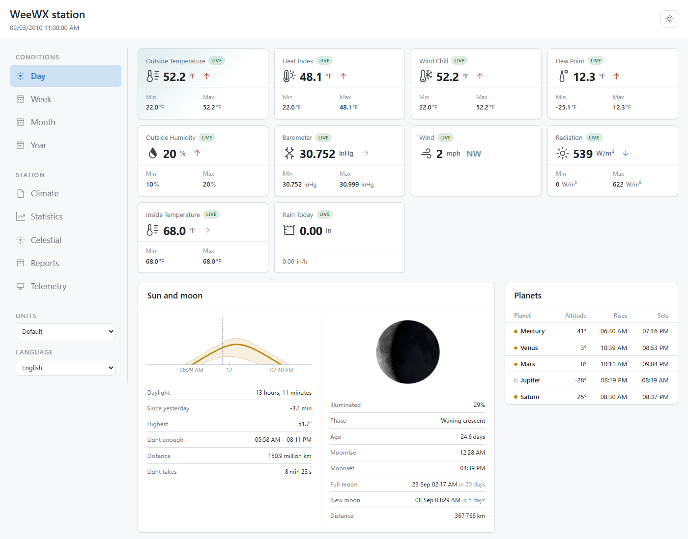
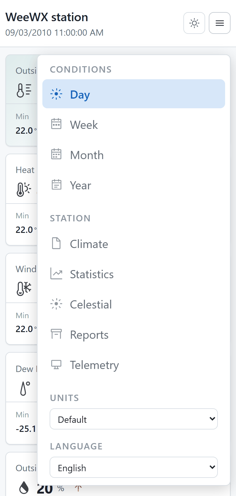
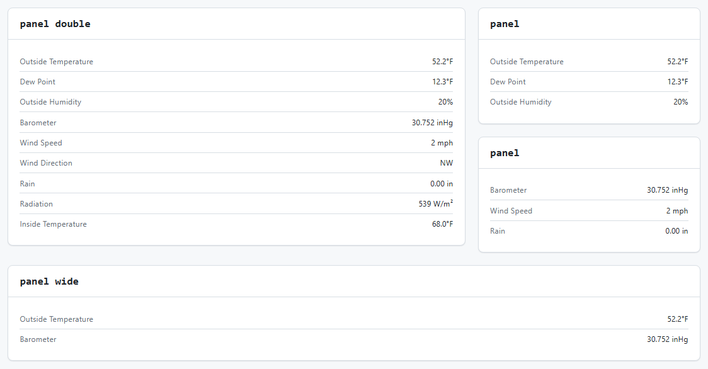
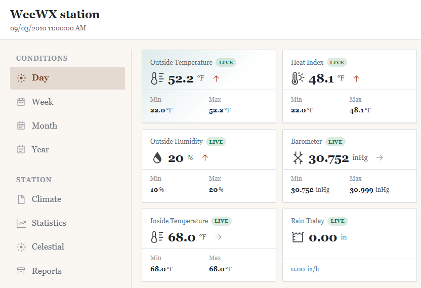

# Customizing the Horizon skin

The Horizon skin is a set of pages about your station. WeeWX writes the pages,
and, with its [JSON generator](json-generator.md), the JSON files that the
charts are drawn from. The browser draws the charts, with
[ECharts](https://echarts.apache.org/), which comes with the skin, and converts
the readings when a reader chooses another unit system.

The skin is controlled by the options in the `[DisplayOptions]` section of its
`skin.conf`, described under
[What the skin adds to [DisplayOptions]](#what-the-skin-adds-to-displayoptions).
A stylesheet of your own can change the colors, fonts and spacing. See
[Changing the colors and fonts](#changing-the-colors-and-fonts).

## Turning the skin on

A new installation has the report `HorizonReport` in `weewx.conf`, switched
off. To switch the report on, set `enable` to `true`, then restart WeeWX:

``` ini hl_lines="4"
[StdReport]
    [[HorizonReport]]
        skin = Horizon
        enable = true
        HTML_ROOT = public_html/horizon
```

An installation upgraded from an earlier version does not have the report. Add
the lines above to `[StdReport]`. If the directory `skins/Horizon` is missing as
well, `weectl station upgrade --what skins` installs it. That command replaces
the other skins too, and keeps a copy of each. See
[weectl station upgrade](../utilities/weectl-station.md#what-option).

The next report writes the pages to `public_html/horizon`, a subdirectory of the
directory where *Seasons* writes its pages.

## Finding your way around

Every page is laid out the same way: the masthead across the top, the
navigation in a column on the left, the page's content beside the navigation,
and the footer under the content. Here is the front page at a desktop width:



The masthead holds the page's title and the time of the latest archive record.
On every page but the front page, a link under the title goes back to the front
page. The button with the sun or the moon, at the right of the masthead,
switches between the light and the dark theme. The browser remembers the
choice. Until a reader chooses, the page follows the theme of the reader's
system.

The navigation has three parts:

* **Conditions** has one entry for each time span in `periods`, which are Day,
  Week, Month and Year in the `skin.conf` that comes with the skin. On the front
  page, the entry of a time span switches the charts and the tiles of the
  current conditions to that time span. On every other page, the entry opens the
  front page on that time span. The Conditions entries appear only when
  `panels` includes `history`, the panel with the charts.
* **Station** links to the other pages. *Climate* shows the year in progress:
  the climatological days, such as frost days; charts of the year month by
  month; a heat map of the year, with one square for each day; and a table of
  every year in the archive, month by month. *Statistics* has the highs, lows
  and totals for the day, week, month, year and rain year. *Celestial* has the
  sun and the moon in detail. *Reports* shows the NOAA summaries of each month
  and year. *Telemetry* has the station's signal, batteries and voltages, and
  charts of the signal and the voltages.
* **Units** and **Language** hold the unit picker and the language picker. The
  unit picker shows the readings in another unit system: `US`, `METRIC` or
  `METRICWX`. *Default* is the report unit system. The browser converts the
  readings, the charts included, and remembers the choice for the next visit.
  The Celestial and Reports pages have no unit picker, because nothing on them
  is a reading to convert. The language picker appears when the pages are
  published in more than one language. See
  [Choosing the language](#choosing-the-language).

On a screen 960 pixels wide or narrower, such as a phone or a tablet held
upright, the navigation is hidden. The menu button at the right of the masthead
opens the navigation as a menu over the page:

{ width="300" }

In a browser that runs no JavaScript, there is no menu button, and the
navigation stays in the page, under the masthead.

The footer of every page, except the climate pages of past years, gives the
station's latitude, longitude and altitude, its hardware, how long WeeWX has
been running, and the version of WeeWX.

## Choosing the panels on the front page

The front page shows the panels named in `panels`, in the order of the list:

``` ini
[DisplayOptions]
    panels = current, forecast, sunmoon, planets, imagery, sensors, history, hilo
```

The panels are laid out on a grid, with as many columns as there is room for.
A column is at least 336 pixels wide. Most panels take one column. `current`,
`forecast`, `history` and `hilo` span the whole row. `sunmoon` spans two columns
and two rows when the grid has three columns, as in the picture of the front
page above.

The panels keep the order of the list, even where that leaves a gap. For
example, when a panel that takes one column is followed by a panel that spans
the row, the rest of the first panel's row stays empty.

To leave a panel out, or to change the order, edit the list. To keep the list
as the skin has it, copy the `panels` line, comment out one copy, and edit the
other.

`history` holds the charts. Which charts `history` shows, and in what order, is
set by [`plot_groups`](../reference/skin-options/displayoptions.md#plot_groups).
What each chart shows is set by its plot definition in `[[day_images]]` under
`[JSONGenerator]`, in the syntax of the Image generator. With `periods = false`
under `[JSONGenerator]`, as the skin comes, `[[week_images]]`,
`[[month_images]]` and `[[year_images]]` set only how long each time span is.
See [The JSON generator](json-generator.md).

These panels come with the skin:

| Panel | What it shows |
|---|---|
| `current` | The current conditions: one tile for each type in `observations_current` that has data this year, most with the day's low and high. Rain and its rate share the last tile. |
| `forecast` | The days ahead, and every third hour of the day the reader selects, today at first. See [Setting up the forecast](#setting-up-the-forecast). |
| `sun` | The sun's height through the day as a curve, over a band that reaches from the curve of the winter solstice to that of the summer solstice. Below the curve are the length of the day and how it changed since yesterday, the sun's greatest height, the start and end of civil twilight, the sun's distance, and how long its light takes to reach the Earth. |
| `moon` | A picture of the moon at its present phase, with the illumination, phase, age, rise and set, the next full and new moon, and the distance of the moon. |
| `sunmoon` | `sun` and `moon` in one panel. List either `sunmoon`, or `sun` and `moon`, not both. |
| `planets` | The planets named in the option `planets`, how high each one stands, and when it rises and sets. A filled mark means the planet is above the horizon. |
| `imagery` | Radar, satellite and map, each in a panel of its own. Under `[Extras]`, `radar_img` and `satellite_img` name the pictures, each linked to `radar_url` or `satellite_url` if given, and `google_map_apikey` adds a Google map of the station. Each appears only when its option is set. |
| `sensors` | Signal strength, batteries and voltages, for the types in `sensor_connections`, `sensor_batteries` and `sensor_voltages` that have data today. |
| `history` | The charts, and the range bar above them, which moves the charts through time. A page can have only one `history`. |
| `hilo` | The statistics table: highs, lows and totals of the types in `observations_stats`, for the day, week, month and year. |

`sun`, `moon`, `sunmoon` and `planets` need `pyephem`, and show nothing where it
is not installed.

The tiles of the current conditions follow the time span. On Day, a tile shows
the latest reading, with the day's low and high under it. On Week, Month or
Year, a tile shows the mean of that week, month or year so far, with its low
and high. Rain, and any other type in `obs_type_sum`, shows the total instead,
and the wind tile shows the mean speed and the vector averaged direction. The
trend arrows, the rain rate and the *Live* badge describe the latest reading,
so they show only on Day.

With the live update on, when no new archive record has arrived for two and a
half archive intervals, the current conditions and the time in the masthead
are shown faded.

The range bar steps the charts back and forward, one time span at a time. The
date between the arrows opens a calendar, to go to any date. *Now* returns to
the latest readings. *Share* copies a link to what the charts show, such as
`index.html#month/2026-07` for July 2026. Over plain HTTP the browser lets no
page write to the clipboard, so *Share* shows the link in a box for the reader
to copy. A link to `index.html#week` opens the front page on the time span
Week. The range bar moves only the charts: the tiles stay on the day, week,
month or year that holds the latest archive record.

The charts shade the nights on time spans of up to nine days, i.e., Day and
Week. On Month and Year a night would be one or two pixels wide.

The curve of the sun panel is drawn against the station's clock, not against
solar time. The sun is highest at about 12:00 only on the central meridian of
the time zone, e.g., 15° E for Central European Time, and summer time moves the
highest point an hour later.

The moon pictures are NASA's, and in the public domain. `moon/LICENSE.txt` has
the details.

## Adding a panel of your own

A panel is an `.inc` file in the skin directory. To add a panel of your own,
write an `.inc` file, and add the file's name, without `.inc`, to `panels`. You
do not have to edit `index.html.tmpl`.

Suppose you would like to show the temperature of a pond, measured as
`extraTemp1`. Save the following as `pond.inc` in the skin directory:

```
#errorCatcher Echo
#encoding UTF-8
<section class="panel" data-live-panel="pond">
  <div class="panel-head"><h2>Pond</h2></div>
  <div class="panel-body">$current.extraTemp1</div>
</section>
```

Then add `pond` to `panels`, at the place where you would like the panel to
appear. After `planets`, on a grid of three columns, the pond panel takes the
place under the planets, beside `sunmoon`:

``` ini
[DisplayOptions]
    panels = current, forecast, sunmoon, planets, pond, imagery, sensors, history, hilo
```

The unit picker does not convert this reading, because the reading carries no
number and unit for the browser. For a reading that the unit picker converts,
write it as `current.inc` does:

```
<span data-obs="extraTemp1" data-value="$current.extraTemp1.raw"
      data-unit="$unit.unit_type.extraTemp1"><span data-unit-value>$current.extraTemp1.format(add_label=False)</span><small data-unit-label>$unit.label.extraTemp1</small></span>
```

The class of the `section` sets how much of the grid the panel takes. `panel`
takes one column. `panel wide` spans the whole row. `panel double` spans two
columns and two rows when the grid has three columns, and takes one column when
the grid has fewer. Here is a panel of each class, on a grid of three columns:



`data-live-panel` keeps the panel up to date, as long as `refresh_interval` is
not `0`. When a new archive record arrives, the browser fetches the page again
in the background, and puts the new version of each panel with a
`data-live-panel` attribute in place of the old one. The browser finds the new
version by the name in the attribute, so give each panel a name that no other
panel uses. Without the attribute, a panel stays as it was when the reader
loaded the page.

## What the skin adds to [DisplayOptions]

Most options of the section are shared with *Seasons*, and described in the
reference, under [_[DisplayOptions]_](../reference/skin-options/displayoptions.md):
`plot_groups`, `periods`, `observations_current`, `observations_stats`,
`observations_rss`, `obs_type_sum`, `obs_type_max`, `telemetry_plot_groups`,
`sensor_connections`, `sensor_batteries` and `sensor_voltages`.

These options are Horizon's own:

| Option | What it does |
|---|---|
| `panels` | Which panels the front page shows, and in what order. See [Choosing the panels on the front page](#choosing-the-panels-on-the-front-page). |
| `refresh_interval` | How often, in seconds, the page asks for `current.json`, to learn whether a new archive record has arrived. The page shows a new archive record at most this many seconds after WeeWX writes `current.json`. `0` turns the live update off. Default is `60`. |
| `planets` | Which planets the `planets` panel lists, and in what order. Any body that `pyephem` knows can be named. Default is `mercury, venus, mars, jupiter, saturn`. |
| `custom_css` | A list of stylesheets of your own. See [Changing the colors and fonts](#changing-the-colors-and-fonts). |
| `custom_js` | A list of scripts of your own. See [Adding a script of your own](#adding-a-script-of-your-own). |
| `lang_root` | For a report whose `HTML_ROOT` is a subdirectory of another report's `HTML_ROOT`, the path back to that `HTML_ROOT`, e.g., `..`. Default is `.`. See [Choosing the language](#choosing-the-language). |

The subsections `[[Forecast]]`, `[[Icons]]` and `[[Languages]]` are described
below.

## Setting up the forecast

The forecast panel shows the forecast in `data/forecast.json`, under the
report's `HTML_ROOT`, when that file exists. When the file does not exist, the
browser asks [Open-Meteo](https://open-meteo.com/) for a forecast, unless
`browser_fetch` is `false`. Without a forecast from either source, the panel
stays hidden. The browser keeps a forecast for an hour, so a reader who has seen
the forecast sees a new `data/forecast.json` up to an hour later.

``` ini
[DisplayOptions]
    [[Forecast]]
        browser_fetch = true
        days = 7
        hours = 8
```

| Option | What it does |
|---|---|
| `browser_fetch` | Whether the browser may ask Open-Meteo for a forecast, `true` or `false`. Default is `true`. |
| `days` | How many days to ask Open-Meteo for. The panel shows every day that `forecast.json` holds. Default is `7`. |
| `hours` | How many forecast times to show for the day the reader selects, three hours apart. Today's first time is the present hour. Default is `8`, i.e., 24 hours. |

When the browser asks Open-Meteo, the reader's IP address reaches a third party.
The request carries the station's position, rounded to three decimals, which is
about 100 meters. On a public web site, consider writing the file with
`forecast-fetch.py`, described below, and setting `browser_fetch = false`.

The script `forecast-fetch.py` in the skin directory asks Open-Meteo for a
forecast and writes the file. The script needs only Python 3, not WeeWX, so the
script can also run on a web server without WeeWX. This crontab line runs the
script at seven minutes past every hour. Adjust the position and the paths to
your station:

```
7 * * * * python3 /etc/weewx/skins/Horizon/forecast-fetch.py --lat 45.686 --lon -121.566 --out /var/www/html/weewx/horizon/data/forecast.json
```

Any other program can write the file instead. Write the file to
`data/forecast.json` under the report's `HTML_ROOT`, with temperatures in °C and
wind speeds in km/h. The skin does not read the file's `units` field. For
example:

``` json
{"source": "my-script", "run": "2026-09-11T06:00",
 "units": {"temperature": "°C", "wind": "km/h"},
 "days": [{"date": "2026-09-11", "code": 61, "high": 21.4, "low": 12.0, "rain": 70, "wind": 18.0}],
 "hours": [{"time": "2026-09-11T15:00", "code": 61, "temperature": 19.8, "rain": 60}]}
```

`code` is a WMO 4677 weather code. The docstring of `to_horizon()` in
`forecast-fetch.py` describes each field. A program of this kind could convert
the forecasts of [*weewx-forecast*][forecast-wiki] or [*weewx-DWD*][dwd].

  [forecast-wiki]: https://github.com/weewx/weewx/wiki/forecasting
  [dwd]: https://github.com/roe-dl/weewx-DWD

## Changing the icons

A tile of the current conditions can have a small icon, chosen by observation
type. To change an icon, or to give one to a type that has none, name a file
under `[[Icons]]`:

``` ini
[DisplayOptions]
    [[Icons]]
        extraTemp1 = temp
        extraHumid1 = humidity
```

The value is the name of an SVG file in `icons/`, without the extension. The
icon is drawn in the color of the text, in the light and the dark theme alike,
so only the shape of the SVG counts, not its colors. A type that has no icon in
the skin and no entry under `[[Icons]]` shows no icon. The icons that come with
the skin are from the IBM Carbon set, under the Apache 2.0 license. See
`icons/LICENSE-Carbon.txt`.

## Choosing the language

The report's `lang` option chooses the language, as for any skin. See
[Changing languages](custom-reports.md#changing-languages). The language files
are in `lang/`. Where a language file lacks a text, the page shows the English
text. To supply the missing texts, see [Localization](localization.md).

To publish the pages in more than one language, add one report for each
language to `[StdReport]`, each with its own `lang` and `HTML_ROOT`, as described
in [Multiple locales](custom-reports.md#multiple-locales). Put the pages of one
language at the top, in the report's `HTML_ROOT`, and the pages of each other
language in a subdirectory of that `HTML_ROOT`. A report that writes to a
subdirectory also needs `lang_root`, the path from its `HTML_ROOT` back to the
top:

``` ini hl_lines="13"
[StdReport]
    [[HorizonReport]]
        skin = Horizon
        enable = true
        lang = de
        HTML_ROOT = public_html/horizon
    [[HorizonReportEN]]
        skin = Horizon
        enable = true
        lang = en
        HTML_ROOT = public_html/horizon/en
        [[[DisplayOptions]]]
            lang_root = ..
```

Then list the languages under `[[Languages]]` in `skin.conf`, each with the path
from the top to the `HTML_ROOT` of its report:

``` ini
[DisplayOptions]
    [[Languages]]
        [[[de]]]
            label = Deutsch
            path = .
        [[[en]]]
            label = English
            path = en
```

With more than one entry, the navigation has a language picker. Name each entry
after the `lang` of its report, so that the picker shows the language of the
page it is on.

## Changing the colors and fonts

Name a stylesheet of your own in `custom_css`:

``` ini
[DisplayOptions]
    custom_css = my-station.css
```

Put the file in the skin directory, and add it to `copy_once` in
`[CopyGenerator]`. WeeWX copies the files in `copy_once` to `HTML_ROOT` with the
first report after it starts, and with `weectl report run`. After a change to
the stylesheet, restart WeeWX, or run `weectl report run`.

Every page loads the stylesheet after `horizon.css`, so what the stylesheet sets
wins. The colors, fonts and spacing of the skin are CSS custom properties, and
a stylesheet changes one by setting it:

``` css
:root {
  --accent: #7a4b2c;
  --bg: #faf6f2;
  --radius: 2px;
  --font: Georgia, "Times New Roman", serif;
}

@media screen and (prefers-color-scheme: dark) {
  :root:not([data-theme="light"]) { --accent: #d8a77a; --bg: #1a1512; }
}
@media screen {
  :root[data-theme="dark"] { --accent: #d8a77a; --bg: #1a1512; }
}
```

The first rule sets the colors of the light theme, and the corners and the font
of both themes. The dark theme has two rules, as in `horizon.css`: one for a
reader whose system is dark and who has not chosen a theme, and one for a reader
who chose dark with the theme button. A color for the dark theme goes in both
rules. Put the dark rules inside `@media screen`, as the skin does, so that a
page still prints in the light colors. With this stylesheet, the top of the
front page looks as follows:



## The names you can set

Each name in this table is written `--name` in a stylesheet, as in the example
above.

| Name | What it sets |
|---|---|
| `bg` | the page behind the panels |
| `surface`, `surface-sunk` | panels, tiles and the masthead; a row of tabs, and a chart that is not yet drawn |
| `ink`, `ink-muted`, `ink-faint` | text; labels; the headings of the navigation, and the small print |
| `border`, `border-strong` | the edges of panels and tiles, and the rules between rows; an edge under the pointer |
| `accent` | links, and what is selected: the page or time span shown, a tab |
| `hi`, `lo` | highs and lows, and a rising and a falling trend; temperature and rain on the climate page |
| `ok` | the *Live* badge, and a battery that is OK |
| `sun` | the sun's curve, a planet above the horizon, and a clear sky in the forecast |
| `warn`, `accent-bright` | a partly cloudy sky, and snow, in the forecast |
| `warm-0` … `warm-8` | the temperature bands, cold to hot: the tint of the outside temperature tile, and the heat map on the climate page |
| `chart-grid`, `chart-axis`, `chart-night` | inside the charts: the grid, the axes, and the shading of the night |
| `radius`, `shadow` | the corners and the shadow of panels and tiles |
| `gap`, `edge`, `pad` | the space between panels, the margin at either side of the page, and the space inside a panel |
| `font`, `font-mono` | the typeface of the page, and of the NOAA reports |
| `fs-xs`, `fs-sm`, `fs-base`, `fs-md`, `fs-lg` | type sizes, from the small print to the page title |

Give the `warm` colors as `#rrggbb` or `rgb()`. The heat map on the climate page
mixes the `warm` colors in the browser, and skips a color written any other way.

The colors of the lines in the charts come from the plot definitions in
`[JSONGenerator]`, such as `chart_line_colors`, and not from the stylesheet.

## Adding a script of your own

Name a script of your own in `custom_js`:

``` ini
[DisplayOptions]
    custom_js = my-station.js
```

As with a stylesheet, put the file in the skin directory, and add it to
`copy_once`. Every page loads its scripts at the end of the page, in this order:
the chart library `echarts.min.js`, on the pages that have charts; the skin's
`horizon.js`; the page's own script, `forecast.js` or `climate.js`; then the
scripts in `custom_js`, in the order of the list. When a script of your own
runs, the page is complete, and the skin has set up its controls.

The skin sends these events to `document`, for a script that has to keep up
with the page:

| Event | When |
|---|---|
| `horizon:update` | A new archive record has arrived. `event.detail.dateTime` is the time of the archive record, as a Unix epoch time. |
| `horizon:panels` | The panels with a `data-live-panel` attribute have been replaced with their new versions. Whatever a script added to one of those panels is gone, and can be added again. |
| `horizon:units` | The reader has chosen another unit system. |

## The climate page

The climatological days use their metric definitions, e.g., a summer day reaches
25 °C. On a page in US units the thresholds are converted, so the summer day's
threshold reads 77 °F.

The climate diagram is always laid out in °C and mm, because Walter and Lieth's
ratio of 20 mm to 10 °C is defined in those units. In other units only the axis
labels change, so the labels are the equivalents of round values in °C and mm,
e.g., 50 and 68 °F for 10 and 20 °C.

The water balance appears only where the station has rain and
evapotranspiration (`ET`) data. WeeWX calculates `ET` from solar radiation,
among other readings, so a station without a radiation sensor has none.

## The climate pages of past years

Each year of the archive has a climate page of its own, such as
`climate-2025.html`, which the year picker on the Climate page opens. WeeWX
stops writing the page of a year when the year ends, so the page of a past year
stays as the templates wrote it in that year's last report. After a change to
the templates or to `skin.conf`, delete the pages of past years, and the next
report writes them again.
